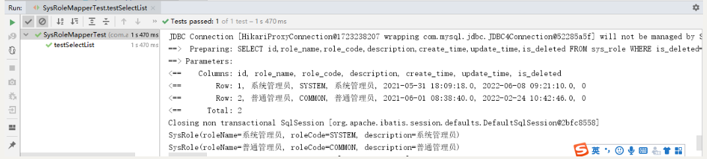
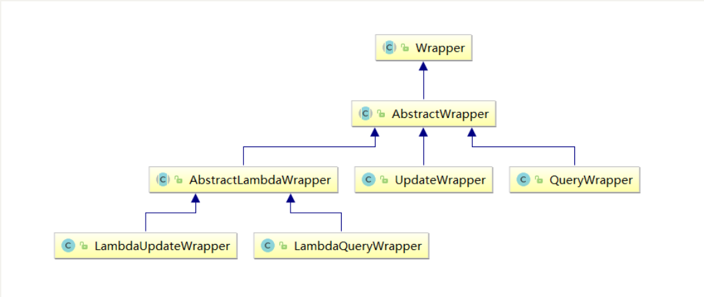

# Mybatis-Plus

## 目录

-   [1、配置文件](#1配置文件)
-   [2、启动类](#2启动类)
-   [3、实体类](#3实体类)
-   [4、添加Mapper类](#4添加Mapper类)
-   [5、测试Mapper接口](#5测试Mapper接口)
-   [6、CRUD测试](#6CRUD测试)
    -   [sysRole实体类](#sysRole实体类)
    -   [6.1、insert添加](#61insert添加)
        -   [6.1.1、示例](#611示例)
        -   [6.1.2、主键策略](#612主键策略)
    -   [6.2、更新](#62更新)
    -   [6.3、删除](#63删除)
        -   [6.3.1、根据id删除](#631根据id删除)
        -   [6.3.2、批量删除](#632批量删除)
    -   [6.4、MyBatis-Plus条件构造器](#64MyBatis-Plus条件构造器)
-   [7、MyBatis-Plus封装service层](#7MyBatis-Plus封装service层)
    -   [7.1、添加service接口](#71添加service接口)
    -   [7.2、添加service接口实现](#72添加service接口实现)
    -   [7.3、测试Service接口](#73测试Service接口)

## 1、配置文件

配置 MySQL 数据库的相关配置及Mybatis-Plus日志

application.yml

```yaml
spring:
  application:
    name: service-system
  profiles:
    active: dev
```

application-dev.yml

```yaml
server:
  port: 8800
mybatis-plus:
  configuration:
    log-impl: org.apache.ibatis.logging.stdout.StdOutImpl # 查看日志
spring:
  datasource:
    driver-class-name: com.mysql.cj.jdbc.Driver
    url: jdbc:mysql://localhost:3306/guigu-auth?characterEncoding=utf-8&useSSL=false
    username: root
    password: root
```

## 2、启动类

在 Spring Boot 启动类中添加 `@MapperScan` 注解，扫描 Mapper 文件夹：

```java
package cod.env.system;

import org.springframework.boot.SpringApplication;
import org.springframework.boot.autoconfigure.SpringBootApplication;

@MapperScan(basePackages = "com.atguigu.system.mapper")
@SpringBootApplication
public class ServiceAuthApplication {

    public static void main(String[] args) {
        SpringApplication.run(ServiceAuthApplication.class, args);
    }

}
```

## 3、实体类

已引入，实体类说明：

实体类注解详细文档：[https://baomidou.com/pages/223848/](https://baomidou.com/pages/223848/ "https://baomidou.com/pages/223848/")

@TableName：表名注解，标识实体类对应的表

@TableId：主键注解，type = IdType.AUTO（数据库 ID 自增）

@TableField：字段注解（非主键）

@TableLogic：逻辑删除

```java
package cod.env.model.system;

import com.baomidou.mybatisplus.annotation.TableField;
import com.baomidou.mybatisplus.annotation.TableName;
import com.atguigu.model.base.BaseEntity;
import lombok.Data;

@Data
@TableName("sys_role")
public class SysRole extends BaseEntity {
   
   private static final long serialVersionUID = 1L;

   //角色名称
   @TableField("role_name")
   private String roleName;

   //角色编码
   @TableField("role_code")
   private String roleCode;

   //描述
   @TableField("description")
   private String description;

}
```

## 4、添加Mapper类

```java
package cod.env.system.mapper;

import cod.env.model.auth.SysRole;
import com.baomidou.mybatisplus.core.mapper.BaseMapper;
import org.apache.ibatis.annotations.Mapper;

@Repository
public interface SysRoleMapper extends BaseMapper<SysRole> {

}
```

com.baomidou.mybatisplus.core.mapper.BaseMapper这是Mybatis-Plus提供的默认Mapper接口。

```java
package com.baomidou.mybatisplus.core.mapper;

import com.baomidou.mybatisplus.core.conditions.Wrapper;
import com.baomidou.mybatisplus.core.metadata.IPage;
import java.io.Serializable;
import java.util.Collection;
import java.util.List;
import java.util.Map;
import org.apache.ibatis.annotations.Param;

public interface BaseMapper<T> extends Mapper<T> {
    int insert(T entity);

    int deleteById(Serializable id);

    int deleteByMap(@Param("cm") Map<String, Object> columnMap);

    int delete(@Param("ew") Wrapper<T> queryWrapper);

    int deleteBatchIds(@Param("coll") Collection<? extends Serializable> idList);

    int updateById(@Param("et") T entity);

    int update(@Param("et") T entity, @Param("ew") Wrapper<T> updateWrapper);

    T selectById(Serializable id);

    List<T> selectBatchIds(@Param("coll") Collection<? extends Serializable> idList);

    List<T> selectByMap(@Param("cm") Map<String, Object> columnMap);

    T selectOne(@Param("ew") Wrapper<T> queryWrapper);

    Integer selectCount(@Param("ew") Wrapper<T> queryWrapper);

    List<T> selectList(@Param("ew") Wrapper<T> queryWrapper);

    List<Map<String, Object>> selectMaps(@Param("ew") Wrapper<T> queryWrapper);

    List<Object> selectObjs(@Param("ew") Wrapper<T> queryWrapper);

    <E extends IPage<T>> E selectPage(E page, @Param("ew") Wrapper<T> queryWrapper);

    <E extends IPage<Map<String, Object>>> E selectMapsPage(E page, @Param("ew") Wrapper<T> queryWrapper);
}
```

## 5、测试Mapper接口

```java
package cod.env.system;

import cod.env.model.system.SysRole;
import cod.env.system.mapper.SysRoleMapper;
import org.junit.jupiter.api.Test;
import org.springframework.beans.factory.annotation.Autowired;
import org.springframework.boot.test.context.SpringBootTest;
import org.springframework.test.context.junit4.SpringRunner;

import java.util.List;

@SpringBootTest
public class SysRoleMapperTest {

    @Autowired
    private SysRoleMapper sysRoleMapper;

    @Test
    public void testSelectList() {
        System.out.println(("----- selectAll method test ------"));
        //UserMapper 中的 selectList() 方法的参数为 MP 内置的条件封装器 Wrapper
        //所以不填写就是无任何条件
        List<SysRole> users = sysRoleMapper.selectList(null);
         for (SysRole sysRole : sysRoles) {
           System.out.println("sysRole = " + sysRole);
        }
    }
}
```

**注意：**

IDEA在sysRoleMapper处报错，因为找不到注入的对象，因为类是动态创建的，但是程序可以正确的执行。

为了避免报错，可以在 mapper 层 的接口上添加 @Repository 或直接使用 @Resource 代替 @Autowired。

控制台输出：



通过以上几个简单的步骤，我们就实现了 User 表的 CRUD 功能，甚至连 XML 文件都不用编写！

## 6、CRUD测试

#### **sysRole实体类**

```java
import cod.env.base.BaseEntity;
import com.baomidou.mybatisplus.annotation.TableField;
import com.baomidou.mybatisplus.annotation.TableName;
import lombok.Data;

@Data
@TableName("sys_role")
public class SysRole extends BaseEntity {
  
  private static final long serialVersionUID = 1L;

  @TableField("role_name")
  private String roleName;

  @TableField("role_code")
  private String roleCode;

  @TableField("description")
  private String description;

}
```

### 6.1、insert添加

#### 6.1.1、示例

```java
@Test
public void testInsert(){
    SysRole sysRole = new SysRole();
    sysRole.setRoleName("角色管理员");
    sysRole.setRoleCode("role");
    sysRole.setDescription("角色管理员");

    int result = sysRoleMapper.insert(sysRole);
    System.out.println(result); //影响的行数
    System.out.println(sysRole.getId()); //id自动回填
}
```

#### 6.1.2、主键策略

**1、ID\_WORKER**

MyBatis-Plus默认的主键策略是：ID\_WORKER  *全局唯一ID*

**2、自增策略**

-   要想主键自增需要配置如下主键策略
-   \- 需要在创建数据表的时候设置主键自增
    -   实体字段中配置 @TableId(type = IdType.AUTO)

```java
@TableId(type = IdType.AUTO)
private Long id;
```

其它主键策略：分析 IdType 源码可知

```java
public enum IdType {
     /**
     * 数据库ID自增
     */
    AUTO(0),
    
    /**
     * 该类型为未设置主键类型
     */
    NONE(1),
    
    /**
     * 用户输入ID
     * 该类型可以通过自己注册自动填充插件进行填充
     */    
    INPUT(2),
    
    /**
     * 全局唯一ID
     */    
    ASSIGN_ID(3),
    
    /**
     * 全局唯一ID (UUID)
     */
    ASSIGN_UUID(4),
    
    /** @deprecated */
    @Deprecated
    ID_WORKER(3),
    /** @deprecated */
    @Deprecated
    ID_WORKER_STR(3),
    /** @deprecated */
    @Deprecated
    UUID(4);
    private final int key;
    private IdType(int key) {
        this.key = key;
    }
    public int getKey() {
        return this.key;
    }
}
```

### 6.2、更新

```java
@Test
public void testUpdateById(){
    SysRole sysRole = new SysRole();
    sysRole.setId(1L);
    sysRole.setRoleName("角色管理员1");

    int result = sysRoleMapper.updateById(sysRole);
    System.out.println(result);

}
```

### 6.3、删除

#### 6.3.1、根据id删除

```java
/**
 * application-dev.yml 加入配置
 * 此为默认值，如果你的默认值和默认的一样，则不需要该配置
 * mybatis-plus:
 *   global-config:
 *     db-config:
 *       logic-delete-value: 1
 *       logic-not-delete-value: 0
 */
@Test
public void testDeleteById(){
    int result = sysRoleMapper.deleteById(2L);
    System.out.println(result);
}
```

#### 6.3.2、批量删除

```java
@Test
public void testDeleteBatchIds() {
    int result = sysRoleMapper.deleteBatchIds(Arrays.asList(1, 2));
    System.out.println(result);
}
```

### 6.4、MyBatis-Plus条件构造器



Wrapper ： 条件构造抽象类，最顶端父类

AbstractWrapper ： 用于查询条件封装，生成 sql 的 where 条件

QueryWrapper ： Entity 对象封装操作类，不是用lambda语法

UpdateWrapper ： Update 条件封装，用于Entity对象更新操作

AbstractLambdaWrapper ： Lambda 语法使用 Wrapper统一处理解析 lambda 获取 column。

LambdaQueryWrapper ：看名称也能明白就是用于Lambda语法使用的查询Wrapper

LambdaUpdateWrapper ： Lambda 更新封装Wrapper

\*\*注意：以下条件构造器的方法入参中的`column `\*\***均表示数据库字段**

```java
@Test
public void testQueryWrapper() {
    QueryWrapper<SysRole> queryWrapper = new QueryWrapper<>();
    queryWrapper.ge("role_code", "role");
    List<SysRole> users = sysRoleMapper.selectList(queryWrapper);
    System.out.println(users);
}
```

其他条件构造有兴趣的可自行测试

## 7、MyBatis-Plus封装service层

#### 7.1、添加service接口

```java
package cod.env.system.service;

import cod.env.model.auth.SysRole;
import com.baomidou.mybatisplus.extension.service.IService;

import java.util.List;

public interface SysRoleService extends IService<SysRole> {

}

```

com.baomidou.mybatisplus.extension.service.IService这是Mybatis-Plus提供的默认Service接口。

```java
package com.baomidou.mybatisplus.extension.service;

import com.baomidou.mybatisplus.core.conditions.Wrapper;
import com.baomidou.mybatisplus.core.mapper.BaseMapper;
import com.baomidou.mybatisplus.core.metadata.IPage;
import com.baomidou.mybatisplus.core.toolkit.Assert;
import com.baomidou.mybatisplus.core.toolkit.CollectionUtils;
import com.baomidou.mybatisplus.core.toolkit.Wrappers;
import com.baomidou.mybatisplus.extension.conditions.query.LambdaQueryChainWrapper;
import com.baomidou.mybatisplus.extension.conditions.query.QueryChainWrapper;
import com.baomidou.mybatisplus.extension.conditions.update.LambdaUpdateChainWrapper;
import com.baomidou.mybatisplus.extension.conditions.update.UpdateChainWrapper;
import com.baomidou.mybatisplus.extension.kotlin.KtQueryChainWrapper;
import com.baomidou.mybatisplus.extension.kotlin.KtUpdateChainWrapper;
import com.baomidou.mybatisplus.extension.toolkit.ChainWrappers;
import com.baomidou.mybatisplus.extension.toolkit.SqlHelper;
import java.io.Serializable;
import java.util.Collection;
import java.util.List;
import java.util.Map;
import java.util.Objects;
import java.util.function.Function;
import java.util.stream.Collectors;
import org.springframework.transaction.annotation.Transactional;

public interface IService<T> {
    int DEFAULT_BATCH_SIZE = 1000;

    default boolean save(T entity) {
        return SqlHelper.retBool(this.getBaseMapper().insert(entity));
    }

    @Transactional(
        rollbackFor = {Exception.class}
    )
    default boolean saveBatch(Collection<T> entityList) {
        return this.saveBatch(entityList, 1000);
    }

    boolean saveBatch(Collection<T> entityList, int batchSize);

    @Transactional(
        rollbackFor = {Exception.class}
    )
    default boolean saveOrUpdateBatch(Collection<T> entityList) {
        return this.saveOrUpdateBatch(entityList, 1000);
    }

    boolean saveOrUpdateBatch(Collection<T> entityList, int batchSize);

    default boolean removeById(Serializable id) {
        return SqlHelper.retBool(this.getBaseMapper().deleteById(id));
    }

    default boolean removeByMap(Map<String, Object> columnMap) {
        Assert.notEmpty(columnMap, "error: columnMap must not be empty", new Object[0]);
        return SqlHelper.retBool(this.getBaseMapper().deleteByMap(columnMap));
    }

    default boolean remove(Wrapper<T> queryWrapper) {
        return SqlHelper.retBool(this.getBaseMapper().delete(queryWrapper));
    }

    default boolean removeByIds(Collection<? extends Serializable> idList) {
        return CollectionUtils.isEmpty(idList) ? false : SqlHelper.retBool(this.getBaseMapper().deleteBatchIds(idList));
    }

    default boolean updateById(T entity) {
        return SqlHelper.retBool(this.getBaseMapper().updateById(entity));
    }

    default boolean update(Wrapper<T> updateWrapper) {
        return this.update((Object)null, updateWrapper);
    }

    default boolean update(T entity, Wrapper<T> updateWrapper) {
        return SqlHelper.retBool(this.getBaseMapper().update(entity, updateWrapper));
    }

    @Transactional(
        rollbackFor = {Exception.class}
    )
    default boolean updateBatchById(Collection<T> entityList) {
        return this.updateBatchById(entityList, 1000);
    }

    boolean updateBatchById(Collection<T> entityList, int batchSize);

    boolean saveOrUpdate(T entity);

    default T getById(Serializable id) {
        return this.getBaseMapper().selectById(id);
    }

    default List<T> listByIds(Collection<? extends Serializable> idList) {
        return this.getBaseMapper().selectBatchIds(idList);
    }

    default List<T> listByMap(Map<String, Object> columnMap) {
        return this.getBaseMapper().selectByMap(columnMap);
    }

    default T getOne(Wrapper<T> queryWrapper) {
        return this.getOne(queryWrapper, true);
    }

    T getOne(Wrapper<T> queryWrapper, boolean throwEx);

    Map<String, Object> getMap(Wrapper<T> queryWrapper);

    <V> V getObj(Wrapper<T> queryWrapper, Function<? super Object, V> mapper);

    default int count() {
        return this.count(Wrappers.emptyWrapper());
    }

    default int count(Wrapper<T> queryWrapper) {
        return SqlHelper.retCount(this.getBaseMapper().selectCount(queryWrapper));
    }

    default List<T> list(Wrapper<T> queryWrapper) {
        return this.getBaseMapper().selectList(queryWrapper);
    }

    default List<T> list() {
        return this.list(Wrappers.emptyWrapper());
    }

    default <E extends IPage<T>> E page(E page, Wrapper<T> queryWrapper) {
        return this.getBaseMapper().selectPage(page, queryWrapper);
    }

    default <E extends IPage<T>> E page(E page) {
        return this.page(page, Wrappers.emptyWrapper());
    }

    default List<Map<String, Object>> listMaps(Wrapper<T> queryWrapper) {
        return this.getBaseMapper().selectMaps(queryWrapper);
    }

    default List<Map<String, Object>> listMaps() {
        return this.listMaps(Wrappers.emptyWrapper());
    }

    default List<Object> listObjs() {
        return this.listObjs(Function.identity());
    }

    default <V> List<V> listObjs(Function<? super Object, V> mapper) {
        return this.listObjs(Wrappers.emptyWrapper(), mapper);
    }

    default List<Object> listObjs(Wrapper<T> queryWrapper) {
        return this.listObjs(queryWrapper, Function.identity());
    }

    default <V> List<V> listObjs(Wrapper<T> queryWrapper, Function<? super Object, V> mapper) {
        return (List)this.getBaseMapper().selectObjs(queryWrapper).stream().filter(Objects::nonNull).map(mapper).collect(Collectors.toList());
    }

    default <E extends IPage<Map<String, Object>>> E pageMaps(E page, Wrapper<T> queryWrapper) {
        return this.getBaseMapper().selectMapsPage(page, queryWrapper);
    }

    default <E extends IPage<Map<String, Object>>> E pageMaps(E page) {
        return this.pageMaps(page, Wrappers.emptyWrapper());
    }

    BaseMapper<T> getBaseMapper();

    Class<T> getEntityClass();

    default QueryChainWrapper<T> query() {
        return ChainWrappers.queryChain(this.getBaseMapper());
    }

    default LambdaQueryChainWrapper<T> lambdaQuery() {
        return ChainWrappers.lambdaQueryChain(this.getBaseMapper());
    }

    default KtQueryChainWrapper<T> ktQuery() {
        return ChainWrappers.ktQueryChain(this.getBaseMapper(), this.getEntityClass());
    }

    default KtUpdateChainWrapper<T> ktUpdate() {
        return ChainWrappers.ktUpdateChain(this.getBaseMapper(), this.getEntityClass());
    }

    default UpdateChainWrapper<T> update() {
        return ChainWrappers.updateChain(this.getBaseMapper());
    }

    default LambdaUpdateChainWrapper<T> lambdaUpdate() {
        return ChainWrappers.lambdaUpdateChain(this.getBaseMapper());
    }

    default boolean saveOrUpdate(T entity, Wrapper<T> updateWrapper) {
        return this.update(entity, updateWrapper) || this.saveOrUpdate(entity);
    }
}
```

#### 7.2、添加service接口实现

```java
package cod.env.system.service.impl;

import cod.env.auth.mapper.SysRoleMapper;
import cod.env.auth.service.SysRoleService;
import cod.env.model.auth.SysRole;
import com.baomidou.mybatisplus.core.conditions.query.LambdaQueryWrapper;
import com.baomidou.mybatisplus.extension.service.impl.ServiceImpl;
import org.springframework.stereotype.Service;
import org.springframework.beans.factory.annotation.Autowired;

import java.util.List;

@Transactional
@Service
public class SysRoleServiceImpl extends ServiceImpl<SysRoleMapper, SysRole> implements SysRoleService {
}
```

com.baomidou.mybatisplus.extension.service.impl.ServiceImpl这是Mybatis-Plus提供的默认Service接口实现。

#### 7.3、测试Service接口

```java
package com.atguigu.system;

import com.atguigu.model.system.SysRole;
import com.atguigu.system.mapper.SysRoleMapper;
import com.atguigu.system.service.SysRoleService;
import com.baomidou.mybatisplus.core.conditions.query.LambdaQueryWrapper;
import com.baomidou.mybatisplus.core.conditions.query.QueryWrapper;
import org.junit.jupiter.api.Test;
import org.junit.runner.RunWith;
import org.springframework.beans.factory.annotation.Autowired;
import org.springframework.boot.test.context.SpringBootTest;
import org.springframework.test.context.junit4.SpringRunner;

import java.util.List;

@SpringBootTest
public class SysRoleServiceTest {

    @Autowired
    private SysRoleService sysRoleService;

    @Test
    public void testSelectList() {
        System.out.println(("----- selectAll method test ------"));
        //UserMapper 中的 selectList() 方法的参数为 MP 内置的条件封装器 Wrapper
        //所以不填写就是无任何条件
        List<SysRole> roles = sysRoleService.list();
        for (SysRole role : roles) {
            System.out.println("role = " + role);
        }
    }

    @Test
    public void testInsert(){
        SysRole sysRole = new SysRole();
        sysRole.setRoleName("角色管理员");
        sysRole.setRoleCode("role");
        sysRole.setDescription("角色管理员");

        boolean result = sysRoleService.save(sysRole);
        System.out.println(result); //成功还是失败
    }

    @Test
    public void testUpdateById(){
        SysRole sysRole = new SysRole();
        sysRole.setId(1L);
        sysRole.setRoleName("角色管理员1");

        boolean result = sysRoleService.updateById(sysRole);
        System.out.println(result);

    }

    @Test
    public void testDeleteById(){
        boolean result = sysRoleService.removeById(2L);
        System.out.println(result);
    }

    @Test
    public void testQueryWrapper() {
        QueryWrapper<SysRole> queryWrapper = new QueryWrapper<>();
        queryWrapper.ge("role_code", "role");
        List<SysRole> users = sysRoleService.list(queryWrapper);
        System.out.println(users);
    }
}
```
