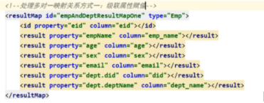
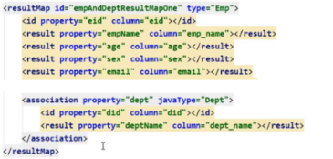
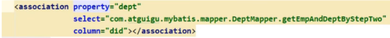
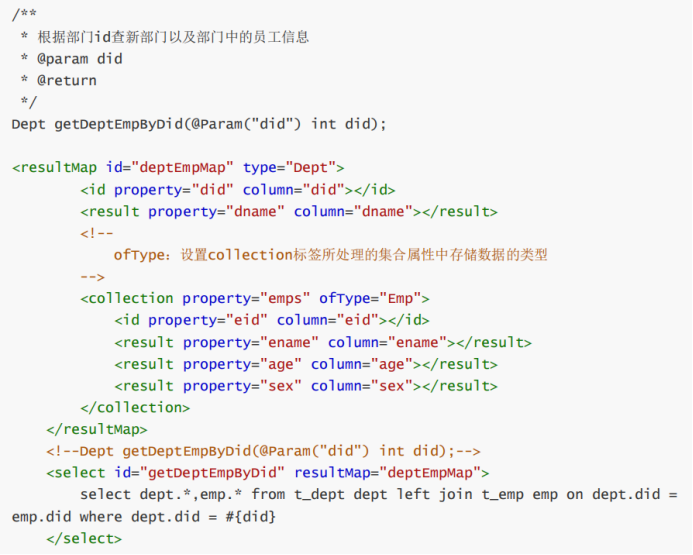
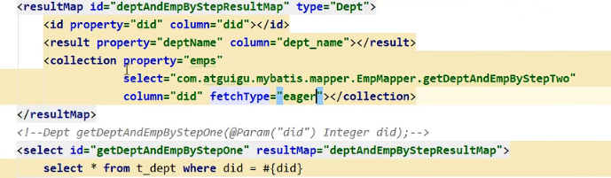
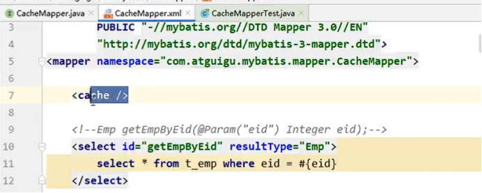

# MyBatis

## 目录

-   [读取和查询](#读取和查询)
    -   [读取配置文件的信息](#读取配置文件的信息)
    -   [引入包作为映射文件注意细节](#引入包作为映射文件注意细节)
    -   [获取参数值的两种方式](#获取参数值的两种方式)
    -   [获取参数值的各种情况](#获取参数值的各种情况)
    -   [mybatis的各种查询](#mybatis的各种查询)
-   [表和表间关系](#表和表间关系)
    -   [处理多对一的映射关系：](#处理多对一的映射关系)
        -   [a>通过级联属性赋值](#a通过级联属性赋值)
        -   [b>分布查询(使用较多)](#b分布查询使用较多)
    -   [处理一对多的映射关系](#处理一对多的映射关系)
        -   [a>collection标签](#acollection标签)
        -   [b>分布查询](#b分布查询)
-   [动态sql](#动态sql)
    -   [\<if>](#if)
    -   [\<where>](#where)
    -   [\<foreach>](#foreach)
    -   [\<sql>标签](#sql标签)
-   [Mybatis的缓存](#Mybatis的缓存)
    -   [二级缓存开启的条件](#二级缓存开启的条件)
-   [分页插件实现分页功能](#分页插件实现分页功能)

## **读取和查询**

#### **读取配置文件的信息**

1.  引入配置文件 :  `<properites resource = xxxx.priperties/>`
2.  使用‘\${ }’格式，读取文件中的信息

#### **引入包作为映射文件注意细节**

1.  main文件夹下的resource文件夹下，以 ’ / ’为分隔符创建
2.  mapper接口所在包要和映射文件所在的包一致、名字一致
3.  在mybatis-config.xml文件的\<mappers>标签下，配置\<package name = “[xxx.xxx.xxx](http://xxx.xxx.xxx "xxx.xxx.xxx")”/>

#### **获取参数值的两种方式**

1.  \${ } 本质为字符串拼接
2.  \#{ } 本质为占位符赋值

#### **获取参数值的各种情况**

1.  Mapper接口方法的参数为单个的字面量类型，可以通过{ }和#{ }以任意的名称获取参数值，但需要注意{ }的单引号问题
2.  Mapper接口方法的参数为多个时，mybatis自动将参数封装在一个map集合，有两种形式存储：

    a>一种是arg0，arg1...为键,以对应的参数值为值的格式，

    b>另一种以param1,param2为键,以对应的参数值为值的格式。

    c>因此我们只需要通过#{ } 和${ }以键的形式访问集合即可，但是需要注意${ }的单引号问题。
3.  若mapper接口方法的参数有多个时，可以手动将这些参数放在一个map中存储,只需要通过#{ }和{ }以键的方式访问值即可，但是需要注意{ }的单引号问题
4.  mapper接口方法的参数是一个实体类类型的参数时，只需要通过#{ }和{ }以属性的方式访问属性值即可，但是需要注意{ }的单引号问题。属性主要看的是get和set方法。
5.  使用@Param注解命名参数此时mybatis自动将参数封装在一个map集合，有两种形式存储：

    a>以@Param注解的值为键,以对应的参数值为值的格式

    b>以param1,param2..为键,以对应的参数值为值的格式

    c>因此我们只需要通过#{ } 和${ }以键的形式访问集合即可，但是需要注意${ }的单引号问题。

    除了实体类对象还有Map集合的情况，其它的情况均为参数加上一个@Param注解

#### **mybatis的各种查询**

1.  若查询出的数据只有一条

    a>可以通过实体类对象接收

    b>可以通过list集合接收

    c>可以通过map集合接收
2.  若查询出的数据有多条

    a>可以通过实体类类型的list集合接收

    b>可以通过map类型的list集合接收

    c>可以在mapper接口的方法上添加@MapKey注解，此时就可以将每条数据转换的map集合作为值，以某个字段的值作为键，放在同一个map集合中

    注意：一定不能通过实体类对象接收，此时会抛异常TooManyResultsExpection&#x20;

**通过解决字段名和属性名不一致**：

a>为字段起别名，保持和属性名的一致

b>设置全局配置，将\_自动映射为驼峰：

mapUnderscoreToCamelCase：将下划线映射为驼峰，其默认为false，需要将value改为true

```xml
<settings>  <setting name = “mapUnderscoreToCamelCase” value =””/>  <settings>
```

c>使用resultMap标签设置自定义映射关系（resultMap只在查询功能中有用，增删改用resultType即可）

Id : 设置唯一标识

type：设置映射关系中的实体类类型

子标签：

id : 设置主键的元素关系

result：设置普通字段的映射关系

属性：

property:设置映射关系中的属性名，必须是type属性所设置的实体类类型中的属性名

column：设置映射关系中的字段名，必须是sql语句查询出的字段名

```xml
<resultMap id = “实体类ResultMap” type=”实体类” >
//设置主键的映射关系
<id property = “eid” column = “eid”></id> 
//设置普通字段的映射关系，建议把实体类和数据库表对应关系全部设置上 
<result property = “empName” column=”emp_name”></result>
.....
//处理多对一的关系
<association></association>
......
//处理一对多的关系
<collection></collection>
......
</resultMap>

```

## 表和表间关系

表和表之间有关系，相对应的对应实体类和实体类来说，也存在一定的关系(例如说：两表联查、多表联查等，这是就需要使用resultMap标签了)

多对一的时候，在表示‘多’的实体类里面设置一个‘一’的成员私有属性，同时对应给get和set方法

一对多的时候，在表示‘一’的实体类里面设置一个体现‘多’的集合属性，同时对应给get和set方法

### 处理多对一的映射关系：

#### **a>通过级联属性赋值**

例如：查询员工以及员工所对应的部门信息

```sql
Sql语句：select * from t_emp left join t_dept on t_emp.did = t_dept.did where t_emp eid = #{}
```



```java
<select id = “getEmpAndDept” resultMap=”empAndDeptResultMapOne”>
select * from t_emp left join t_dept on t_emp.did = t_dept.did where t_emp eid = #{eid}
</select>

```

b>使用association标签(专门处理多对一的标签)



property：需要处理多对一的映射关系的属性名

javaType：该属性的类型

把javaType=’Dept’ 对象赋值给property= ’dept ’属性...,最后得到完整的Emp对象

注意：在体现多对一的”多“这种实体类中设置一个“一”的实体类属性，并赋get和set方法

#### **b>分布查询(使用较多)**

例：通过分布查询查询员工以及员工对应的部门信息

**第一步：查询员工信息**

```java
mapper接口方法： Emp getEmpAndDeptByStepOne(@Param(“eid”) Integer eid);
```

对应mapper接口的映射文件：

```xml
<resultMap id=”empAndDeptByStepResultMap” type=”Emp”>
  <id property=”eid” column=”eid”></id>
  <result property=”empName” column=”emp_name”></result>
<result property=”age” column=”age”></result>
<result property=”empName” column=”emp_name”></result>
<result property=”sex” column=”sex”></result>
<result property=”email” column=”email”></result>
  <association property=”dept”
  select=””
  column=”did”>
  </association>
  <select id = “getEmpAndDeptByStepOne” resultMap=””>
  Select * from t_emp where eid = #{eid}
</select>
```

association标签中：

select:设置分布查询的sql的唯一标识(namespace.SQLId或mapper接口的全类名.方法名)

其实就是方法名右键‘Copy Reference’

column：设置分布查询的条件

fetchType:当开启了全局的延迟加载之后，可通过次属性手动控制延迟加载的效果

fetchType=”lazy|eager”,默认是:lazy，表示延迟加载；eager:立即加载



**第二步：根据did查询员工对应的部门信息**

```java
Mapper接口方法： Dept getEmpAndDeptByStepTwo(@Param(“did”) Integer did)
```

对应mapper接口的映射文件：

```xml
<select id =”getEmpAndDeptByStepTwo”resultType=”Dept”>
  select * from t_dept where did =#{did}
</select>
```

### 处理一对多的映射关系

#### a>collection标签



\<collection>标签中使用ofType表示该属性所对应的集合中存储数据的类型

#### b>分布查询

例：通过分布查询查询部门以及部门中所有的员工信息

第一步：查询部门信息



第二步：以did为查询条件，查询该部门下的员工信息

注意：通过集合在体现一对多的”一“实体类中，设置一个对应”多”的这种实体类属性，并赋get和set方法

## **动态sql**

mybatis框架的动态sql技术是一种根据特定条件动态拼装sql语句的功能，它存在的意义是为了解解决拼接sql语句字符串时的痛点问题。

#### **\<if>**

**if标签可通过test属性的表达式进行判断，若表达式结果为true，则标签中的内容会执行，反之标签中的内容不会执行**

```xml
<!--List<Emp> getEmpListByMoreTJ(Emp emp);-->
<select id="getEmpListByMoreTJ" resultType="Emp">
select * from t_emp where 1=1
<if test="ename != '' and ename != null">
and ename = #{ename}
</if>
<if test="age != '' and age != null">
and age = #{age}
</if>
<if test="sex != '' and sex != null">
and sex = #{sex}
</if>
</select>
```

#### **\<where>**

**where标签可以动态的生成where条件**

```xml
<select id="getEmpListByMoreTJ2" resultType="Emp">
select * from t_emp
<where>
<if test="ename != '' and ename != null">
ename = #{ename}
</if>
<if test="age != '' and age != null">
and age = #{age}
</if>
<if test="sex != '' and sex != null">
and sex = #{sex}
</if>
</where>
</select>
```

**当where标签中有内容时，会自动生成where关键字，并且将内容前**多余的and或or去掉

**当where标签中没有内容时，此时where标签没有任何效果**

**注意：where标签不能将其中内容后面多余的and或or去掉**

**\<trim>：若标签中有内容时：**

**prefix|suffix:将trim标签中内容前面或后面添加指定内容**

**suffixOverrides|prefixOverrides : 将trim标签中内容前面或后面去掉指定内容**

**若标签中没有内容时，trim标签也没有任何效果**

**\<choose>、\<when>、\<otherwise>相当于if...else if...else**

```xml
<!--List<Emp> getEmpListByChoose(Emp emp);-->
<select id="getEmpListByChoose" resultType="Emp">
select <include refid="empColumns"></include> from t_emp
<where>
<choose>
<when test="empName != '' and empName != null">
emp_name = #{empName}
</when>
<when test="age != '' and age != null">
age = #{age}
</when>
<when test="sex != '' and sex != null">
sex = #{sex}
</when>
<when test="email != '' and email != null">
email = #{email}
</when>
<otherwise>
did=1
</otherwise>
</choose>
</where>
</select>
```

**when至少要有一个，otherwise最多只能有一个**

#### **\<foreach>**

**帮助实现批量操作**

-   collection：设置需要循环的数组和集合
-   item：表示数组或集合中的每一个数据
-   separator：循环体之间的分割符
-   open：foreach标签所循环的所有内容的开始符
-   close：foreach标签所循环的所有内容的结束符
-   (关于open和close的使用一般是在做批量删除的时候，做外成where id in ( ) )

#### <**sql>标签**

**将需要设置的经常查询的表的cloumn作成sql片段，将需要引用的**

**\<include refid=” ”>\</include>这些放在dml语句中**

**设置sql片段：`<sql id = “empColumns”>eid,emp_name,age,sex,email</sql>`**

**引用sql片段：`<include refid=” ” ></include>`**

## **Mybatis的缓存**

**首先：mybatis默认开启一级缓存，一级缓存的级别是sqlsession级别，范围是在同一个sqlsession对象中**

**使一级缓存失效的四种情况：**

1\) 不同的sqlsession对应不同的一级缓存

2\) 同一个sqlsession但是查询条件不同

3\) 同一个sqlsession两次查询期间执行了任何一次增删改操作，同时跟数据库的隔离级别有关

4\) 同一个sqlsession两次查询期间手动清空了缓存(手动清空，sqlsession.clearCache())

**其次，关于二级缓存，它是sqlsessionFactory，通过同一个sqlsessionFactory创建的sqlsession查询的结果会被缓存，此后若再次执行相同的查询语句，结果就会从缓存中获取**

### **二级缓存开启的条件**

a>在核心配置文件中，设置全局配置属性cacheEnable= **”true** ”，默认为true，不需要设置

b>在映射文件中设置标签\<cache/>

c>二级缓存必须在sqlsession关闭或提交之后有效

d>查询的数据所转换的实体类类型必须实现序列化的接口



**使二级缓存失效的情况**

两次查询之间执行了任意的增删改，会使一级和二级缓存同时失效

**二级缓存的相关配置**

在mapper配置文件中可以添加的cache标签可以设置一些属性：

eviction属性：缓存回收策略

LRU(Least Recently Used) -最近最少使用的:移除最长时间不被使用的对象

FIFO(First in First out) 先进先出：按对象进入缓存的顺序来移除它们。&#x20;

SOFT-软引用：移除基于垃圾回收器状态和软引用规则的对象。

WEAK-弱引用：更积极地移除基于垃圾收集器状态和弱引用规则的对象。

默认的是LRU。

flushInterval属性：刷新间隔，单位毫秒

默认情况是不设置，也就是没有刷新间隔，缓存仅仅调用语句时刷新

size属性：引用数目，正整数

代表缓存最多可以存储多少个对象，太大容易导致内存溢出

readOnly属性：只读,true/false&#x20;

true : 只读缓存；会给所有调用者返回缓存对象的相同实例。因此这些对象不能被修改。这提供了很重要的性能优势。

false ：读写缓存；会返回缓存对象的拷贝（通过序列化）。这会慢一些，但是安全，因此默认是false

缓存查询顺序：

首先查询二级缓存，因为二级缓存中可能会有其他程序已经查出来的数据，可以拿来直接使用

如果二级缓存没有命中，再查询一级缓存

如果一级缓存也没有命中，则查询数据库

Sqlsession关闭后，一级缓存中的数据会写入二级缓存

## **分页插件实现分页功能**

1.  **导入相应的包\<pagehelper>，配置分页插件**
    ```xml
    <!-- [https://mvnrepository.com/artifact/com.github.pagehelper/pagehelper](https://mvnrepository.com/artifact/com.github.pagehelper/pagehelper) -->
    <dependency>
    <groupId>com.github.pagehelper</groupId>
    <artifactId>pagehelper</artifactId>
    <version>5.2.0</version>
    </dependency>
    **在MyBatis的核心配置文件中配置插件**
    <plugins>
    <!--设置分页插件-->
    <plugin interceptor="com.github.pagehelper.PageInterceptor"></plugin>
    </plugins>
    ```
2.  **需要在查询功能之前开启分页（创建出一个Page对象）**
    ```xml
      Page<Object> page = PageHelper.startPage(int pageNum, int pageSize);
    ```
3.  **查询全部相关数据，对应封装在list集合中**
4.  **查询功能之后，可以使用PageInfo对象将上面查询完的list集合和导航分页数（当前需要访问的页面数）封装在一起，进行数据处理后返回给前端使用**

&#x20;  &#x20;
