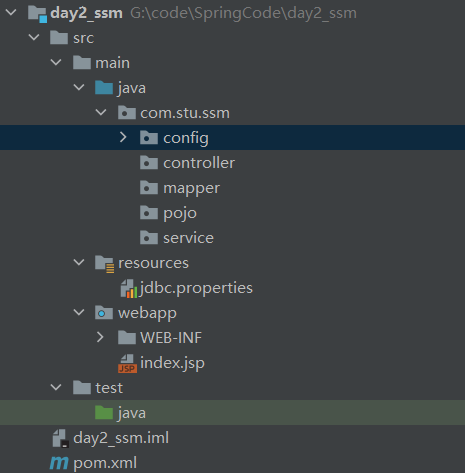

# SSM整合规范

## 目录

-   [大致步骤](#大致步骤)
    -   [一、使用Maven创建ssm项目骨架](#一使用Maven创建ssm项目骨架)
    -   [二、添加相应Maven坐标](#二添加相应Maven坐标)
    -   [三、配置SpringConfig类](#三配置SpringConfig类)
        -   [整合Mybatis需要引入Mybatis相关配置类 @Import](#整合Mybatis需要引入Mybatis相关配置类-Import)
    -   [四、配置SpringMvcConfig类](#四配置SpringMvcConfig类)
    -   [五、配置Web项目入口](#五配置Web项目入口)
        -   [创建Web项目入口配置类](#创建Web项目入口配置类)
    -   [六、功能模块\[与具体的业务模块有关\]](#六功能模块与具体的业务模块有关)

## 大致步骤

### 一、使用Maven创建ssm项目骨架



***

### 二、添加相应Maven坐标

-   在pom.xml中添加相关**相应的Maven坐标**
    ```xml
    <?xml version="1.0" encoding="UTF-8"?>

    <project xmlns="http://maven.apache.org/POM/4.0.0" xmlns:xsi="http://www.w3.org/2001/XMLSchema-instance"
      xsi:schemaLocation="http://maven.apache.org/POM/4.0.0 http://maven.apache.org/xsd/maven-4.0.0.xsd">
      <modelVersion>4.0.0</modelVersion>

      <groupId>com.stu.ssm</groupId>
      <artifactId>day2_ssm</artifactId>
      <version>1.0-SNAPSHOT</version>

      <dependencies>
        <dependency>
          <groupId>org.springframework</groupId>
          <artifactId>spring-webmvc</artifactId>
          <version>5.2.10.RELEASE</version>
        </dependency>

        <dependency>
          <groupId>org.springframework</groupId>
          <artifactId>spring-jdbc</artifactId>
          <version>5.2.10.RELEASE</version>
        </dependency>

        <dependency>
          <groupId>org.springframework</groupId>
          <artifactId>spring-test</artifactId>
          <version>5.2.10.RELEASE</version>
        </dependency>

        <dependency>
          <groupId>org.mybatis</groupId>
          <artifactId>mybatis</artifactId>
          <version>3.5.6</version>
        </dependency>

        <dependency>
          <groupId>org.mybatis</groupId>
          <artifactId>mybatis-spring</artifactId>
          <version>1.3.0</version>
        </dependency>

        <dependency>
          <groupId>mysql</groupId>
          <artifactId>mysql-connector-java</artifactId>
          <version>5.1.47</version>
        </dependency>

        <dependency>
          <groupId>com.alibaba</groupId>
          <artifactId>druid</artifactId>
          <version>1.1.16</version>
        </dependency>

        <dependency>
          <groupId>junit</groupId>
          <artifactId>junit</artifactId>
          <version>4.12</version>
          <scope>test</scope>
        </dependency>

        <dependency>
          <groupId>javax.servlet</groupId>
          <artifactId>javax.servlet-api</artifactId>
          <version>3.1.0</version>
          <scope>provided</scope>
        </dependency>

        <dependency>
          <groupId>com.fasterxml.jackson.core</groupId>
          <artifactId>jackson-databind</artifactId>
          <version>2.9.0</version>
        </dependency>
      </dependencies>

      <build>
        <plugins>
          <plugin>
            <groupId>org.apache.tomcat.maven</groupId>
            <artifactId>tomcat7-maven-plugin</artifactId>
            <version>2.1</version>
            <configuration>
              <port>80</port>
              <path>/</path>
            </configuration>
          </plugin>
        </plugins>
      </build>


    </project>

    ```

***

### 三、配置SpringConfig类

-   **标识该类为配置类 @Configuration**
-   **扫描Service所在的包 @ComponentScan**
-   **在Service层要管理事务 @EnableTransactionManagement**
-   **读取外部的properties配置文件 @PropertySource**

```java
@Configuration
@ComponentScan({"com.stu.ssm.service"})
@PropertySource("classpath:jdbc.properties")
@Import({JdbcConfig.class,MyBatisConfig.class})
@EnableTransactionManagement
public class SpringConfig {
}
```

#### 整合Mybatis需要引入Mybatis相关配置类 @Import

-   第三方数据源配置类 JdbcConfig
    -   构建DataSource数据源，DruidDataSouroce,需要注入数据库连接四要素， @Bean @Value
    -   构建平台事务管理器，DataSourceTransactionManager,@Bean
    ```java
    public class JdbcConfig {
        @Value("${jdbc.driver}")
        private String driver;
        @Value("${jdbc.url}")
        private String url;
        @Value("${jdbc.username}")
        private String username;
        @Value("${jdbc.password}")
        private String password;

        @Bean
        public DataSource dataSource(){
            DruidDataSource dataSource = new DruidDataSource();
            dataSource.setDriverClassName(driver);
            dataSource.setUrl(url);
            dataSource.setUsername(username);
            dataSource.setPassword(password);
            return dataSource;
        }

        @Bean
        public PlatformTransactionManager transactionManager(DataSource dataSource){
            DataSourceTransactionManager ds = new DataSourceTransactionManager();
            ds.setDataSource(dataSource);
            return ds;
        }
    }
    ```
-   Mybatis配置类 MybatisConfig
    -   构建SqlSessionFactoryBean并设置别名扫描与数据源，@Bean
    -   构建MapperScannerConfigurer并设置DAO层的包扫描
    ```java
    public class MyBatisConfig {
        @Bean
        public SqlSessionFactoryBean sqlSessionFactory(DataSource dataSource) {
            SqlSessionFactoryBean factoryBean = new SqlSessionFactoryBean();
            factoryBean.setDataSource(dataSource);
            factoryBean.setTypeAliasesPackage("com.stu.ssm.pojo");
            return factoryBean;
        }

        @Bean
        public MapperScannerConfigurer mapperScannerConfigurer() {
            MapperScannerConfigurer msc = new MapperScannerConfigurer();
            msc.setBasePackage("com.stu.ssm.dao");
            return msc;
        }
    }
    ```

***

### 四、配置SpringMvcConfig类

-   标识该类为配置类 @Configuration
-   扫描Controller所在的包 @ComponentScan
-   开启SpringMVC注解支持 @EnableWebMvc

```java
@Configuration
@ComponentScan("com.stu.ssm.controller")
@EnableWebMvc
public class SpringMvcConfig {
}
```

### 五、配置Web项目入口

#### 创建Web项目入口配置类

-   **代码如下**
    ```java
    public class ServletConfig extends AbstractAnnotationConfigDispatcherServletInitializer {
        //加载Spring配置类
        protected Class<?>[] getRootConfigClasses() {
            return new Class[]{SpringConfig.class};
        }
        //加载SpringMVC配置类
        protected Class<?>[] getServletConfigClasses() {
            return new Class[]{SpringMvcConfig.class};
        }
        //设置SpringMVC请求地址拦截规则
        protected String[] getServletMappings() {
            return new String[]{"/"};
        }
        //设置post请求中文乱码过滤器
        @Override
        protected Filter[] getServletFilters() {
            CharacterEncodingFilter filter = new CharacterEncodingFilter();
            filter.setEncoding("utf-8");
            return new Filter[]{filter};
        }
    }
    ```

### 六、功能模块\[与具体的业务模块有关]

-   创建数据库表
-   根据数据库表创建对应的模型类
-   通过Dao层完成数据库表的增删改查(接口+自动代理)
-   编写Service层\[Service接口+实现类]
    -   @Service
    -   @Transactional
    -   整合Junit对业务层进行单元测试
        -   @RunWith
        -   @ContextConfiguration
        -   @Test
-   编写Controller层
    -   接收请求 @RequestMapping @GetMapping @PostMapping @PutMapping @DeleteMapping
    -   接收数据 简单、POJO、嵌套POJO、集合、数组、JSON数据类型
        -   @RequestParam
        -   @PathVariable
        -   @RequestBody
    -   转发业务层
        -   @Autowired
    -   响应结果
        -   @ResponseBody
