# AOP

## 目录

-   [什么是AOP？](#什么是AOP)
    -   [使用注解开发快速入门](#使用注解开发快速入门)
-   [AOP工程流程](#AOP工程流程)
-   [AOP核心概念](#AOP核心概念)
-   [AOP配置管理](#AOP配置管理)
    -   [AOP切入点表达式](#AOP切入点表达式)
    -   [书写技巧](#书写技巧)
    -   [通知类型](#通知类型)
    -   [获取数据](#获取数据)
    -   [获取异常](#获取异常)
-   [AOP事务管理](#AOP事务管理)
    -   [Spring事务角色](#Spring事务角色)
    -   [Spring事务属性](#Spring事务属性)
    -   [事务传播行为的可选值](#事务传播行为的可选值)

### 什么是AOP？

-   **AOP :  面向切面编程**
-   **OOP ：面向对象编程**
-   **AOP是在不改原有代码的前提下对其进行增强。**

Spring的理念：无入侵式/无侵入式

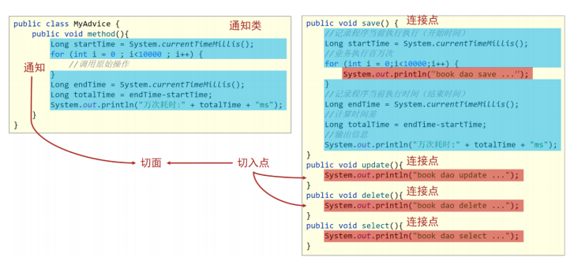

**连接点：** \*\*​`Spring`****的****`AOP`\*\***是对一个类的方法在不进行任何修改的前提下实现增强，可以进行增强的方法叫做连接点**

-   **切入点：对于需要被增强的方法，叫做切入点（匹配连接点的式子）**
    -   一个具体的方法:如com.itheima.dao包下的BookDao接口中的无形参无返回值的save方法
    -   匹配多个方法:所有的save方法，所有的get开头的方法，所有以Dao结尾的接口中的任意方法，所有带有一个参数的方法
    -   连接点范围要比切入点范围大，是切入点的方法也一定是连接点，但是是连接点的方法就不一定要被增强，所以可能不是切入点。

**通知：存放共性的方法，也就是增强的内容（在切入点执行的操作）**

**切面：通知是要增强的内容，会有多个，切入点是需要被增强的方法，也会有多个，那哪个切入点需要添**

**加哪个通知，就需要提前将它们之间的关系描述清楚，切面就是对于通知和切入点之间的关系描述**

**通知类：通知是一个方法，方法不能独立存在需要被写在一个类中**

#### 使用注解开发快速入门

-   **1.导入坐标(pom.xml)**
    ```xml
    <--!这个坐标是导入Spring开发基础框架-->
    <dependency>
            <groupId>org.springframework</groupId>
            <artifactId>spring-context</artifactId>
            <version>5.2.10.RELEASE</version>
        </dependency>
     <--!这个坐标是导入AspectJ的jar包,AspectJ是AOP思想的一个具体实现，
          Spring有自己的AOP实现，但是相比于AspectJ来说比较麻烦，
          所以采用Spring整合ApsectJ的方式进行AOP开发 -->
        <dependency>
            <groupId>org.aspectj</groupId>
            <artifactId>aspectjweaver</artifactId>
            <version>1.9.4</version>
        </dependency>
    ```
-   **2.制作连接点(原始操作，Dao接口与实现类)**

    简单创建一个Dao类并交给Spring容器管理即可
    ```java
    @Repository 
    public class BookDao {
      public void save(){
        System.out.println("Hello AOP!");
      }
    }
    ```
-   **3.制作共性功能(通知类与通知)**
    ```java
    @Component //定义为一个Bean对象给IOC容器管理
     @Aspect //制作为切面,设置当前类为AOP切面类
    public class MyAdvice {
        public void method(){
            System.out.println(System.currentTimeMillis());
        }
    }
    ```
-   **4.定义切入点**
    ```java
    @Component //定义为一个Bean对象给IOC容器管理
     @Aspect //制作为切面,设置当前类为AOP切面类
    public class MyAdvice {
       //设置切入点方法,参数里面写入切入点表达式
        @Pointcut ("execution(void com.stu.dao.BookDao.save())")
       public void pt(){}

     
        public void method(){
            System.out.println(System.currentTimeMillis());
        }
    }
    ```
-   **5.绑定切入点与通知关系(切面)**
    ```java
    @Component //定义为一个Bean对象给IOC容器管理
     @Aspect //制作为切面,设置当前类为AOP切面类
    public class MyAdvice {
       //设置切入点方法,参数里面写入切入点表达式
        @Pointcut ("execution(void com.stu.dao.BookDao.save())")
       public void pt(){}

        //设置当前通知方法与切入点之间的绑定关系，
        //当前通知方法在原始切入点方法前运行
         @Before("pt()") 
        public void method(){
            System.out.println(System.currentTimeMillis());
        }
    }
    ```

| 标签名                       | 类型    | 作用                                    |
| ------------------------- | ----- | ------------------------------------- |
| `@EnableAspectJAutoProxy` | 配置类注解 | 开启注解格式AOP功能                           |
| `@Aspect`                 | 类注解   | 设置当前类为AOP切面类                          |
| `@Pointcut`               | 方法注解  | 设置切入点方法                               |
| `@Before`                 | 方法注解  | 设置当前通知方法与切入点之间的绑定关系，当前通知方法在原始切入点方法前运行 |

### AOP工程流程

-   流程1：`Spring`容器启动
    -   容器启动就需要去加载`bean`,哪些类需要被加载呢?
    -   需要被增强的类，如:`BookDao`
    -   通知类，如:`MyAdvice`
        注意此时`bean`对象还没有创建成功
-   流程2：读取所有配置中的切入点
    ```java
    @Component//定义为一个Bean对象给IOC容器管理
    @Aspect//制作为切面,设置当前类为AOP切面类
    public class MyAdvice {
       //设置切入点方法,参数里面写入切入点表达式
       @Pointcut("execution(void com.stu.dao.BookDao.save())")
       public void pt(){}

        @Pointcut("execution(void com.stu.dao.BookDao.cry())")
        public void ptx(){}//这个切入点没有被使用，所以不会被读取
        
        //设置当前通知方法与切入点之间的绑定关系，
        //当前通知方法在原始切入点方法前运行
        @Before("pt()")
        public void method(){
            System.out.println(System.currentTimeMillis());
        }
    }
    ```
-   流程3：初始化`bean`

    判定bean对应的类中的方法是否匹配到任意切入点
    -   注意第1步在容器启动的时候，`bean`对象还没有被创建成功。
    -   要被实例化`bean`对象的类中的方法和切入点进行匹配
        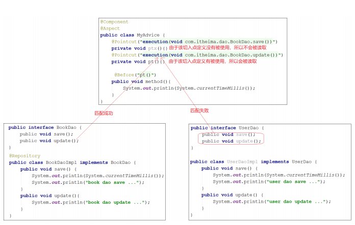
    匹配失败，创建原始对象,如`UserDao`
    -   匹配失败说明不需要增强，直接调用原始对象的方法即可。
        匹配成功，创建原始对象（目标对象）的代理对象,如: `BookDao`
    -   匹配成功说明需要对其进行增强
    -   对哪个类做增强，这个类对应的对象就叫做目标对象
    -   因为要对目标对象进行功能增强，而采用的技术是动态代理，所以会为其创建一个代理对象
    -   最终运行的是代理对象的方法，在该方法中会对原始方法进行功能增强
-   流程4：获取`bean`执行方法
    -   获取的`bean`是原始对象时，调用方法并执行，完成操作
    -   获取的`bean`是代理对象时，根据代理对象的运行模式运行原始方法与增强的内容，完成操作

***

### AOP核心概念

-   目标对象`(Target)`：原始功能去掉共性功能对应的类产生的对象，这种对象是无法直接完成最终工作的
-   代理`(Proxy)`：目标对象无法直接完成工作，需要对其进行功能回填，通过原始对象的代理对象实现

目标对象就是要增强的类\[如:`BookServiceImpl`类]对应的对象，也叫原始对象，不能说它不能运行，只能说它在运行的过程中对于要增强的内容是缺失的。

`SpringAOP`是在不改变原有设计(代码)的前提下对其进行增强的，它的底层采用的是代理模式实现的，所以要对原始对象进行增强，就需要对原始对象创建代理对象，在代理对象中的方法把通知\[如:`MyAdvice`中的`method方法`]内容加进去，就实现了增强,这就是我们所说的代理`(Proxy)`。

**SpringAOP的本质或者可以说底层实现是通过代理模式。**

***

### AOP配置管理

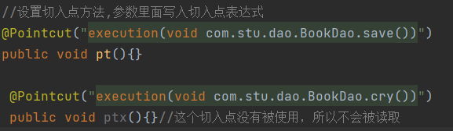

#### AOP切入点表达式

语法格式

&#x20;       切入点表达式标准格式：动作关键字(访问修饰符 返回值 包名.类/接口名.方法名(参数) 异常名）

例子讲解：

```java
execution(public Book com.stu.dao.BookDao.save(Book))
```

-   `execution`：动作关键字，描述切入点的行为动作，例如`execution`表示执行到指定切入点
-   `public`:访问修饰符,还可以是`public`，`private`等，可以省略
-   `User`：返回值，写返回值类型
-   `com.stu.dao`：包名，多级包使用点连接
-   `BookDao`:类/接口名称
-   `save`：方法名
-   `User`:参数，直接写参数的类型，多个类型用逗号隔开
-   异常名：方法定义中抛出指定异常，可以省略

切入点表达式就是要找到需要增强的方法，所以它就是对一个具体方法的描述，但是方法的定义会有很多。**使用****通配符****可以加速对某类方法进行增强**

通配符

-   **\*** : 单个独立的任意符号，可以独立出现，也可以作为前缀或者后缀的匹配符出现

```java
execution(public * com.stu.*.BookDao.find*(*))
```

匹配`com.stu`包下的任意包中的`BookDao`类或接口中所有以`find`开头的带有一个参数的方法

-   **..** : 多个连续的任意符号，可以独立出现，常用于简化包名与参数的书写

```java
execution（public User com..UserService.findById(..))
```

匹配`com`包下的任意包中的`UserService`类或接口中所有名称为`findById`的方法

-   \*\*+ \*\*: 专用于匹配子类类型

```java
execution(* *..*Service+.*(..))
```

这个使用率较低，描述子类的，一般做JavaEE开发，继承机会就一次，使用都很慎重，所以很少用它。`*Service+`，表示所有以`Service`结尾的接口的子类

**开发常用**：

```java
execution(* com.stu.*. Service.find (..))
```

-   将项目中所有业务层方法的以find开头的方法匹配

```java
execution(* com.stu.*. Service.save (..))
```

-   将项目中所有业务层方法的以save开头的方法匹配

***

#### 书写技巧

-   所有代码按照标准规范开发，否则以下技巧全部失效
-   描述切入点通常描述接口，而不描述实现类,如果描述到实现类，就出现紧耦合了
-   访问控制修饰符针对接口开发均采用`public`描述（可省略访问控制修饰符描述）
-   返回值类型对于增删改类使用精准类型加速匹配，对于查询类使用\*通配快速描述
-   包名书写尽量不使用..匹配，效率过低，常用\*做单个包描述匹配，或精准匹配
-   接口名/类名书写名称与模块相关的采用\*\*匹配，例如\*\*`UserService`\**书写成*`*Service`，绑定业务层接口名
-   方法名书写以动词进行精准匹配，名词采用匹配，例如`getById`书写成`getBy`,`selectAll`书写成`select`
-   参数规则较为复杂，根据业务方法灵活调整
-   通常不使用异常作为匹配规则

***

#### 通知类型

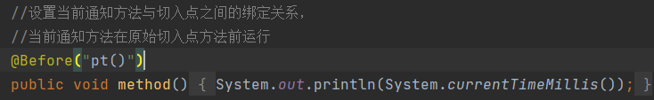

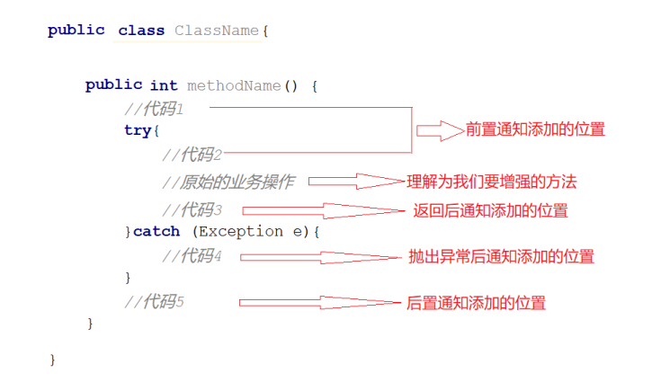

(1)  前置通知，追加功能到方法执行前,类似于在代码1或者代码2添加内容

(2)  后置通知,追加功能到方法执行后,不管方法执行的过程中有没有抛出异常都会执行，类似于在代码5添加内容

(3)  返回后通知,追加功能到方法执行后，只有方法正常执行结束后才进行,类似于在代码3添加内容，如果方法执行抛出异常，返回后通知将不会被添加

(4)  抛出异常后通知,追加功能到方法抛出异常后，只有方法执行出异常才进行,类似于在代码4添加内容，只有方法抛出异常后才会被添加

(5)  环绕通知,环绕通知功能比较强大，它可以追加功能到方法执行的前后，这也是比较常用的方式，它可以实现其他四种通知类型的功能

-   前置通知
-   后置通知

    
-   环绕通知(重点)

    **环绕通知**的基本使用
    ```java
    @Component//定义为一个Bean对象给IOC容器管理
    @Aspect//制作为切面,设置当前类为AOP切面类
    public class MyAdvice {
       //设置切入点方法,参数里面写入切入点表达式
       @Pointcut("execution(void com.stu.dao.BookDao.save())")
       public void pt(){}

        @Pointcut("execution(void com.stu.dao.BookDao.cry())")
        public void ptx(){}//这个切入点没有被使用，所以不会被读取

        //设置当前通知方法与切入点之间的绑定关系，
        //当前通知方法为环绕通知    
         @Around ("pt()")
        public void method(ProceedingJoinPoint pjp) throws Throwable {
            System.out.println("Hello!");
            pjp.proceed();
            System.out.println("Bye!");
        }
    }
    ```
    说明:`proceed()`为什么要抛出异常?

    原因很简单，看下源码就知道了

    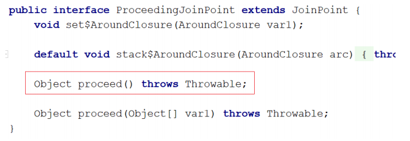

    **运行结果：**

    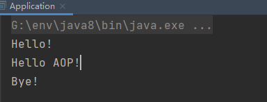

    ps : **带有返回类型的环绕通知**
    ```java
    @Component//定义为一个Bean对象给IOC容器管理
    @Aspect//制作为切面,设置当前类为AOP切面类
    public class MyAdvice {
       //设置切入点方法,参数里面写入切入点表达式
       @Pointcut("execution(void com.stu.dao.BookDao.save())")
       //void就是返回Null
       public void pt(){}

        @Pointcut("execution(int com.stu.dao.BookDao.select())")
        public void ptx(){}//这个切入点没有被使用，所以不会被读取

        //设置当前通知方法与切入点之间的绑定关系，
        //当前通知方法为环绕通知    
         @Around ("ptx()")
        public Object aroundSelect(ProceedingJoinPoint pjp) throws Throwable {
            System.out.println("Hello!");
            //表示对原始操作的调用
            Object ret = pjp.proceed();
            System.out.println("Bye!");
            return ret;
        }
    }
    ```
    细节： 为什么返回的是`Object`而不是`int`的主要原因是`Object`类型更通用。  &#x20;

    &#x20;          在环绕通知中是可以对原始方法返回值就行修改的。

    **环绕通知注意事项**
    1.  环绕通知必须依赖形参`ProceedingJoinPoint`才能实现对原始方法的调用，进而实现原始方法调用前后同时添加通知
    2.  通知中如果未使用`ProceedingJoinPoint`对原始方法进行调用将跳过原始方法的执行3. 对原始方法的调用可以不接收返回值，通知方法设置成`void`即可，如果接收返回值，最好设定为`Object`类型
    3.  原始方法的返回值如果是`void`类型，通知方法的返回值类型可以设置成`void`,也可以设置成`Object`
    4.  由于无法预知原始方法运行后是否会抛出异常，因此环绕通知方法必须要处理`Throwable`异常
-   返回后通知(了解)

    **返回后通知**
    ```java
    @Component//定义为一个Bean对象给IOC容器管理
    @Aspect//制作为切面,设置当前类为AOP切面类
    public class MyAdvice {
       //设置切入点方法,参数里面写入切入点表达式
       @Pointcut("execution(void com.stu.dao.BookDao.save())")
       public void pt(){}

        @Pointcut("execution(void com.stu.dao.BookDao.cry())")
        public void ptx(){}//这个切入点没有被使用，所以不会被读取

        //设置当前通知方法与切入点之间的绑定关系，
        @AfterReturning("pt()")
        public void method() throws Throwable {
            System.out.println("Hello!");
        }
    }
    ```
    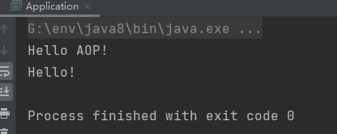

    注意：返回后通知是需要在原始方法select正常执行后才会被执行，如果select()方法执行的过程中出现了异常，那么返回后通知是不会被执行。后置通知是不管原始方法有没有抛出异常都会被执行。
-   抛出异常后通知(了解)
    ```java
    @Repository
    public class BookDao {
        public void save(){
            System.out.println("Hello AOP!");
        }

        public void cry(){

            System.out.println("Cry");
        }

        public int select()throws Exception{
            System.out.println("bookDao select is running");
            int i = 1 / 0;
            return i;
        }
    }
    ```
    ```java
    @Component//定义为一个Bean对象给IOC容器管理
    @Aspect//制作为切面,设置当前类为AOP切面类
    public class MyAdvice {
       //设置切入点方法,参数里面写入切入点表达式
       @Pointcut("execution(void com.stu.dao.BookDao.save())")
       public void pt(){}

        @Pointcut("execution(int com.stu.dao.BookDao.select())")
        public void pt2(){}

        //设置当前通知方法与切入点之间的绑定关系，
        @AfterThrowing()  {
            System.out.println("afterThrowing advice ...");
        }
    }
    ```
    **注意**：异常后通知是需要原始方法抛出异常，可以在`select()`方法中添加一行代码`int i = 1/0`即可。如果没有抛异常，异常后通知将不会被执行。

***

#### 获取数据

-   **非环绕通知获取方法形参数据**

    在方法上添加参数`JoinPoint`,通过`JoinPoint`来获取参数

    因为参数的个数是不固定的，所以使用数组更通配些
    ```java
    //非环绕通知获取参数值
      @Before("pt2()")
      public void before(JoinPoint jp) {
        Object[] args = jp.getArgs();
        System.out.println(Arrays.toString(args));
        System.out.println("before advice ..." );
      }
    ```
-   **环绕通知获取方法形参数据**

    在方法上添加参数`ProceedingJoinPoint`，因为`ProceedingJoinPoint`是`JoinPoint`类的子类，所以对于`ProceedingJoinPoint`类中应该也会有对应的`getArgs()`方法
    ```java
    //环绕通知获取参数值
        @Around("pt2()")
        public Object around(ProceedingJoinPoint pjp) throws Throwable {
            Object[] args = pjp.getArgs();
            System.out.println(Arrays.toString(args));
            Object ret =  pjp.proceed();
            return  ret;
        }
    ```
    注意：`pjp.proceed()`方法是有两个构造方法，分别是

    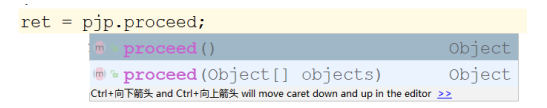
    -   调用无参数的`proceed`，当原始方法有参数，会在调用的过程中自动传入参数
    -   所以调用这两个方法的任意一个都可以完成功能
    -   但是当需要修改原始方法的参数时，就只能采用带有参数的方法,如下:
    ```java
    //环绕通知获取参数值
        @Around("pt2()")
        public Object around(ProceedingJoinPoint pjp) throws Throwable {
            Object[] args = pjp.getArgs();
            System.out.println(Arrays.toString(args));
            args[0] = 666;
            Object ret =  pjp.proceed();
            return  ret;
        }
    }
    ```
    **有了这个特性后，我们就可以在环绕通知中对原始方法的参数进行拦截过滤，避免由于参数的问题导致程序无法正确运行，保证代码的健壮性。**
-   **获取值数据返回值**
    -   **环绕通知获取返回值**
        ```java
        //环绕通知获取参数值
            @Around("pt2()")
            public Object around(ProceedingJoinPoint pjp) throws Throwable {
                Object[] args = pjp.getArgs();
                System.out.println(Arrays.toString(args));
                args[0] = 666;
                Object ret =  pjp.proceed();
                return  ret;
            }
        }
        ```
        上述代码中，ret就是方法的返回值，我们是可以直接获取，不但可以获取，如果需要还可以进行修改
    -   返回后通知获取返回值
        ```java
            @Pointcut("execution(* com.stu.dao.BookDao.findName(..))")
            private void ptxxx(){}

            @AfterReturning(value = "ptxxx()",returning = "ret")
            public void afterReturning(Object ret){
                System.out.println("afterReturning advice  ... " + ret);
                }
            }
        ```
        注意：

        (1)参数名的问题

        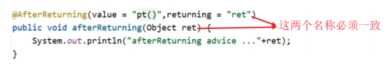

        (2)afterReturning方法参数类型的问题

        参数类型可以写成`String`，但是为了能匹配更多的参数类型，建议写成`Object`类型

        (3)`afterReturning`方法参数的顺序问题

        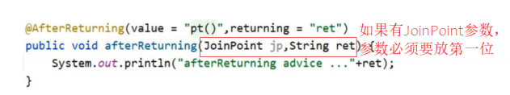

        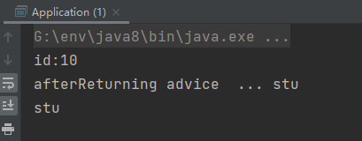

#### 获取异常

-   **环绕通知获取异常**

    在增强的方法里写上`try-catch`语句将`pjp.proceed(..)`包含起来处理即可。
    ```java
        @Pointcut("execution(* com.stu.dao.BookDao.findName(..))")
        public void pt2(){}//这个切入点没有被使用，所以不会被读取
    //环绕通知获取参数值
        @Around("pt2()")
        public Object around(ProceedingJoinPoint pjp) throws Throwable {
            Object[] args = pjp.getArgs();
            System.out.println(Arrays.toString(args));
            args[0] = 666;
            Object ret = null;
            try{
                ret =  pjp.proceed();
            }catch (Throwable throwable){
                throwable.printStackTrace();
            }
            return  ret;
        }
    }
    ```
-   **抛出异常后通知获取异常**
    ```java
        @Pointcut("execution(* com.stu.dao.BookDao.findName(..))")
        private void ptxxx(){}

        @AfterThrowing(value = "ptxxx()",throwing = "t")
        public void afterThrowing(Throwable t){
            System.out.println("afterThrowing advice ..."+t);
         }
    ```
    如何让原始方法抛出异常，方式有很多...
    ```java
       if(true){ throw new NullPointerException(); }
    ```
    **注意 :**

    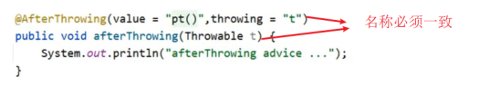

    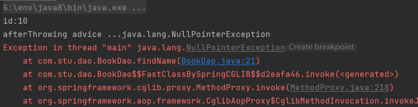

***

### AOP事务管理

`Spring`事务作用：在数据层或业务层保障一系列的数据库操作同成功同失败

`Spring`为了管理事务，提供了一个平台事务管理器`PlatformTransactionManager`

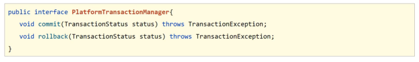

`commit`是用来提交事务，`rollback`是用来回滚事务。

`PlatformTransactionManager`只是一个接口，`Spring`还为其提供了一个具体的实现：

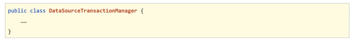

从名称上可以看出，只需要给它一个`DataSource`对象，它就可以在业务层管理事务。其内部采用的是`JDBC`的事务。如果持久层采用的是`JDBC`相关的技术，就可以采用这个事务管理器来管理事务。而`Mybatis`内部采用的就是`JDBC`的事务，所以后期`Spring`整合`Mybatis`就采用的这个`DataSourceTransactionManager`事务管理器。

使用步骤：

step1：添加`@Transactional`标签

标签写在接口类上、接口方法上、实现类上和实现类方法上

-   写在接口类上，该接口的所有实现类的所有方法都会有事务
-   写在接口方法上，该接口的所有实现类的该方法都会有事务
-   写在实现类上，该类中的所有方法都会有事务
-   写在实现类方法上，该方法上有事务
-   建议写在实现类或实现类的方法上

step2: 在`JdbcConfig`配置类中配置事务管理器

```java
    @Bean
    public PlatformTransactionManager transactionManager(DataSource dataSource){
        DataSourceTransactionManager transactionManager = new DataSourceTransactionManager();
        transactionManager.setDataSource(dataSource);
        return  transactionManager;
    }
```

step3：在`SpringConfig`配置类开启事务注解

```java
//开启注解式事务驱动 
 @EnableTransactionManagement
```

**@EnableTransactionManagement**

-   类型：配置类注解
-   位置：配置类定义上方
-   作用：设置当前Spring环境中开启注解式事务支持

**@Transactional**

类型：接口/类/方法注解

位置：业务层接口上方，业务层实现类上方，业务方法上方

作用：为当前业务层方法添加事务（如果设置在类或接口上方则类或接口中所有方法均添加事务）

#### Spring事务角色

未开启`Spring`事务之前

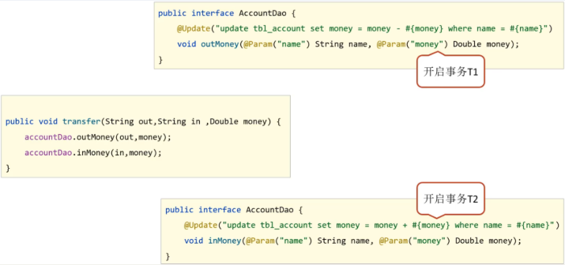

-   AccountDao的outMoney因为是修改操作，会开启一个事务T1
-   AccountDao的inMoney因为是修改操作，会开启一个事务T2
-   AccountService的transfer没有事务，
    -   运行过程中如果没有抛出异常，则T1和T2都正常提交，数据正确
    -   如果在两个方法中间抛出异常，T1因为执行成功提交事务，T2因为抛异常不会被执行
    -   就会导致数据出现错误

开启`Spring`的事务管理后

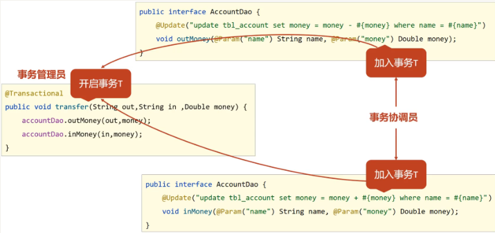

-   transfer上添加了@Transactional注解，在该方法上就会有一个事务T
-   AccountDao的outMoney方法的事务T1加入到transfer的事务T中
-   AccountDao的inMoney方法的事务T2加入到transfer的事务T中
-   这样就保证他们在同一个事务中，当业务层中出现异常，整个事务就会回滚，保证数据的准确性。

**事务角色**

-   事务管理员：发起事务方，在Spring中通常指代业务层开启事务的方法
-   事务协调员：加入事务方，在Spring中通常指代数据层方法，也可以是业务层方法

目前的事务管理是基于`DataSourceTransactionManager`和`SqlSessionFactoryBean`使用的是同一个数据源。

#### Spring事务属性

事务配置

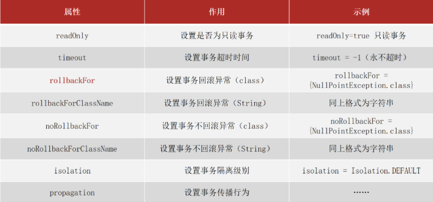

上面这些属性都可以在`@Transactional`注解的参数上进行设置。

-   `readOnly`：true只读事务，false读写事务，增删改要设为false,查询设为true。
-   `timeout`:设置超时时间单位秒，在多长时间之内事务没有提交成功就自动回滚，-1表示不设置超时时间。
-   rollbackFor:当出现指定异常进行事务回滚
-   noRollbackFor:当出现指定异常不进行事务回滚
    -   思考:出现异常事务会自动回滚，这个是我们之前就已经知道的
    -   noRollbackFor是设定对于指定的异常不回滚，这个好理解
    -   rollbackFor是指定回滚异常，对于异常事务不应该都回滚么，为什么还要指定?
        -   这块需要更正一个知识点，并不是所有的异常都会回滚事务，比如下面的代码就不会回滚
        ```java
        public interface AccountService {
            /**
             * 转账操作
             * @param out 传出方
             * @param in 转入方
             * @param money 金额
             */
            //配置当前接口方法具有事务
            public void transfer(String out,String in ,Double money) throws IOException;
        }

        @Service
        public class AccountServiceImpl implements AccountService {

            @Autowired
            private AccountDao accountDao;
          @Transactional
            public void transfer(String out,String in ,Double money) throws IOException{
                accountDao.outMoney(out,money);
                //int i = 1/0; //这个异常事务会回滚
                if(true){
                    throw new IOException(); //这个异常事务就不会回滚
                }
                accountDao.inMoney(in,money);
            }

        }
        ```
        出现这个问题的原因是，Spring的事务只会对`Error异常`和`RuntimeException异常`及其子类进行事务回滚，其他的异常类型是不会回滚的，对应IOException不符合上述条件所以不回滚
        -   此时就可以使用rollbackFor属性来设置出现IOException异常不回滚
        ```java
        @Service
        public class AccountServiceImpl implements AccountService {

            @Autowired
            private AccountDao accountDao;
           @Transactional(rollbackFor = {IOException.class})
            public void transfer(String out,String in ,Double money) throws IOException{
                accountDao.outMoney(out,money);
                //int i = 1/0; //这个异常事务会回滚
                if(true){
                    throw new IOException(); //这个异常事务就不会回滚
                }
                accountDao.inMoney(in,money);
            }

        }
        ```
    -   rollbackForClassName等同于rollbackFor,只不过属性为异常的类全名字符串
    -   noRollbackForClassName等同于noRollbackFor，只不过属性为异常的类全名字符串
    -   isolation设置事务的隔离级别
        -   DEFAULT :默认隔离级别, 会采用数据库的隔离级别
        -   READ\_UNCOMMITTED : 读未提交
        -   READ\_COMMITTED : 读已提交
        -   REPEATABLE\_READ : 重复读取
        -   SERIALIZABLE: 串行化
            事务传播行为：事务协调员对事务管理员所携带事务的处理态度。
    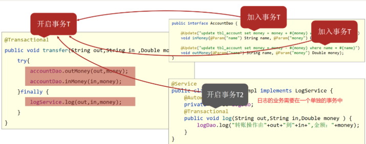

    改变事务的传播行为：使用`propagation属性`

    修改logService改变事务的传播行为
    ```java
    @Service
    public class LogServiceImpl implements LogService {

        @Autowired
        private LogDao logDao;
      //propagation设置事务属性：传播行为设置为当前操作需要新事务
        @Transactional(propagation = Propagation.REQUIRES_NEW)
        public void log(String out,String in,Double money ) {
            logDao.log("转账操作由"+out+"到"+in+",金额："+money);
        }
    }
    ```
    #### 事务传播行为的可选值
    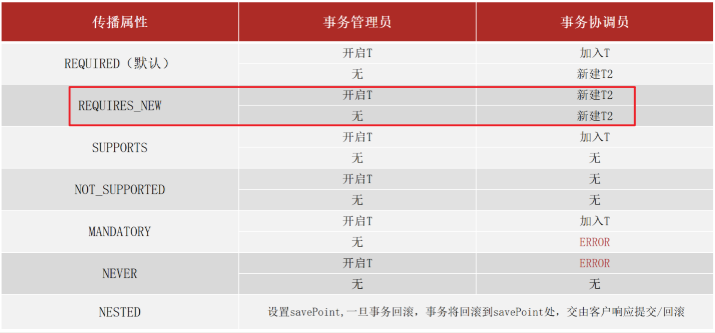

    对于我们开发实际中使用的话，因为默认值需要事务是常态的。根据开发过程选择其他的就可以了，例如案例中需要新事务就需要手工配置。其实入账和出账操作上也有事务，采用的就是默认值。
