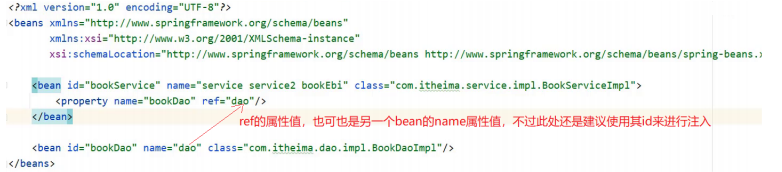
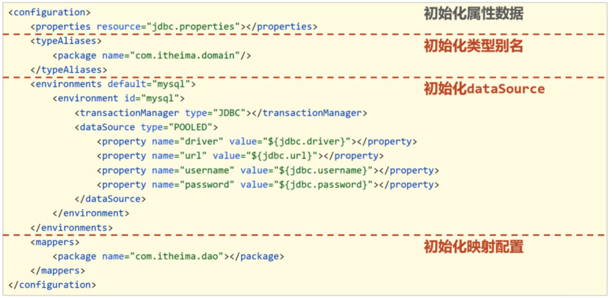

# IOC

## 目录

-   [Spring和IOC之间的关系：](#Spring和IOC之间的关系)
-   [  (1)什么IOC/DI思想?](#--1什么IOCDI思想)
-   [  (2)什么是IOC容器?](#--2什么是IOC容器)
-   [  (3)什么是Bean?](#--3什么是Bean)
    -   [bean基础配置](#bean基础配置)
    -   [bean实例化](#bean实例化)
    -   [bean的生命周期](#bean的生命周期)
-   [(4)DI（Dependency Injection）依赖注入](#4DIDependency-Injection依赖注入)
    -   [Spring中的注入方式](#Spring中的注入方式)
    -   [自动配置](#自动配置)
    -   [  集合注入](#--集合注入)
-   [(5)管理第三方Bean（传统方式）](#5管理第三方Bean传统方式)
-   [核心容器](#核心容器)
    -   [(1)容器的创建方式](#1容器的创建方式)
    -   [(2)Bean的三种获取方式](#2Bean的三种获取方式)
    -   [(3)容器类层次结构](#3容器类层次结构)
-   [IOC/DI注解开发](#IOCDI注解开发)
    -   [纯注解开发](#纯注解开发)
    -   [注解开发bean作用范围与生命周期管理](#注解开发bean作用范围与生命周期管理)
    -   [注解开发依赖注入](#注解开发依赖注入)
    -   [注解开发注入简单数据类型、注解读取properties配置文件](#注解开发注入简单数据类型注解读取properties配置文件)
    -   [注解开发管理第三方Bean](#注解开发管理第三方Bean)
    -   [注解开发为第三方Bean对象注入资源](#注解开发为第三方Bean对象注入资源)
    -   [纯注解开发小结](#纯注解开发小结)
-   [案例](#案例)
    -   [Spring整合Mybatis](#Spring整合Mybatis)
    -   [Spring整合Junit](#Spring整合Junit)

***

### **Spring和IOC之间的关系：**

-   **Spring技术对IOC思想进行了实现**
-   **Spring提供了一个容器，称为****IOC容器****，用来充当IOC思想中的"外部"**
-   **IOC思想中的别人\[外部]指的就是Spring的IOC容器**

***

### &#x20; **(1)什么IOC/DI思想?**

**IOC:控制反转，控制反转的是对象的创建权**

**DI:依赖注入，绑定对象与对象之间的依赖关系**

***

### &#x20; **(2)什么是IOC容器?**

**Spring创建了一个容器用来存放所创建的对象，这个容器就叫IOC容器**

***

### &#x20; **(3)什么是Bean?**

**容器中所存放的一个个对象就叫Bean或Bean对象**

#### **bean基础配置**

-   **1. bean的id 与class属性**
    ```xml
    <bean id = "" class = ""/>
    ```
    

    **思考：**

    **class属性能不能写接口如BookDao的类全名呢?**

    **答案：肯定是不行，因为接口是没办法创建对象的。**

    **前面提过为bean设置id时，id必须唯一，但是如果由于命名习惯而产生了分歧后，该如何解决?**

    **答案：给bean标签起别名**
-   **2. bean的name属性**

    

    **step1 ： 配置别名**

    **打开spring的配置文件 applicationContext.xml**
    ```xml
    <?xml version="1.0" encoding="UTF-8"?> 
    <beans xmlns="http://www.springframework.org/schema/beans" 
    xmlns:xsi="http://www.w3.org/2001/XMLSchema-instance" 
    xsi:schemaLocation="http://www.springframework.org/schema/beans 
    http://www.springframework.org/schema/beans/spring-beans.xsd"> 
    <!--name:为bean指定别名，别名可以有多个，使用逗号，分号，空格进行分隔--> 
       <bean id="bookService" name="service service4 bookEbi"
           class="com.itheima.service.impl.BookServiceImpl"> 
          <property name="bookDao" ref="bookDao"/> 
       </bean>
      <!--scope：为bean设置作用范围，可选值为单例singloton，非单例prototype--> 
      <bean id="bookDao" name="dao" class="com.itheima.dao.impl.BookDaoImpl"/> 
      </beans>
    ```
    **说明:Ebi全称Enterprise Business Interface，翻译为企业业务接口**

    **step2 : 根据名称容器中获取bean对象**
    ```java
    public class AppForName {
     public static void main(String[] args) { 
             ApplicationContext ctx = new 
                   ClassPathXmlApplicationContext("applicationContext.xml"); 
     //此处根据bean标签的id属性和name属性的任意一个值来获取bean对象 
             BookService bookService = (BookService) ctx.getBean("service4"); 
             bookService.save(); 
         } 
     }
    ```
-   **3.bean作用范围scope配置**

    

    **默认情况下，Spring创建的bean对象都是单例的**

    **配置bean为非单例：**
    -   **在spring的配置文件中修改\<bean>标签的scope属性**
    ```xml
    <bean id="bookDao" name="dao" class="com.itheima.dao.impl.BookDaoImpl" 
       scope=""/>

    ```
    -   **scpoe设置为singleton****（默认单例）** ​
    ```xml
    <bean id="bookDao" name="dao" class="com.itheima.dao.impl.BookDaoImpl" 
       scope="singleton"/>

    ```
    -   **scpoe设置为prototype****（非单例）** ​
    ```xml
    <bean id="bookDao" name="dao" class="com.itheima.dao.impl.BookDaoImpl" 
       scope="prototype"/>
    ```
    **为什么bean默认为单例?**
    -   **bean为单例的意思是在Spring的IOC容器中只会有该类的一个对象**
    -   **bean对象只有一个就避免了对象的频繁创建与销毁，达到了bean对象的复用，性能高****bean在容器中是单例的，会不会产生线程安全问题?**
    -   **如果对象是有状态对象，即该对象有成员变量可以用来存储数据的，因为所有请求线程共用一个bean对象，所以会存在线程安全问题。**
    -   **如果对象是无状态对象，即该对象没有成员变量没有进行数据存储的，因方法中的局部变量在方法调用完成后会被销毁，所以不会存在线程安全问题。****哪些bean对象适合交给容器进行管理?**
    -   **表现层对象**
    -   **业务层对象**
    -   **数据层对象**
    -   **工具对象****哪些bean对象不适合交给容器进行管理?**
    -   **封装实例的域对象，因为会引发线程安全问题，所以不适合。**
-   **注意事项**

    **bean依赖注入的ref属性指定bean，必须在容器中存在**

    

    **如果不存在，则会报错**

    

    **这个错误大家需要特别关注下:**

    

    **获取bean无论是通过id还是name获取，如果无法获取到，将抛出异常**

    **NoSuchBeanDefinitionException**

#### bean实例化

-   **bean的三种实例方式**
    -   **一、实例化bean的三种方式：构造方法,静态工厂和实例工厂**
    -   **二、构造方法实例化**

        **：在****自定义类的实现类****中提供一个无参构造函数，Spring容器在创建对象的时候也走的是构造函数，无论类的构造方法是否为私有，因为Spring底层使用的是反射，不受权限的管控**
    -   **三、静态工厂实例化**

        **step1：创建工厂类并提供一个静态方法**
        ```java
        //静态工厂创建对象 
        public class OrderDaoFactory {
             public static OrderDao getOrderDao(){ 
                 return new OrderDaoImpl();
            } 
         }
        ```
        **step2：在使用类中通过工厂获取对象**

        编写AppForInstanceOrder运行类，在类中通过工厂获取对象
        ```java
        public class AppForInstanceOrder { 
            public static void main(String[] args) {
         //通过静态工厂创建对象
              OrderDao orderDao = OrderDaoFactory.getOrderDao(); 
              orderDao.save(); 
              } 
          }
        ```
        **step3：在配置文件中添加如下内容**
        ```xml
        <bean id = "orderDao" class = "com.xxxx.factory.OrderDaoFactory" 
        factory-method = "getOrderDao"/>
        ```
        **class:工厂类的类全名**

        **factory-mehod:具体工厂类中创建对象的方法名**

        **对应关系如下图:**

        

        在工厂的静态方法中，除了new对象还可以做其他的一些业务操作，这些操作必不可少
        ```java
         public class OrderDaoFactory { 
            public static OrderDao getOrderDao(){ 
              System.out.println("factory setup....");//模拟必要的业务操作 
                return new OrderDaoImpl(); 
             } 
          }
        ```
    -   **四、实例工厂实例化**

        **创建一个工厂类UserDaoFactory并提供一个普通方法，注意此处和静态工厂的工厂类不一样的地方是方法不是静态方法**
        ```java
         public class UserDaoFactory { 
            public UserDao getUserDao(){  
                return new UserDaoImpl(); 
             } 
          }
        ```
        **最重要：在spring的配置文件中添加以下内容：**
        ```xml
        <bean id = "userFactory" class = "com.xxxx.factory.UserDaoFactory"/>

        <bean id = "userDao" factory-method = "getUserDao" factory-bean = "userFactory"/>
        ```
        **实例化工厂运行顺序**
        -   **创建实例化对象，对应的是第一行的配置**
        -   **调用对象中的方法来创建bean，对应的是第二行配置**
        1.  **factory-bean：工厂的实例化对象**
        2.  **factory-method：工厂对象的具体创建对象的方法名，对应关系如下：**
    -   **五、Spring为了实例化工厂配置方式提供了一种叫FactoryBean的方式来简化开发**

        **使用FactoryBean的使用**

        **(1) 创建一个自定义FacoryBean类实现FactoryBean接口，重写接口方法**
        ```java
        public class UserDaoFactoryBean implements FactoryBean<UserDao> { 
           //代替原始实例工厂中创建对象的方法 
            public UserDao getObject() throws Exception { 
               return new UserDaoImpl(); 
                }
           //返回所创建类的Class对象 
            public Class<?> getObjectType() { 
               return UserDao.class; 
                } 
            }
        ```
        **(2)在spring的配置文件中配置**
        ```xml
         <bean id="userDao" class="com.itheima.factory.UserDaoFactoryBean"/>
        ```

**FactoryBean接口**

-   **FactoryBean接口其实会有三个方法**

```java
    T getObject() thorws Exception;
    
    Class<T> getObjectType();
    
    default boolen isSingleton(){
        return true;
    }
```

**方法一:getObject()，被重写后，在方法中进行对象的创建并返回**

**方法二:getObjectType(),被重写后，主要返回的是被创建类的Class对象**

**方法三:没有被重写，因为它已经给了默认值，从方法名中可以看出其作用是设置对象是否为单例，默认true默认应该是单例**

#### bean的生命周期

**1)关于Spring中对bean生命周期控制提供了两种方式:**

-   在配置文件中的bean标签中添加init-method和destroy-method属性
-   类实现InitializingBean与DisposableBean接口，这种方式了解下即可。

**2)对于bean的生命周期控制在bean的整个生命周期中所处的位置如下:**

-   **初始化容器**

1.  创建对象(内存分配)
2.  执行构造方法
3.  执行属性注入(set操作)
4.  执行bean初始化方法

-   **使用bean**

1.  执行业务操作

-   **关闭/销毁容器**

1.  执行bean销毁方法

**3)关闭容器的两种方式:**

-   **ConfigurableApplicationContext是ApplicationContext的子类**

1.  close()方法
2.  registerShutdownHook()方法

***

***

### (4)DI（Dependency Injection）依赖注入


**在容器中建立bean与bean之间的依赖关系的整个过程，称为依赖注入**

**业务层要用数据层的类对象，以前是自己new的，现在自己不new了，靠别人\[外部其实指的就是IOC容器]来给注入进来，这种思想就是依赖注入**

#### Spring中的注入方式

-   **普通方法(set方法)**

    **可以注入简单类型（包括String类型）和引用类型**

    **step1**:**在bean中定义引用类型属性，并提供可访问的setter方法**
    ```java
    public class BookServiceImpl implements BookService{
        private BookDao bookDao ;

        public void setBookDao(BookDao bookDao) {
            this.bookDao = bookDao;
        }
    }
    ```
    **step2**:**配置中使用****property****标签ref属性注入引用类型对象**
    ```xml
     <bean id = "bookDao" class="com.stu.dao.BookDaoImpl"></bean>
        <bean id="bookService" class="com.stu.service.BookServiceImpl">
            <property name="bookDao" ref="bookDao"></property>
        </bean>
    ```
    **如果是注入简单类型：依旧还是声明数据类型，提供setter方法，但是XML文件中的配置应该改为：**
    ```xml
    <property name=" "  value =" "/>   <--!Spring在进行数据注入时会进行类型的自动转换-->
    ```
-   **构造方法（构造器注入）**

    **step1：提供构造方法**
    ```java
    public class BookServiceImpl implements BookService{
        private BookDao bookDao ;

        public BookServiceImpl(BookDao bookDao) {
            this.bookDao = bookDao;
        }
    }
    ```
    **step2**:**配置中使用****constructor-arg****标签ref属性注入引用类型对象**
    ```xml
     <bean id = "bookDao" class="com.stu.dao.BookDaoImpl"></bean>
        <bean id="bookService" class="com.stu.service.BookServiceImpl">
            <constructor-arg name="bookDao" ref="bookDao"/>
        </bean>
    ```

#### **自动配置**

\*\*      IoC容器根据bean所依赖的资源在容器中自动查找并注入到bean中的过程称为自动装配\*\*​

-   自动装配用于引用类型依赖注入，不能对简单类型进行操作
-   **按类型（常用）**

    **实现按照类型注入的配置**
    ```xml
    <?xml version="1.0" encoding="UTF-8"?>
    <beans xmlns="http://www.springframework.org/schema/beans"
           xmlns:xsi="http://www.w3.org/2001/XMLSchema-instance"
           xsi:schemaLocation="http://www.springframework.org/schema/beans
            http://www.springframework.org/schema/beans/spring-beans.xsd">
        <bean id = "bookDao" class="com.stu.dao.BookDaoImpl"/></bean>
        <!--autowire属性：开启自动装配，通常使用按类型装配-->
        <bean id="bookService" class="com.stu.service.BookServiceImpl" autowire="byType"/>
    </beans>
    ```
    **注意事项:**
    -   **需要注入属性的类中对应属性的setter方法不能省略**
    -   **被注入的对象必须要被Spring的IOC容器管理**
    -   **按照类型在Spring的IOC容器中如果找到多个对象会报**\*\*`NoUniqueBeanDefinitionException`\*\*
-   **按名称**

    **实现按照名称注入的配置**
    ```xml
    <?xml version="1.0" encoding="UTF-8"?>
    <beans xmlns="http://www.springframework.org/schema/beans"
           xmlns:xsi="http://www.w3.org/2001/XMLSchema-instance"
           xsi:schemaLocation="http://www.springframework.org/schema/beans
            http://www.springframework.org/schema/beans/spring-beans.xsd">
        <bean id = "bookDao" class="com.stu.dao.BookDaoImpl"/></bean>
        <!--autowire属性：开启自动装配，通常使用按类型装配-->
        <bean id="bookService" class="com.stu.service.BookServiceImpl" autowire="byName"/>
    </beans>
    ```
    **注意事项:**
    -   **按照名称注入中的名称指的是：set方法set后首字母小写是其属性名**
    -   **如果按名称去找对应的bean对象，找不到则注入Null**
    -   **当某一个类型在IOC容器中有多个对象，按照名称注入只找其指定名称对应的bean对象，不会报错，两种方式介绍完后，以后用的更多的是按照类型注入。**
-   **按构造方法**
-   **不启用自动装配**
-   使用按类型装配时（byType）必须保障容器中相同类型的bean唯一，推荐使用
-   使用按名称装配时（byName）必须保障容器中具有指定名称的bean，因变量名与配置耦合，不推
-   荐使用
-   自动装配优先级低于setter注入与构造器注入，同时出现时自动装配配置失效

#### &#x20; 集合注入

集合类型：数组、List、Set、Map、Properties...

**在bean标签中注入：**

```xml
<?xml version="1.0" encoding="UTF-8"?>
<beans xmlns="http://www.springframework.org/schema/beans"
       xmlns:xsi="http://www.w3.org/2001/XMLSchema-instance"
       xsi:schemaLocation="http://www.springframework.org/schema/beans
        http://www.springframework.org/schema/beans/spring-beans.xsd">
    <bean id = "bookDao" class="com.stu.dao.BookDaoImpl"/></bean>
</beans>
```

示例：

注入数组类型：

```xml
<?xml version="1.0" encoding="UTF-8"?>
<beans xmlns="http://www.springframework.org/schema/beans"
       xmlns:xsi="http://www.w3.org/2001/XMLSchema-instance"
       xsi:schemaLocation="http://www.springframework.org/schema/beans
        http://www.springframework.org/schema/beans/spring-beans.xsd">
    <bean id = "bookDao" class="com.stu.dao.BookDaoImpl"/>
    <property name = "array">  <--! 像注入数组一样，把对应标签改成 list or set ..即可 -->
      <array>
        <value>100</value>
        <value>100</value>
        <value>100</value>
      </array>
    </bean>
</beans>
```

-   **property标签表示setter方式注入，构造方式注入**\*\*`constructor-arg`****标签内部也可以写****`<array>、<list>、<set>、<map>、<props>`\*\***标签**
-   **List的底层也是通过数组实现的，所以**\*\*`<list>`****和****`<array>`\*\***标签是可以混用**
-   **集合中要添加引用类型，只需要把**\*\*`<value>`****标签改成****`<ref>`\*\***标签，这种方式用的比较少**

***

### (5)管理第三方Bean（传统方式）

> 提示，先创建一个空的Maven工程

**step1:在**\*\*`pom.xml`****中添加依赖 导入****`spring-context`\*\***坐标**

```xml
<dependencies>
      <dependency>
           <groupId>org.springframework</groupId>
           <artifactId>spring-context</artifactId> 
           <version>5.2.10.RELEASE</version> 
      </dependency> 
</dependencies>
```

**step2:在resources目录下添加spring的配置文件**\*\*`applicationContext.xml`\*\*

```xml
<?xml version="1.0" encoding="UTF-8"?>
<beans xmlns="http://www.springframework.org/schema/beans"
       xmlns:xsi="http://www.w3.org/2001/XMLSchema-instance"
       xsi:schemaLocation="http://www.springframework.org/schema/beans
        http://www.springframework.org/schema/beans/spring-beans.xsd">
</beans>
```

**step3：在配置文件中将【第三方的类】制作成一个bean，让IOC容器进行管理**

&#x20;数据库连接需要基础的四要素驱动、连接、用户名和密码，【如何注入】到对应的bean中？下面开始示例

**step4:在**\*\*`pom.xml`****中导入druid的依赖，  并在****`applicationContext.xml`****配置文件中添加****`DruidDataSource`\*\***的配置**

```xml
<?xml version="1.0" encoding="UTF-8"?>
<beans xmlns="http://www.springframework.org/schema/beans"
       xmlns:xsi="http://www.w3.org/2001/XMLSchema-instance"
       xsi:schemaLocation="http://www.springframework.org/schema/beans
        http://www.springframework.org/schema/beans/spring-beans.xsd">
        
    <bean id="dataSource" class="com.alibaba.druid.pool.DruidDataSource" >
        <property name="driverClassName" value="com.mysql.jdbc.Driver"/>
        <property name="url" value="jdbc:mysql://localhost:3306/spring_db"/>
        <property name="username" value="root"/>
        <property name="password" value="root"/>
    </bean>
</beans>
```

**step5：改进——使用配置文件将数据库信息保存在文件中，并交给spring来加载这些配置文件**

> **将数据库连接四要素提取到**\*\*`properties`\*\***配置文件，并且通过spring来加载配置信息并使用这些信息来完成属性注入。**

-   [ ] **在resource目录下创建一个**\*\*`jdbc.properties`(任意起),添加对应的属性键值对\*\*​

```.properties
jdbc.driver=com.mysql.jdbc.Driver
jdbc.url=jdbc:mysql://localhost:3306/spring_db
jdbc.username=root
jdbc.password=root
```

-   [ ] **在Spring的配置文件**\*\*`applicationContext.xml`****中开****`context`\*\***命名空间**
-   [ ] **使用**\*\*`${key}`****来读取****`properties`\*\***配置文件中的内容并完成属性注入**

```xml
<?xml version="1.0" encoding="UTF-8"?>
<beans xmlns="http://www.springframework.org/schema/beans"
       xmlns:xsi="http://www.w3.org/2001/XMLSchema-instance"
       xmlns:context="http://www.springframework.org/schema/context"
       xsi:schemaLocation="http://www.springframework.org/schema/beans
        http://www.springframework.org/schema/beans/spring-beans.xsd
        http://www.springframework.org/schema/context
        http://www.springframework.org/schema/context/spring-context.xsd">
<!--打开context命名空间-->
    <context:property-placeholder location="jdbc.properties"/>
    
    <bean id="dataSource" class="com.alibaba.druid.pool.DruidDataSource">
        <property name="driverClassName" value="${jdbc.driver}"/>
        <property name="url" value="${jdbc.url}"/>
        <property name="username" value="${jdbc.username}"/>
        <property name="password" value="${jdbc.password}"/>
    </bean>
</beans>
```

**注意：**`<context:property-placeholder/>`**标签会加载系统的环境变量，而且环境变量的值会被优先加载**

解决方案：在该标签中配置`system-properties-mode:"NEVER"`表示不加载系统属性，就可以解决该问题。

**读取多个**\*\*`properties`\*\***配置文件的四种方式**

-   **读取多个properties配置文件**                                                                                                                                                            &#x20;

    **方式一：** 如果配置文件多的话，每个都需要配置
    ```.properties
    <context:property-placeholder location=" jdbc.properties,jdbc2.properties " system-properties- mode="NEVER"/>
    ```
    **方式二：**

    `*.properties`代表所有以`properties`结尾的文件都会被加载，可以解决方式一的问题，但是不标准&#x20;
    ```.properties
    <context:property-placeholder location=" *.properties "  system-properties- mode="NEVER"/>
    ```
    **方式三：**

    标准的写法，`classpath`:代表的是从根路径下开始查找，但是只能查询当前项目的根路径
    ```.properties
    <context:property-placeholder location=" classpath:*.properties " system-properties-mode="NEVER"/>
    ```
    **方式四：**

    不仅可以加载当前项目还可以加载当前项目所依赖的所有项目的根路径下的`properties`配置文件
    ```.properties
    <context:property-placeholder location=" classpath * :*.properties " system-properties-mode="NEVER"/>
    ```

***

### 核心容器

&#x20;                `简单的理解为ApplicationContext`

#### (1)容器的创建方式

-   类路径下的XML配置文件

```java
ApplicationContext ctx = new ClassPathXmlApplicationContext("applicationContext.xml");
```

-   文件系统下的XML配置文件

```java
ApplicationContext ctx = new FileSystemXmlApplicationContext("applicationContext.xml");
```

这种方式是从项目路径下开始查找applicationContext.xml配置文件的，所以需要将其修改为:带有自己的具体路径

#### (2)Bean的三种获取方式

方式一：每次获取的时候都需要进行类型转换

```java
BookDao bookDao = (BookDao) ctx.getBean("bookDao");
```

方式二：可以解决类型强转问题，但是参数又多加了一个

```java
BookDao bookDao = ctx.getBean("bookDao"，BookDao.class);
```

方式三：类似`依赖注入`中的`按类型注入`。必须确保IOC容器中该类型对应的`bean`对象只能有一个

```java
BookDao bookDao = ctx.getBean(BookDao.class);
```

#### (3)容器类层次结构

&#x20; （在`IDEA`中双击`shift `,输入`BeanFactory`,点击进入，`ctrl+h`，即可看见如下关系）


-   `BeanFactory`是延迟加载，只有在获取`bean`对象的时候才会去创建
-   `ApplicationContext`是立即加载，容器加载的时候就会创建`bean`对象
-   `ApplicationContext`要想成为延迟加载，只需要在需要使用的`bean`的配置文件中的`bean`标签中

&#x20;     设置一个`lazy-init="true" `即可

***

### IOC/DI注解开发

-   注解开发定义`bean`用的是`2.5`版提供的注解，纯注解开发用的是`3.0`版提供的注解
-   实现注解开发可以简化配置文件的书写

**step 1 : 在实体类上加注解**


**step 2 : 在Spring的配置文件中开启包扫描**

```xml
  <?xml version="1.0" encoding="UTF-8"?>
<beans xmlns="http://www.springframework.org/schema/beans"
       xmlns:xsi="http://www.w3.org/2001/XMLSchema-instance"
       xmlns:context="http://www.springframework.org/schema/context"
       xsi:schemaLocation="http://www.springframework.org/schema/beans http://www.springframework.org/schema/beans/spring-beans.xsd http://www.springframework.org/schema/context https://www.springframework.org/schema/context/spring-context.xsd">
<--!开启包扫描-->
      <context:component-scan base-package="com.stu"/>
</beans>
```

`component-scan`

-   `component`:组件`,Spring`将管理的`bean`视作自己的一个组件
-   `scan`:扫描

`base-package`指定`Spring`框架扫描的包路径，它会扫描指定包及其子包中的所有类上的注解。

-   包路径越多\[如:com.stu.dao.impl]，扫描的范围越小速度越快
-   包路径越少\[如:com.stu],扫描的范围越大速度越慢
-   一般扫描到项目的组织名称即Maven的groupId下\[如:com.stu]即可。

***

#### 纯注解开发

-   使用Java配置类替代配置文件，但两者的原理大致是一样的
-   配置一个SpringConfig.class类时，需要在类的上方添加：`@ComponentScan `和 `@Configuration`注解
-   `@ComponentScan` : 类注解，注解用于设定当前类为配置类 value(默认)：定义bean的id
-   `@ComponentScan`注解用于设定扫描路径，此注解只能添加一次，多个数据使用数组格式，例如：             &#x20;

```java
@ComponentScan ({"com.stu.service","com.stu.dao"})
```

&#x20;     ` value`(默认）:  扫描路径，此路径可以逐层向下扫描

-   读取Spring核心配置文件初始化容器对象切换为读取Java配置类初始化容器对象

```java
//加载配置文件初始化容器
ApplicationContext ctx = 
        new ClassPathXmlApplicationContext("applicationContext.xml");
        
//加载配置类初始化容器
ApplicationContext ctx = 
        new AnnotationConfigApplicationContext(SpringConfig.class);
     //加载后的操作.....   
     BookService bookService = (BookService) ctx.getBean("bookService");
     bookService.save();
     System.out.println("-------------------------");
     BookDao bean = ctx.getBean(BookDao.class);
     System.out.println(bean);
```

***

#### 注解开发bean作用范围与生命周期管理

`作用范围`

`@Scope `：在类上方使用，设置该类创建对象的作用范围，可用于设置创建出的bean是否为单例对象

&#x20;       属性：`value`(默认)：定义`bean`作用范围，默认值`singleton`(单例)，可选值`prototype`（非单例）

`生命周期`&#x20;

**对方法进行标识，哪个是初始化方法，哪个是销毁方法?**

&#x20;   **只需要在对应的方法上添加@PostConstruct和@PreDestroy注解即可。**

示例：

```java
@Repository//数据层注解
public class BookDaoImpl implements BookDao {
     public void save() {
        System.out.println("BookDao is save");
    }

    @PostConstruct    //在构造方法之后执行，替换 init-method
    public  void init(){
          System.out.println("init");
      }

    @PreDestroy    //在销毁方法之前执行,替换 destroy-method
    public void destroy(){
        System.out.println("destroy...");
    }

}

   //需要注意的是destroy只有在容器关闭的时候，才会执行

```

**@PostConstruct和@PreDestroy注解如果找不到，需要导入下面的jar包**

```xml
<dependency> 
    <groupId>javax.annotation</groupId> 
    <artifactId>javax.annotation-api</artifactId>
    <version>1.3.2</version>
</dependency>
```

**找不到的原因是从JDK9以后jdk中的javax.annotation包被移除了，这两个注解刚好就在这个包中**

***

#### **注解开发依赖注入**

> Spring为了使用注解简化开发，并没有提供构造函数注入、setter注入对应的注解，只提供了自动装配的注解实现。

快速入门：使用Autowired按类型注入

```java
@Service
public class BookServiceImpl implements BookService {

    @Autowired
    private BookDao bookDao;

    public void save() {
        bookDao.save();
    }

}

```

为什么我们以前写的`setter`方法可以删除呢?

-   自动装配基于反射设计创建对象并通过暴力反射为私有属性进行设值
-   普通反射只能获取`public`修饰的内容
-   暴力反射除了获取`public`修饰的内容还可以获取`private`修改的内容
-   所以此处无需提供`setter`方法

`@Autowired`是按照类型注入，那么对应`BookDao`接口如果有多个实现类(例如：`bookDao1`,`bookDao2`)，那么应该给对应的实现类的bean属性设置不同的别名（`bookDao1`,`bookDao2`），就需要使用到`@Qualifier`来指定注入哪个名称的bean对象。

```java
@Service
public class BookServiceImpl implements BookService {

    @Autowired
    @Qualifier("bookDao1")
    private BookDao bookDao;
    //@Qualifier注解后的值就是需要注入的bean的名称。
    public void save() {
        bookDao.save();
    }

}

```

***

#### 注解开发注入简单数据类型、注解读取properties配置文件

使用`@Value`注解，注意数据格式要匹配

```java
@Service
public class BookServiceImpl implements BookService {
    @Value("JiaKai")
    private String name;
    @Autowired
    private BookDao bookDao;
    public void save() {
        bookDao.save();
        System.out.println("name is " + name)
    }

}

```

`@Value`一般会被用在从`properties`配置文件中读取内容进行使用

步骤：1. 在`jdbc.properties`文件中添加 `name  = JiaKai`

&#x20;         2\. 在配置类上添加`@PropertySource`注解

&#x20;         3\. 使用`@Value("${ name }")`读取配置文件中的内容

注意细节：

-   如果读取的的`properties`配置文件有多个，可以使用`@PropertySource`的属性来指定多个

```java
@PropertySource({"jdbc.properties","xxx.properties"})
```

-   `@PropertySource`注解属性中不支持使用通配符\* ,运行会报错
-   `@PropertySource`注解属性中可以把`classpath:`加上,代表从当前项目的根路径找文件

```java
@PropertySource({"classpath:jdbc.properties","classpath:xxx.properties"})
```

***

#### 注解开发管理第三方Bean

**为了利于代码阅读和分类管理，推荐使用**\*\*`@Import`\*\***标签和自定义配置类结合的方法**

-   **方式一：使用**\*\*`@Configuration`\*\***标签并且在Spring配置类中使用扫描注解**

    步骤： 1. 导入对应的jar包

    &#x20;          2\. 在配置类中添加`@Configuration`标签，同时按照需求添加方法，该方法的返回值就是要创建的Bean对象类型

    &#x20;          3\. 在方法上添加`@Bean`标签&#x20;

    &#x20;          4\. 在Spring的核心配置类文件中，使用扫描注解标签`@ComponentScan`
-   **方式二：使用**\*\*`@Import`\*\***标签注入将自定义类在Spring配置类中注入使用**

    步骤： 1. 导入对应的jar包

    &#x20;          2\. 在配置类中按照需求添加方法，该方法的返回值就是要创建的Bean对象类型

    &#x20;          3\. 在方法上添加`@Bean`标签&#x20;

    &#x20;          4\. 在Spring的核心配置类文件中，使用`@Import`标签注入该自定义类

\*\*`@Import`\*\***注解在配置类中只能写一次，参数需要的是一个数组，可以引入多个配置类。**

***

#### 注解开发为第三方Bean对象注入资源

**简单类型注入：案例演示配置DruidDataSource**

**准备：1.在**\*\*`jdbc.properties`\*\*配置好相关属性值

&#x20;         2\. 在 spring核心配置类中加载`jdbc.properties`配置文件

&#x20;         3\. 在JdbcConfig类中，编写一个返回DataSource的方法

&#x20;         4\. 在方法中使用`jdbc.properties`配置文件中的数据 &#x20;

演示：

SpringConfig类中的代码：

```java
@Configuration
@ComponentScan("com.stu")
@PropertySource("jdbc.properties")
public class SpringConfig {

}
```

JdbcConfig类中的代码：

```java
public class JdbcConfig {
    @Value("${jdbc.driver}")
    private String driver;
    @Value("${jdbc.url}")
    private String url;
    @Value("${jdbc.username}")
    private  String username;
    @Value("${jdbc.password}")
    private String password;

    @Bean
    public DataSource dataSource(){
       DruidDataSource ds = new DruidDataSource();
        ds.setDriverClassName(driver);
        ds.setUrl(url);
        ds.setUsername(username);
        ds.setPassword(password);
        return ds;
    }
}
```

**引用类型注入：只需要为bean定义方法设置形参即可，容器会根据类型自动装配对象。**

```java
public class JdbcConfig {
    @Value("${jdbc.driver}")
    private String driver;
    @Value("${jdbc.url}")
    private String url;
    @Value("${jdbc.username}")
    private  String username;
    @Value("${jdbc.password}")
    private String password;

    @Bean
    public DataSource dataSource(BookDao bookDao){//这里使用了Bean中管理的BookDao对象
        System.out.println(bookDao);
        DruidDataSource ds = new DruidDataSource();
        ds.setDriverClassName(driver);
        ds.setUrl(url);
        ds.setUsername(username);
        ds.setPassword(password);
        return ds;
    }
}
```

***

#### **纯注解开发小结**


### 案例

#### Spring整合Mybatis

首先对`Mybatis`程序的核心对象进行分析


答案：需要交给`Spring`管理的是`SqlSessionFactory`

整合Mybatis，就是将Mybatis用到的内容交给Spring管理，分析配置文件



-   **对配置文件的说明**
    -   第一行读取外部`properties`配置文件，`Spring`有提供具体的解决方案`@PropertySource` ,需要交给`Spring`
    -   第二行起别名包扫描，为`SqlSessionFactory`服务的，需要交给`Spring`
    -   第三行主要用于做连接池，`Spring`之前我们已经整合了`Druid`连接池，这块也需要交给Spring
    -   前面三行一起都是为了创建`SqlSession`对象用的，那么用`Spring`管理`SqlSession`对象吗?
    -   回忆下`SqlSession`是由`SqlSessionFactory`创建出来的，所以只需要将`SqlSessionFactory`交给`Spring`管理即可。
    -   第四行是`Mapper`接口和映射文件\[如果使用注解就没有该映射文件]，这个是在获取到
    -   `SqlSession`以后执行具体操作的时候用，所以它和`SqlSessionFactory`创建的时机都不在同一个时间，可能需要单独管理

**具体需要实现的事件**

-   **第一件事是:Spring要管理MyBatis中的SqlSessionFactory**
-   **第二件事是:Spring要管理Mapper接口的扫描**
-   **最后将配置类导入Spring的配置类中**

**创建**\*\*`Mybatis`****配置类并配置****`SqlSessionFactory`\*\*

```java
public class MybatisConfig {
//定义bean，SqlSessionFactoryBean，用于产生SqlSessionFactory对象
    @Bean
    public SqlSessionFactoryBean sqlSessionFactoryBean(DataSource dataSource){
        SqlSessionFactoryBean ssfb = new SqlSessionFactoryBean();
        //设置模型类的别名扫描
        ssfb.setTypeAliasesPackage("com.stu.domain");
        //设置数据源
        ssfb.setDataSource(dataSource);
        return  ssfb;
    }
//定义bean，返回MapperScannerConfigurer对象
    @Bean
    public MapperScannerConfigurer mapperScannerConfigurer(){
        MapperScannerConfigurer msc = new MapperScannerConfigurer();
        msc.setBasePackage("com.stu.dao");
        return  msc;
    }
}
```

-   **代码说明**
    -   **使用SqlSessionFactoryBean封装SqlSessionFactory需要的环境信息**
    1.  `SqlSessionFactoryBean`是前面我们讲解`FactoryBean`的一个子类，在该类中将`SqlSessionFactory`的创建进行了封装，简化对象的创建，我们只需要将其需要的内容设置即可。
    2.  方法中有一个参数为`dataSource`,当前`Spring`容器中已经创建了`Druid`数据源，类型刚好是`DataSource`类型，此时在初始化`SqlSessionFactoryBean`这个对象的时候，发现需要使用`DataSource`对象，而容器中刚好有这么一个对象，就自动加载了`DruidDataSource`对象。
    -   **使用MapperScannerConfigurer加载Dao接口，创建代理对象保存到IOC容器**
    1.  这个`MapperScannerConfigurer`对象也是`MyBatis`提供的专用于整合的`jar`包中的类，用来处理原始配置文件中的`mappers`相关配置，加载数据层的`Mapper`接口类
    2.  `MapperScannerConfigurer`有一个核心属性`basePackage`，就是用来设置所扫描的包路径

***

#### Spring整合Junit

&#x20;   `sping`整合`junit`使用两个注解：`@RunWith `和 `@ContextConfiguration`

`@RunWith`:设置类运行器（设置JUnit运行器）

`@ContextConfiguration`：设置Spring环境对应的配置类

-   整合Junit需要导入对应的`spring-test`和`junit`坐标
-   编写测试类，在测试类上添加`@RunWith`和`@ContextConfiguration`标签
-   `@RunWith`使用格式一般固定都是：`@RunWith(SpringJUnit4ClassRunner.class)`
-   `@ContextConfiguration`使用格式：

```java
@ContextConfiguration(classes = {SpringConfiguration.class}) //加载配置类，配置类可根据情况配置
```

**注意：**

> 单元测试，如果测试的是注解配置类，则使用`@ContextConfiguration(classes = 配置类.class)`

> 单元测试，如果测试的是配置文件，则使用`@ContextConfiguration(locations={配置文件名,...})`

> `Junit`运行后是基于`Spring`环境运行的，所以Spring提供了一个专用的类运行器，这个务必要设置，这个类运行器就在Spring的测试专用包中提供的，导入的坐标就是这个东西`SpringJUnit4ClassRunner`

> 上面两个配置都是固定格式，当需要测试哪个`bean`时，使用自动装配加载对应的对象，下面的工作就和以前做Junit单元测试完全一样了
