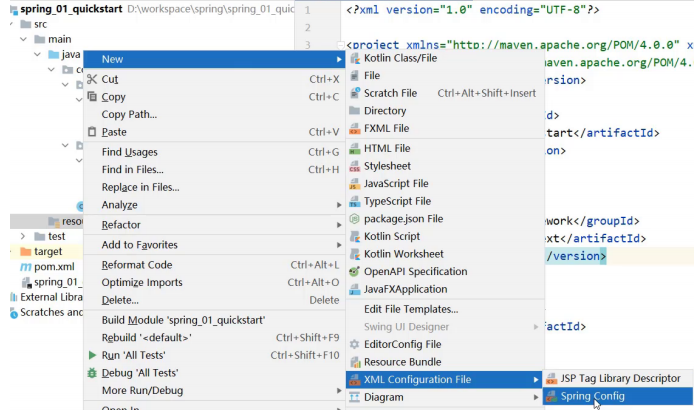
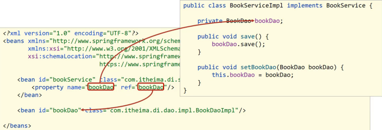

# 配置文件

## 目录

-   [添加spring配置文件](#添加spring配置文件)

### **添加spring配置文件**

-   **step1:resources下添加spring配置文件applicationContext.xml，并完成bean的配置**

    
-   **step2:完成bean的配置**
    ```xml
    <?xml version="1.0" encoding="UTF-8"?> 
    <beans xmlns="http://www.springframework.org/schema/beans" 
    xmlns:xsi="http://www.w3.org/2001/XMLSchema-instance" 
    xsi:schemaLocation="http://www.springframework.org/schema/beans 
    http://www.springframework.org/schema/beans/spring-beans.xsd">
     <!--bean标签标示配置bean 
     id属性标示给bean起名字 
     class属性表示给bean定义类型 
     --> 
     <bean id="bookDao" class="com.itheima.dao.impl.BookDaoImpl"/> 
     <bean id="bookService" class="com.itheima.service.impl.BookServiceImpl"/> 
    </beans>
    ```
    **注意事项：bean定义时id属性在同一个上下文中(配置文件)不能重复**
-   **step3：在配置文件中添加依赖注入**
    ```xml
    <?xml version="1.0" encoding="UTF-8"?> 
    <beans xmlns="http://www.springframework.org/schema/beans" 
    xmlns:xsi="http://www.w3.org/2001/XMLSchema-instance" 
    xsi:schemaLocation="http://www.springframework.org/schema/beans 
    http://www.springframework.org/schema/beans/spring-beans.xsd">
     <!--bean标签标示配置bean 
     id属性标示给bean起名字 
     class属性表示给bean定义类型 
     --> 
     <bean id="bookDao" class="com.itheima.dao.impl.BookDaoImpl"/> 
     <bean id="bookService" class="com.itheima.service.impl.BookServiceImpl">
     <!--配置server与dao的关系-->
      <!--property标签表示配置当前bean的属性 
             name属性表示配置哪一个具体的属性 
             ref属性表示参照哪一个bean --> 
             <property name="bookDao" ref="bookDao"/>
     </bean> 
    </beans>
    ```
    **注意:配置中的两个bookDao的含义是不一样的**
    -   **name="bookDao"中bookDao的作用是让Spring的IOC容器在获取到名称后，将首字母大写，前面加set找对应的setBookDao()方法进行对象注入**
    -   **ref="bookDao"中bookDao的作用是让Spring能在IOC容器中找到id为bookDao的Bean对象给bookService进行注入**
