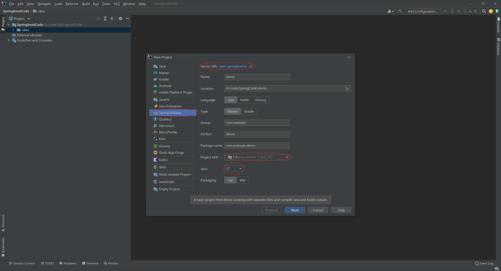
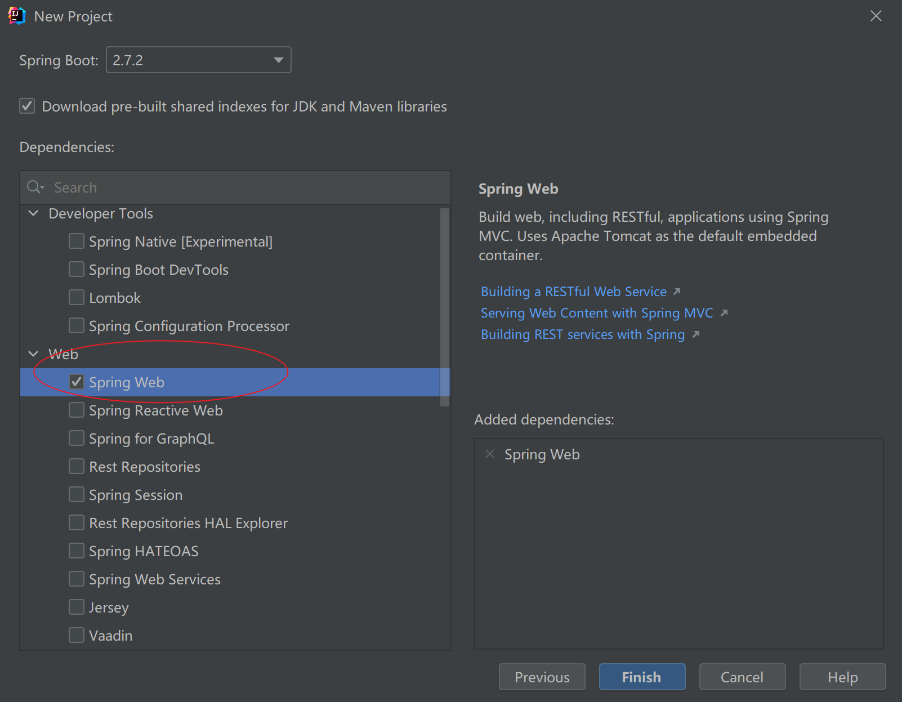
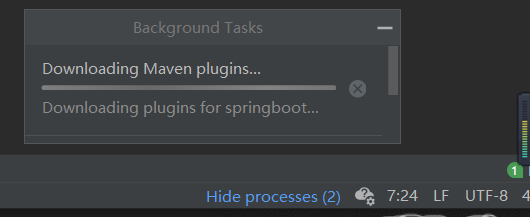
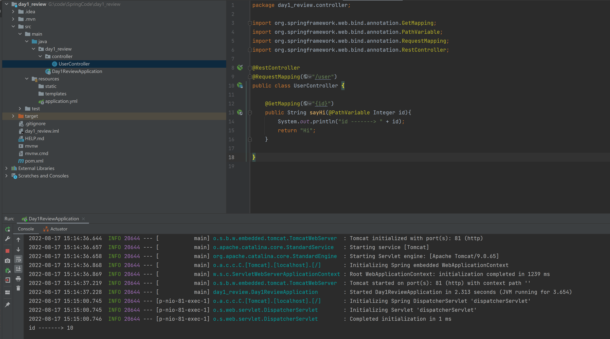
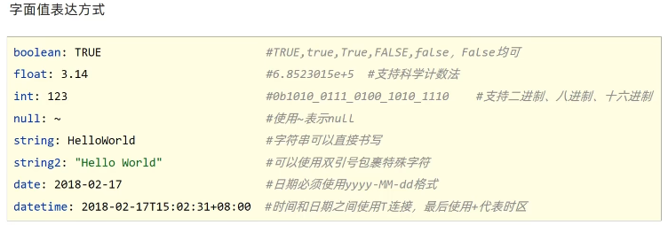
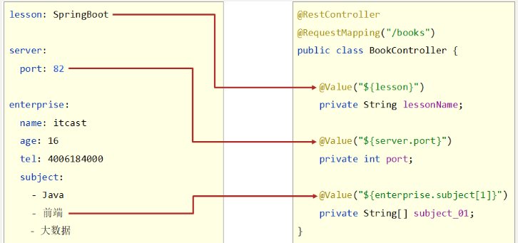
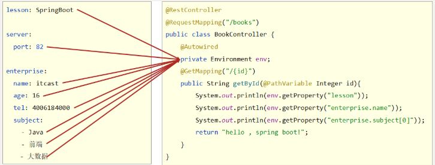
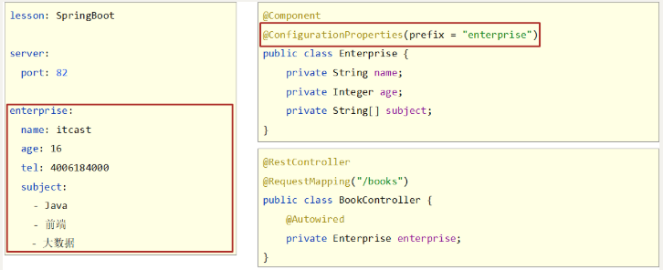
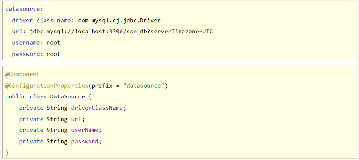
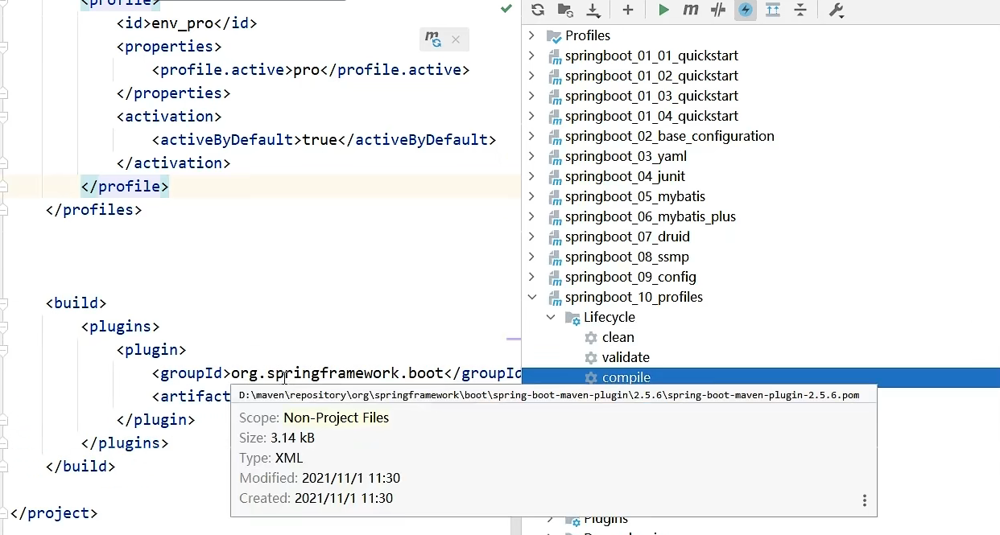

# SpringBoot

## 目录

-   [1、基础篇](#1基础篇)
    -   [快速入门](#快速入门)
    -   [Boot程序的核心功能](#Boot程序的核心功能)
        -   [优点](#优点)
    -   [简化操作的4个方面](#简化操作的4个方面)
        -   [parent](#parent)
        -   [starter](#starter)
        -   [引导类](#引导类)
        -   [内嵌tomcat](#内嵌tomcat)
    -   [基础配置](#基础配置)
        -   [属性配置](#属性配置)
        -   [配置文件](#配置文件)
    -   [YAML文件](#YAML文件)
        -   [语法](#语法)
        -   [数据读取](#数据读取)
        -   [数据引用](#数据引用)
    -   [基于SpringBoot完成SSMP整合](#基于SpringBoot完成SSMP整合)
-   [2、进阶篇](#2进阶篇)
    -   [多环境开发控制](#多环境开发控制)

## 1、基础篇

### 快速入门

1.  创建一个boot程序，勾选web功能

    

    
2.  &#x20;如果是第一次配置 Spring Boot 的话可能需要等待一会儿 IDEA 下载相应的 依赖包

    
3.  测试：写一个controller包，再里面写入对应的Controller方法

    

    

### **Boot程序的核心功能**

#### **优点**

-   起步依赖（简化依赖配置）
    -   依赖配置的书写简化就是靠这个起步依赖达成的。
-   自动配置（简化常用工程相关配置）
    -   配置过于繁琐，使用自动配置就可以做相应的简化，但是内部还是很复杂的，后面具体展开说。
-   辅助功能（内置服务器，……）
    -   除了上面的功能，其实SpringBoot程序还有其他的一些优势，比如快速入门中没有配置Tomcat服务器，但是能正常运行，这是SpringBoot入门程序中一个可以感知到的功能，也是SpringBoot的辅助功能之一。

### 简化操作的4个方面

#### **parent**

**使用parent可以帮助开发者进行版本的统一管理**

parent定义出来以后，并不是直接使用的，仅仅给了开发者一个说明书，但是并没有实际使用，这个一定要确认清楚。

那SpringBoot又是如何做到这一点的呢？可以查阅SpringBoot的配置源码，看到这些定义。

-   项目中的pom.xml中继承了一个坐标

```xml
<parent>
    <groupId>org.springframework.boot</groupId>
    <artifactId>spring-boot-starter-parent</artifactId>
    <version>2.5.4</version>
</parent>
```

-   打开后可以查阅到其中又继承了一个坐标

```xml
<parent>
    <groupId>org.springframework.boot</groupId>
    <artifactId>spring-boot-dependencies</artifactId>
    <version>2.5.4</version>
</parent>
```

-   这个坐标中定义了两组信息

第一组是各式各样的依赖版本号属性，下面列出依赖版本属性的局部，可以看的出来，定义了若干个技术的依赖版本号。

```xml
<properties>
    <activemq.version>5.16.3</activemq.version>
    <aspectj.version>1.9.7</aspectj.version>
    <assertj.version>3.19.0</assertj.version>
    <commons-codec.version>1.15</commons-codec.version>
    <commons-dbcp2.version>2.8.0</commons-dbcp2.version>
    <commons-lang3.version>3.12.0</commons-lang3.version>
    <commons-pool.version>1.6</commons-pool.version>
    <commons-pool2.version>2.9.0</commons-pool2.version>
    <h2.version>1.4.200</h2.version>
    <hibernate.version>5.4.32.Final</hibernate.version>
    <hibernate-validator.version>6.2.0.Final</hibernate-validator.version>
    <httpclient.version>4.5.13</httpclient.version>
    <jackson-bom.version>2.12.4</jackson-bom.version>
    <javax-jms.version>2.0.1</javax-jms.version>
    <javax-json.version>1.1.4</javax-json.version>
    <javax-websocket.version>1.1</javax-websocket.version>
    <jetty-el.version>9.0.48</jetty-el.version>
    <junit.version>4.13.2</junit.version>
</properties>
```

第二组是各式各样的依赖坐标信息，可以看出依赖坐标定义中没有具体的依赖版本号，而是引用了第一组信息中定义的依赖版本属性值.

```xml
<dependencyManagement>
    <dependencies>
        <dependency>
            <groupId>org.hibernate</groupId>
            <artifactId>hibernate-core</artifactId>
            <version>${hibernate.version}</version>
        </dependency>
        <dependency>
            <groupId>junit</groupId>
            <artifactId>junit</artifactId>
            <version>${junit.version}</version>
        </dependency>
    </dependencies>
</dependencyManagement>
```

上面的依赖坐标定义是出现在\<dependencyManagement>标签中的，是对引用坐标的依赖管理，并不是实际使用的坐标。因此当你的项目中继承了这组parent信息后，在不使用对应坐标的情况下，前面的这组定义是不会具体导入某个依赖的。

因为在maven中继承机会只有一次，上述继承的格式还可以切换成导入的形式进行，并且在阿里云的starter创建工程时就使用了此种形式。

```xml
<dependencyManagement>
    <dependencies>
        <dependency>
            <groupId>org.springframework.boot</groupId>
            <artifactId>spring-boot-dependencies</artifactId>
            <version>${spring-boot.version}</version>
            <type>pom</type>
            <scope>import</scope>
        </dependency>
    </dependencies>
</dependencyManagement>
```

#### **starter**

**固定技术搭配，** ​**使用starter可以帮助开发者减少依赖配置**。

这个东西其实在入门案例里面已经使用过了，入门案例中的web功能就是使用这种方式添加依赖的。可以查阅SpringBoot的配置源码，看到这些定义。

-   项目中的pom.xml定义了使用SpringMVC技术，但是并没有写SpringMVC的坐标，而是添加了一个名字中包含starter的依赖

```xml
<dependency>
    <groupId>org.springframework.boot</groupId>
    <artifactId>spring-boot-starter-web</artifactId>
</dependency>
```

-   在spring-boot-starter-web中又定义了若干个具体依赖的坐标

```xml
<dependencies>
    <dependency>
        <groupId>org.springframework.boot</groupId>
        <artifactId>spring-boot-starter</artifactId>
        <version>2.5.4</version>
        <scope>compile</scope>
    </dependency>
    <dependency>
        <groupId>org.springframework.boot</groupId>
        <artifactId>spring-boot-starter-json</artifactId>
        <version>2.5.4</version>
        <scope>compile</scope>
    </dependency>
    <dependency>
        <groupId>org.springframework.boot</groupId>
        <artifactId>spring-boot-starter-tomcat</artifactId>
        <version>2.5.4</version>
        <scope>compile</scope>
    </dependency>
    <dependency>
        <groupId>org.springframework</groupId>
        <artifactId>spring-web</artifactId>
        <version>5.3.9</version>
        <scope>compile</scope>
    </dependency>
    <dependency>
        <groupId>org.springframework</groupId>
        <artifactId>spring-webmvc</artifactId>
        <version>5.3.9</version>
        <scope>compile</scope>
    </dependency>
</dependencies>
```

之前提到过开发SpringMVC程序需要导入spring-webmvc的坐标和spring整合web开发的坐标，就是上面这组坐标中的最后两个了。

但是我们发现除了这两个坐标，还有其他的坐标。比如第二个，叫做spring-boot-starter-json。看名称就知道，这个是与json有关的坐标了，但是看名字发现和最后两个又不太一样，它的名字中也有starter，打开看看里面有什么？

```xml
<dependencies>
    <dependency>
        <groupId>org.springframework.boot</groupId>
        <artifactId>spring-boot-starter</artifactId>
        <version>2.5.4</version>
        <scope>compile</scope>
    </dependency>
    <dependency>
        <groupId>org.springframework</groupId>
        <artifactId>spring-web</artifactId>
        <version>5.3.9</version>
        <scope>compile</scope>
    </dependency>
    <dependency>
        <groupId>com.fasterxml.jackson.core</groupId>
        <artifactId>jackson-databind</artifactId>
        <version>2.12.4</version>
        <scope>compile</scope>
    </dependency>
    <dependency>
        <groupId>com.fasterxml.jackson.datatype</groupId>
        <artifactId>jackson-datatype-jdk8</artifactId>
        <version>2.12.4</version>
        <scope>compile</scope>
    </dependency>
    <dependency>
        <groupId>com.fasterxml.jackson.datatype</groupId>
        <artifactId>jackson-datatype-jsr310</artifactId>
        <version>2.12.4</version>
        <scope>compile</scope>
    </dependency>
    <dependency>
        <groupId>com.fasterxml.jackson.module</groupId>
        <artifactId>jackson-module-parameter-names</artifactId>
        <version>2.12.4</version>
        <scope>compile</scope>
    </dependency>
</dependencies>
```

我们可以发现，这个starter中又包含了若干个坐标，其实就是使用SpringMVC开发通常都会使用到Json，使用json又离不开这里面定义的这些坐标，看来还真是方便，SpringBoot把我们开发中使用的东西能用到的都给提前做好了。你仔细看完会发现，里面有一些你没用过的。的确会出现这种过量导入的可能性，没关系，可以通过maven中的排除依赖剔除掉一部分。不过你不管它也没事，大不了就是过量导入呗。

到这里基本上得到了一个信息，使用starter可以帮开发者快速配置依赖关系。以前写依赖3个坐标的，现在写导入一个就搞定了，就是加速依赖配置的。

**starter与parent的区别**

朦朦胧胧中感觉starter与parent好像都是帮助我们简化配置的，但是功能又不一样，梳理一下。

**starter**是一个坐标中定了若干个坐标，以前写多个的，现在写一个，是用来**减少依赖配置**的书写量的。

**parent**是定义了几百个依赖版本号，以前写依赖需要自己手工控制版本，现在由SpringBoot统一管理，这样就不存在版本冲突了，是用来**减少依赖冲突的**。

**实际开发应用方式**

-   实际开发中如果需要用什么技术，先去找有没有这个技术对应的starter
    -   如果有对应的starter，直接写starter，而且无需指定版本，版本由parent提供
    -   如果没有对应的starter，手写坐标即可
-   实际开发中如果发现坐标出现了冲突现象，确认你要使用的可行的版本号，使用手工书写的方式添加对应依赖，覆盖SpringBoot提供给我们的配置管理
    -   方式一：直接写坐标
    -   方式二：覆盖\<properties>中定义的版本号，就是下面这堆东西了，哪个冲突了覆盖哪个就OK了
    ```xml
    <properties>
        <activemq.version>5.16.3</activemq.version>
        <aspectj.version>1.9.7</aspectj.version>
        <assertj.version>3.19.0</assertj.version>
        <commons-codec.version>1.15</commons-codec.version>
        <commons-dbcp2.version>2.8.0</commons-dbcp2.version>
        <commons-lang3.version>3.12.0</commons-lang3.version>
        <commons-pool.version>1.6</commons-pool.version>
        <commons-pool2.version>2.9.0</commons-pool2.version>
        <h2.version>1.4.200</h2.version>
        <hibernate.version>5.4.32.Final</hibernate.version>
        <hibernate-validator.version>6.2.0.Final</hibernate-validator.version>
        <httpclient.version>4.5.13</httpclient.version>
        <jackson-bom.version>2.12.4</jackson-bom.version>
        <javax-jms.version>2.0.1</javax-jms.version>
        <javax-json.version>1.1.4</javax-json.version>
        <javax-websocket.version>1.1</javax-websocket.version>
        <jetty-el.version>9.0.48</jetty-el.version>
        <junit.version>4.13.2</junit.version>
    </properties>
    ```

**温馨提示**

SpringBoot官方给出了好多个starter的定义，方便我们使用，而且名称都是如下格式

```java
命名规则：spring-boot-starter-技术名称
```

**总结**

1.  开发SpringBoot程序需要导入坐标时通常导入对应的starter
2.  每个不同的starter根据功能不同，通常包含多个依赖坐标
3.  使用starter可以实现快速配置的效果，达到简化配置的目的

所以后期见了spring-boot-starter-aaa这样的名字，这就是SpringBoot官方给出的starter定义。那非官方定义的也有吗？有的，大概就是xxxx-spring-xxxx，这样子的使用格式。

#### **引导类**

目前程序运行的入口就是SpringBoot工程创建时自带的那个类，也就是带有main方法的那个类，运行这个类就可以启动SpringBoot工程的运行。

```java
@SpringBootApplication
public class Springboot0101QuickstartApplication {
    public static void main(String[] args) {
        SpringApplication.run(Springboot0101QuickstartApplication.class, args);
    }
}
```

```java
@SpringBootApplication
public class QuickstartApplication {
    public static void main(String[] args) {
        ConfigurableApplicationContext ctx = SpringApplication.run(QuickstartApplication.class, args);
        BookController bean = ctx.getBean(BookController.class);
        System.out.println("bean======>" + bean);
    }
}
```

**总结**

1.  SpringBoot工程提供引导类用来启动程序
2.  SpringBoot工程启动后创建并初始化Spring容器

通过上述操作不难看出，其实SpringBoot程序启动还是创建了一个Spring容器对象。当前运行的这个类在SpringBoot程序中是所有功能的入口，称为**引导类**。

作为一个引导类最典型的特征就是当前类上方声明了一个注解 **@SpringBootApplication**。

SpringBoot本身是为了加速Spring程序的开发的，而Spring程序运行的基础是需要创建Spring容器对象（IoC容器）并将所有的对象放置到Spring容器中管理，也就是一个一个的Bean。现在改用SpringBoot加速开发Spring程序，这个容器还在吗？这个疑问不用说，一定在。其实当前这个类运行后就会产生一个Spring容器对象，并且可以将这个对象保存起来，通过容器对象直接操作Bean。

#### **内嵌tomcat**

**内嵌Tomcat定义位置**

说到定义的位置，我们就想，如果我们不开发web程序，用的着web服务器吗？肯定用不着啊。那如果这个东西被加入到你的程序中，伴随着什么技术进来的呢？肯定是web相关的功能啊，没错，就是前面导入的web相关的starter做的这件事。&#x20;

```xml
<dependency>
    <groupId>org.springframework.boot</groupId>
    <artifactId>spring-boot-starter-web</artifactId>
</dependency>
```

打开web对应的starter查看导入了哪些东西。

```xml
<dependencies>
    <dependency>
        <groupId>org.springframework.boot</groupId>
        <artifactId>spring-boot-starter</artifactId>
        <version>2.5.4</version>
        <scope>compile</scope>
    </dependency>
    <dependency>
        <groupId>org.springframework.boot</groupId>
        <artifactId>spring-boot-starter-json</artifactId>
        <version>2.5.4</version>
        <scope>compile</scope>
    </dependency>
    <dependency>
        <groupId>org.springframework.boot</groupId>
        <artifactId>spring-boot-starter-tomcat</artifactId>
        <version>2.5.4</version>
        <scope>compile</scope>
    </dependency>
    <dependency>
        <groupId>org.springframework</groupId>
        <artifactId>spring-web</artifactId>
        <version>5.3.9</version>
        <scope>compile</scope>
    </dependency>
    <dependency>
        <groupId>org.springframework</groupId>
        <artifactId>spring-webmvc</artifactId>
        <version>5.3.9</version>
        <scope>compile</scope>
    </dependency>
</dependencies>
```

第三个依赖就是tomcat对应的东西了，居然也是一个starter，再打开看看。

```xml
<dependencies>
    <dependency>
        <groupId>jakarta.annotation</groupId>
        <artifactId>jakarta.annotation-api</artifactId>
        <version>1.3.5</version>
        <scope>compile</scope>
    </dependency>
    <dependency>
        <groupId>org.apache.tomcat.embed</groupId>
        <artifactId>tomcat-embed-core</artifactId>
        <version>9.0.52</version>
        <scope>compile</scope>
        <exclusions>
            <exclusion>
                <artifactId>tomcat-annotations-api</artifactId>
                <groupId>org.apache.tomcat</groupId>
            </exclusion>
        </exclusions>
    </dependency>
    <dependency>
        <groupId>org.apache.tomcat.embed</groupId>
        <artifactId>tomcat-embed-el</artifactId>
        <version>9.0.52</version>
        <scope>compile</scope>
    </dependency>
    <dependency>
        <groupId>org.apache.tomcat.embed</groupId>
        <artifactId>tomcat-embed-websocket</artifactId>
        <version>9.0.52</version>
        <scope>compile</scope>
        <exclusions>
            <exclusion>
                <artifactId>tomcat-annotations-api</artifactId>
                <groupId>org.apache.tomcat</groupId>
            </exclusion>
        </exclusions>
    </dependency>
</dependencies>
```

这里面有一个核心的坐标，tomcat-embed-core，叫做tomcat内嵌核心。这个东西把tomcat功能引入到了程序中的。

谁把tomcat引入到程序中的？spring-boot-starter-web中的spring-boot-starter-tomcat做的。

这个东西是默认加入到程序中的，web服务器对应的功能。

再来说第二个问题，这个服务器是怎么运行的？

**内嵌Tomcat运行原理**

Tomcat服务器是一款java语言开发的软件，tomcat安装目录中保存有很多jar文件。

下面的问题来了，既然是使用java语言开发的，运行的时候肯定符合java程序运行的原理，java程序运行靠的是什么？对象呀，一切皆对象，万物皆对象。那tomcat运行起来呢？也是对象啊。

如果是对象，那Spring容器是用来管理对象的，这个对象能交给Spring容器管理吗？把吗去掉，是个对象都可以交给Spring容器管理，行了，这下通了，tomcat服务器运行其实是以对象的形式在Spring容器中运行的。怪不得我们没有安装这个tomcat但是还能用，闹了白天这东西最后是以一个对象的形式存在，保存在Spring容器中悄悄运行的。具体运行的是什么呢？其实就是上前面提到的那个tomcat内嵌核心。

```xml
<dependencies>
    <dependency>
        <groupId>org.apache.tomcat.embed</groupId>
        <artifactId>tomcat-embed-core</artifactId>
        <version>9.0.52</version>
        <scope>compile</scope>
    </dependency>
</dependencies>
```

那既然是个对象，如果把这个对象从Spring容器中去掉是不是就没有web服务器的功能呢？是这样的，通过依赖排除可以去掉这个web服务器功能。

```xml
<dependencies>
    <dependency>
        <groupId>org.springframework.boot</groupId>
        <artifactId>spring-boot-starter-web</artifactId>
        <exclusions>
            <exclusion>
                <groupId>org.springframework.boot</groupId>
                <artifactId>spring-boot-starter-tomcat</artifactId>
            </exclusion>
        </exclusions>
    </dependency>
</dependencies>
```

**更换内嵌Tomcat**

SpringBoot提供了3款内置的服务器：

-   tomcat(默认)：apache出品，粉丝多，应用面广，负载了若干较重的组件
-   jetty：更轻量级，负载性能远不及tomcat
-   undertow：负载性能勉强跑赢tomcat

    想用哪个，加个坐标就OK。前提是把tomcat排除掉，因为tomcat是默认加载的。

```xml
<dependencies>
    <dependency>
        <groupId>org.springframework.boot</groupId>
        <artifactId>spring-boot-starter-web</artifactId>
        <exclusions>
            <exclusion>
                <groupId>org.springframework.boot</groupId>
                <artifactId>spring-boot-starter-tomcat</artifactId>
            </exclusion>
        </exclusions>
    </dependency>
    <dependency>
        <groupId>org.springframework.boot</groupId>
        <artifactId>spring-boot-starter-jetty</artifactId>
    </dependency>
</dependencies>
```

**总结**

1.  内嵌Tomcat服务器是SpringBoot辅助功能之一
2.  内嵌Tomcat工作原理是将Tomcat服务器作为对象运行，并将该对象交给Spring容器管理
3.  变更内嵌服务器思想是去除现有服务器，添加全新的服务器

[简化的四个方面](简化的四个方面/简化的四个方面.md "简化的四个方面")

### 基础配置

#### 属性配置

1.  SpringBoot程序可以在application.properties/yml/yaml等文件中进行属性配置
2.  application.properties/yml/yaml文件中只要输入要配置的属性关键字就可以根据提示进行设置
3.  SpringBoot将配置信息集中在一个文件中写，不管你是服务器的配置，还是数据库的配置，总之都写在一起，逃离一个项目十几种配置文件格式的尴尬局面

SpringBoot默认配置文件是application.properties

**关闭运行日志图表（banner)**

```.properties
spring.main.banner-mode=off
```

**设置运行日志的显示级别**

```.properties
logging.level.root=debug
```

详情查看官方文档：

[https://docs.spring.io/spring-boot/docs/current/reference/html/application-properties.html#application-properties](https://docs.spring.io/spring-boot/docs/current/reference/html/application-properties.html#application-properties "https://docs.spring.io/spring-boot/docs/current/reference/html/application-properties.html#application-properties")

#### 配置文件

SpringBoot除了支持properties格式的配置文件，还支持另外两种格式的配置文件。三种配置文件格式分别如下:

-   properties格式（**传统格式/默认格式**）
-   yml格式（**主流格式**）
-   yaml格式

下面列举三种不同文件格式配置相同的属性范例，先了解一下。

-   application.properties（properties格式）

```.properties
server.port=80
```

-   application.yml（yml格式）

```yaml
server:
  port: 81
```

-   application.yaml（yaml格式）

```yaml
server:
  port: 82
```

**配置文件的优先级**

1.  配置文件间的加载优先级 properties（最高）> yml > yaml（最低）
2.  不同配置文件中相同配置按照加载优先级相互覆盖，不同配置文件中不同配置全部保留

### YAML文件

#### 语法

YAML（YAML Ain't Markup Language），一种数据序列化格式。具有容易阅读、容易与脚本语言交互、以数据为核心，重数据轻格式的特点。常见的文件扩展名有两种：

-   .yml格式（主流）
-   .yaml格式

    具体的语法格式要求如下：

1.  大小写敏感
2.  属性层级关系使用多行描述，**每行结尾使用冒号结束**
3.  使用缩进表示层级关系，同层级左侧对齐，只允许使用空格（不允许使用Tab键）
4.  属性值前面添加空格（属性名与属性值之间使用冒号+空格作为分隔）
5.  \#号 表示注释

    上述规则不要死记硬背，按照书写习惯慢慢适应，并且在Idea下由于具有提示功能，慢慢适应着写格式就行了。核心的一条规则要记住，\<font color="#ff0000">\<b>数据前面要加空格与冒号隔开\</b>\</font>。

    下面列出常见的数据书写格式，熟悉一下
    ```yaml
    boolean: TRUE              #TRUE,true,True,FALSE,false，False均可
    float: 3.14                #6.8523015e+5  #支持科学计数法
    int: 123                   #0b1010_0111_0100_1010_1110    #支持二进制、八进制、十六进制
    null: ~                    #使用~表示null
    string: HelloWorld            #字符串可以直接书写
    string2: "Hello World"        #可以使用双引号包裹特殊字符
    date: 2018-02-17              #日期必须使用yyyy-MM-dd格式
    datetime: 2018-02-17T15:02:31+08:00  #时间和日期之间使用T连接，最后使用+代表时区
    ```
    ```yaml
    subject:
      - Java
      - 前端
      - 大数据
    enterprise:
      name: itcast
        age: 16
        subject:
          - Java
            - 前端
            - 大数据
    likes: [王者荣耀,刺激战场]      #数组书写缩略格式
    users:               #对象数组格式一
      - name: Tom
         age: 4
      - name: Jerry
        age: 5
    users:               #对象数组格式二
      -  
        name: Tom
        age: 4
      -   
        name: Jerry
        age: 5          
    users2: [ { name:Tom , age:4 } , { name:Jerry , age:5 } ]  #对象数组缩略格式
    ```
    yaml语法规则

    

    **在YML文件中配置特殊的字符中使用****""** ​**包括起来**

    注意：yaml文件中对于数字的定义支持进制书写格式，如需使用字符串请使用引号明确标注。

#### 数据读取

**读取单一数据**

yaml中保存的单个数据，可以使用Spring中的注解@Value读取单个数据，属性名引用方式：**\${一级属性名.二级属性名……}**



记得使用@Value注解时，要将该注解写在某一个指定的Spring管控的bean的属性名上方，这样当bean进行初始化时候就可以读取到对应的单一数据了。

总结

1.  使用@Value配合SpEL读取单个数据
2.  如果数据存在多层级，依次书写层级名称即可

**读取全部数据**

pringBoot提供了一个对象，能够把所有的数据都封装到这一个对象中，这个对象叫做Environment，使用自动装配注解可以将所有的yaml数据封装到这个对象中



数据封装到了Environment对象中，获取属性时，通过Environment的接口操作进行，具体方法是getProperties（String），参数填写属性名即可

**总结**

1.  使用Environment对象封装全部配置信息
2.  使用@Autowired自动装配数据到Environment对象中

**读取对象数据**

由于Java是一个面向对象的语言，很多情况下，我们会将一组数据封装成一个对象。SpringBoot也提供了可以将一组yaml对象数据封装一个Java对象的操作

首先定义一个对象，并将该对象纳入Spring管控的范围，也就是定义成一个bean，然后使用注解@ConfigurationProperties指定该对象加载哪一组yaml中配置的信息。



这个@ConfigurationProperties必须告诉他加载的数据前缀是什么，这样指定前缀下的所有属性就封装到这个对象中。记得数据属性名要与对象的变量名一一对应啊，不然没法封装。其实以后如果你要定义一组数据自己使用，就可以先写一个对象，然后定义好属性，下面到配置中根据这个格式书写即可。



**总结**

1.  使用@ConfigurationProperties注解绑定配置信息到封装类中
2.  封装类需要定义为Spring管理的bean，否则无法进行属性注入

#### 数据引用

如果你在书写yaml数据时，经常出现如下现象，比如很多个文件都具有相同的目录前缀

```yaml
center:
  dataDir: /usr/local/fire/data
    tmpDir: /usr/local/fire/tmp
    logDir: /usr/local/fire/log
    msgDir: /usr/local/fire/msgDir
```

```yaml
center:
  dataDir: D:/usr/local/fire/data
    tmpDir: D:/usr/local/fire/tmp
    logDir: D:/usr/local/fire/log
    msgDir: D:/usr/local/fire/msgDir
```

```yaml
baseDir: /usr/local/fire
center:
    dataDir: ${baseDir}/data
    tmpDir: ${baseDir}/tmp
    logDir: ${baseDir}/log
    msgDir: ${baseDir}/msgDir
```

```yaml
lesson: "Spring\tboot\nlesson"
```

**总结**

1.  在配置文件中可以使用\${属性名}方式引用属性值
2.  如果属性中出现特殊字符，可以使用双引号包裹起来作为字符解析

### 基于SpringBoot完成SSMP整合

**导入对应starter，使用对应配置**

[整合JUnit](整合JUnit/整合JUnit.md "整合JUnit")

[整合MyBatis](整合MyBatis/整合MyBatis.md "整合MyBatis")

[整合MP](整合MP/整合MP.md "整合MP")

[整合Druid](整合Druid/整合Druid.md "整合Druid")

[整合Redis](整合Redis/整合Redis.md "整合Redis")

## 2、进阶篇

### 多环境开发控制

IDEA中使用Maven控制SpringBoot环境开发

**maven中设置多环境（使用属性方式区分环境）**

```xml
<profiles>
  <profile>
    <id>env_dev</id>
    <properties>
      <profile.active>dev</profile.active>
    </properties>
    <activation>
      <activeByDefault>true</activeByDefault>        <!--默认启动环境-->
    </activation>
  </profile>
  <profile>
    <id>env_pro</id>
    <properties>
      <profile.active>pro</profile.active>
    </properties>
  </profile>
</profiles>
```

**SpringBoot中读取maven设置值**

```yaml
spring:
  profiles:
    active: @profile.active@
```

上面的@属性名@就是读取maven中配置的属性值的语法格式。

**总结**

1.  当Maven与SpringBoot同时对多环境进行控制时，以Mavn为主，SpringBoot使用@..@占位符读取Maven对应的配置属性值
2.  基于SpringBoot读取Maven配置属性的前提下，如果在Idea下测试工程时pom.xml每次更新需要手动compile方可生效


