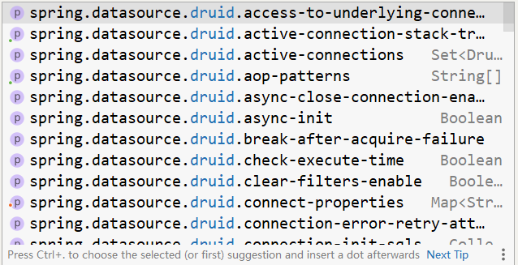

# 整合Druid

在没有指定数据源时，我们的配置如下：

```yaml
spring:
  datasource:
    driver-class-name: com.mysql.cj.jdbc.Driver
    url: jdbc:mysql://localhost:3306/ssm_db?serverTimezone=Asia/Shanghai
    username: root
    password: root
```

此时虽然没有指定数据源，但是根据SpringBoot的德行，肯定帮我们选了一个它认为最好的数据源对象，这就是HiKari。通过启动日志可以查看到对应的身影。

```latex
2021-11-29 09:39:15.202  INFO 12260 --- [           main] com.zaxxer. hikari .HikariDataSource       : HikariPool-1 - Starting...
2021-11-29 09:39:15.208  WARN 12260 --- [           main] com.zaxxer. hikari .util.DriverDataSource  : Registered driver with driverClassName=com.mysql.jdbc.Driver was not found, trying direct instantiation.
2021-11-29 09:39:15.551  INFO 12260 --- [           main] com.zaxxer. hikari .HikariDataSource       : HikariPool-1 - Start completed.
```

上述信息中每一行都有HiKari的身影，如果需要更换数据源，其实只需要两步即可。

1.  导入对应的技术坐标
2.  配置使用指定的数据源类型

    下面就切换一下数据源对象

**步骤①**：导入对应的坐标（注意，是坐标，此处不是starter）

```xml
<dependencies>
    <dependency>
        <groupId>com.alibaba</groupId>
        <artifactId>druid</artifactId>
        <version>1.1.16</version>
    </dependency>
</dependencies>
```

**步骤②**：修改配置，在数据源配置中有一个type属性，专用于指定数据源类型

```yaml
spring:
  datasource:
    driver-class-name: com.mysql.cj.jdbc.Driver
    url: jdbc:mysql://localhost:3306/ssm_db?serverTimezone=UTC
    username: root
    password: root
    type: com.alibaba.druid.pool.DruidDataSource
```

**专用的配置格式：导入对应的starter，进行相应的配置**

**步骤①**：导入对应的starter

```xml
<dependencies>
    <dependency>
        <groupId>com.alibaba</groupId>
        <artifactId>druid-spring-boot-starter</artifactId>
        <version>1.2.6</version>
    </dependency>
</dependencies>
```

**步骤②**：修改配置

```yaml
spring:
  datasource:
    druid:
      driver-class-name: com.mysql.cj.jdbc.Driver
      url: jdbc:mysql://localhost:3306/ssm_db?serverTimezone=UTC
      username: root
      password: root
```

注意观察，配置项中，在datasource下面并不是直接配置url这些属性的，而是先配置了一个druid节点，然后再配置的url这些东西。言外之意，url这个属性是druid下面的属性，那你能想到什么？除了这4个常规配置外，还有druid专用的其他配置。通过提示功能可以打开druid相关的配置查阅


