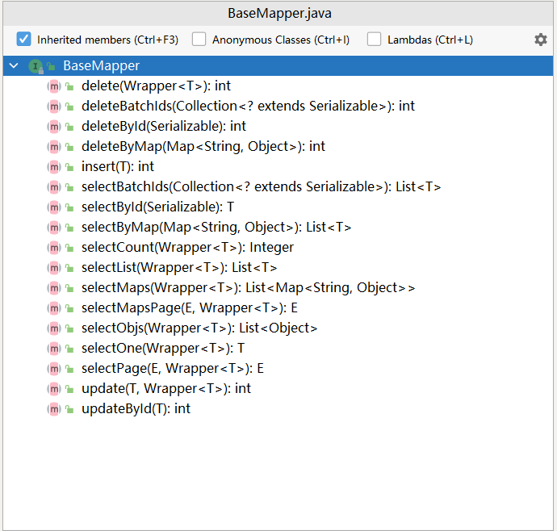

# 整合MP

**步骤①**：导入对应的starter

```xml
<dependency>
    <groupId>com.baomidou</groupId>
    <artifactId>mybatis-plus-boot-starter</artifactId>
    <version>3.4.3</version>
</dependency>

<--！记得导入Mysql驱动 -->
<dependency>
    <groupId>mysql</groupId>
    <artifactId>mysql-connector-java</artifactId>
    <scope>runtime</scope>
</dependency>

```

关于这个坐标，此处要说明一点，之前我们看的starter都是spring-boot-starter-？？？，也就是说都是下面的格式

```latex
Spring-boot-start-***
```

而MyBatis与MyBatisPlus这两个坐标的名字书写比较特殊，是第三方技术名称在前，boot和starter在后。此处简单提一下命名规范，后期**原理篇**会再详细讲解

| starter所属 | 命名规则                                 | 示例                                                         |
| --------- | ------------------------------------ | ---------------------------------------------------------- |
| 官方提供      | spring-boot-starter-技术名称             | spring-boot-starter-web \<br/>spring-boot-starter-test     |
| 第三方提供     | 第三方技术名称-spring-boot-starter          | mybatis-spring-boot-starter\<br/>druid-spring-boot-starter |
| 第三方提供     | 第三方技术名称-boot-starter（第三方技术名称过长，简化命名） | mybatis-plus-boot-starter                                  |

温馨提示

SpringBoot官网还未收录此坐标，而我们IDEA创建模块时读取的是SpringBoot官网的Spring Initializr。如果换用阿里云的url创建项目可以找到对应的坐标。

**步骤②**：配置数据源相关信息

```yaml
#2.配置相关信息
spring:
  datasource:
    driver-class-name: com.mysql.cj.jdbc.Driver
    url: jdbc:mysql://localhost:3306/ssm_db
    username: root
    password: root
```

没了，剩下的就是写MyBaitsPlus的程序了

**映射接口（Dao层）**

```java
@Mapper
public interface BookDao extends BaseMapper<Book> {
}
```

核心在于Dao接口继承了一个BaseMapper的接口，这个接口中帮助开发者预定了若干个常用的API接口，简化了通用API接口的开发工作。



**业务层** **(Service层)**

接口：

```java
public interface BookService extends IService<Book> {
}
```

实现类：

```java
@Service
public class BookServiceImpl extends ServiceImpl<BookDao, Book> implements BookService {
}
```

同时：在配置application.yml文件时，添加如下配置即可，可以设置所有表名的通用前缀名

```yaml
mybatis-plus:
  global-config:
    db-config:
      table-prefix: tbl_    #设置所有表的通用前缀名称为tbl_
```
