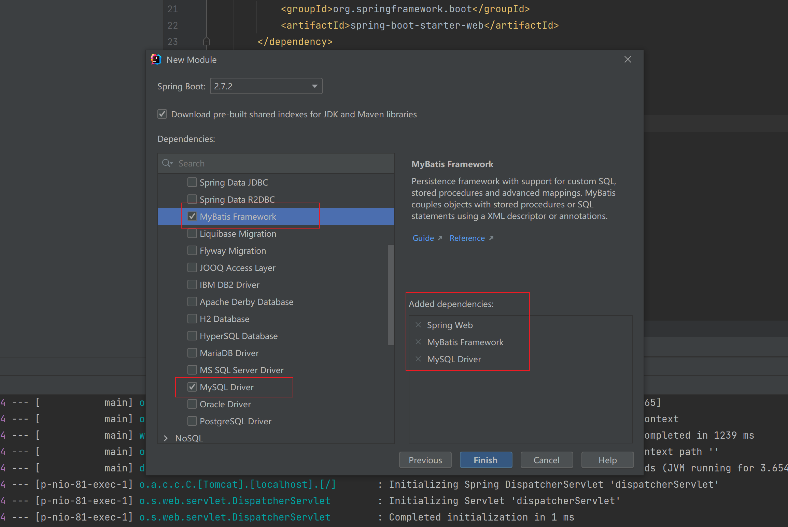

# 整合MyBatis

#### Spring整合MyBatis

-   导入坐标，MyBatis坐标不能少，Spring整合MyBatis还有自己专用的坐标，此外Spring进行数据库操作的jdbc坐标是必须的，剩下还有mysql驱动坐标，本例中使用了Druid数据源，这个倒是可以不要
    ```xml
    <dependencies>
        <dependency>
            <groupId>com.alibaba</groupId>
            <artifactId>druid</artifactId>
            <version>1.1.16</version>
        </dependency>
        <dependency>
            <groupId>org.mybatis</groupId>
            <artifactId>mybatis</artifactId>
            <version>3.5.6</version>
        </dependency>
        <dependency>
            <groupId>mysql</groupId>
            <artifactId>mysql-connector-java</artifactId>
            <version>5.1.47</version>
        </dependency>
        <!--1.导入mybatis与spring整合的jar包-->
        <dependency>
            <groupId>org.mybatis</groupId>
            <artifactId>mybatis-spring</artifactId>
            <version>1.3.0</version>
        </dependency>
        <!--导入spring操作数据库必选的包-->
        <dependency>
            <groupId>org.springframework</groupId>
            <artifactId>spring-jdbc</artifactId>
            <version>5.2.10.RELEASE</version>
        </dependency>
    </dependencies>
    ```
-   Spring核心配置
    ```java
    @Configuration
    @ComponentScan("com.itheima")
    @PropertySource("jdbc.properties")
    public class SpringConfig {
    }
    ```
-   MyBatis要交给Spring接管的bean
    ```java
    //定义mybatis专用的配置类
    @Configuration
    public class MyBatisConfig {
    //    定义创建SqlSessionFactory对应的bean
        @Bean
        public SqlSessionFactoryBean sqlSessionFactory(DataSource dataSource){
            //SqlSessionFactoryBean是由mybatis-spring包提供的，专用于整合用的对象
            SqlSessionFactoryBean sfb = new SqlSessionFactoryBean();
            //设置数据源替代原始配置中的environments的配置
            sfb.setDataSource(dataSource);
            //设置类型别名替代原始配置中的typeAliases的配置
            sfb.setTypeAliasesPackage("com.itheima.domain");
            return sfb;
        }
    //    定义加载所有的映射配置
        @Bean
        public MapperScannerConfigurer mapperScannerConfigurer(){
            MapperScannerConfigurer msc = new MapperScannerConfigurer();
            msc.setBasePackage("com.itheima.dao");
            return msc;
        }

    }
    ```
-   数据源对应的bean，此处使用Druid数据源
    ```java
    @Configuration
    public class JdbcConfig {
        @Value("${jdbc.driver}")
        private String driver;
        @Value("${jdbc.url}")
        private String url;
        @Value("${jdbc.username}")
        private String userName;
        @Value("${jdbc.password}")
        private String password;

        @Bean("dataSource")
        public DataSource dataSource(){
            DruidDataSource ds = new DruidDataSource();
            ds.setDriverClassName(driver);
            ds.setUrl(url);
            ds.setUsername(userName);
            ds.setPassword(password);
            return ds;
        }
    }
    ```
-   数据库连接信息（properties格式）
    ```.properties
    jdbc.driver=com.mysql.jdbc.Driver
    jdbc.url=jdbc:mysql://localhost:3306/spring_db?useSSL=false
    jdbc.username=root
    jdbc.password=root
    ```
    上述格式基本上是最简格式了，要写的东西还真不少。

#### SpringBoot整合MyBaits

**步骤①**：若在项目创建前，在SQL模块勾选好Mysql和MyBatis框架



**步骤②**：若在项目创建后，可直接在项目pom.xml中加入坐标

```xml
<dependencies>
    <!--1.导入对应的starter-->
    <dependency>
        <groupId>org.mybatis.spring.boot</groupId>
        <artifactId>mybatis-spring-boot-starter</artifactId>
        <version>2.2.0</version>
    </dependency>

    <dependency>
        <groupId>mysql</groupId>
        <artifactId>mysql-connector-java</artifactId>
        <scope>runtime</scope>
    </dependency>
</dependencies>
```

**步骤③**：配置数据源相关信息，没有这个信息你连接哪个数据库都不知道

```yaml
#2.配置相关信息
spring:
  datasource:
    driver-class-name: com.mysql.cj.jdbc.Driver
    url: jdbc:mysql://localhost:3306/ssm_db
    username: root
    password: root
```

测试：编写一个MyBatis程序运行需要的Dao（或者Mapper）

**实体类**

```java
public class Book {
    private Integer id;
    private String type;
    private String name;
    private String description;
}
```

**映射接口（Dao）**

```java
@Mapper
public interface BookDao {
    @Select("select * from tbl_book where id = #{id}")
    public Book getById(Integer id);
}
```

**测试类**

```java
@SpringBootTest
class Springboot05MybatisApplicationTests {
    @Autowired
    private BookDao bookDao;
    @Test
    void contextLoads() {
        System.out.println(bookDao.getById(1));
    }
}
```

```yaml
#2.配置相关信息
spring:
  datasource:
    driver-class-name: com.mysql.cj.jdbc.Driver
    url: jdbc:mysql://localhost:3306/ssm_db?serverTimezone=UTC
    username: root
    password: root
```

```yaml
#2.配置相关信息
spring:
  datasource:
    driver-class-name: com.mysql.cj.jdbc.Driver
    url: jdbc:mysql://localhost:3306/ssm_db?serverTimezone=Asia/Shanghai
    username: root
    password: root
```

```latex
Loading class `com.mysql.jdbc.Driver'. 
  This is deprecated. The new driver class is `com.mysql.cj.jdbc.Driver'. 
  The driver is automatically registered via the SPI and manual loading of the driver class is generally unnecessary.
```

**总结**

如果不想每次都设置这个东西，也可以去修改mysql中的配置文件mysql.ini，在mysqld项中添加default-time-zone=+8:00也可以解决这个问题。其实方式方法很多，这里就说这么多吧。

此外在运行程序时还会给出一个提示，说数据库驱动过时的警告，根据提示修改配置即可，弃用**com.mysql.jdbc.Driver**，换用com.mysql.cj.jdbc.Driver。前面的例子中已经更换了驱动了，在此说明一下。

这里设置的UTC是全球标准时间，你也可以理解为是英国时间，中国处在东八区，需要在这个基础上加上8小时，这样才能和中国地区的时间对应的，也可以修改配置为Asia/Shanghai，同样可以解决这个问题。

完美，开发从此变的就这么简单。再体会一下SpringBoot如何进行第三方技术整合的，是不是很优秀？具体内部的原理到原理篇再展开讲解

注意：当前使用的SpringBoot版本是2.5.4，对应的坐标设置中Mysql驱动使用的是8x版本。使用SpringBoot2.4.3（不含）之前版本会出现一个小BUG，就是MySQL驱动升级到8以后要求强制配置时区，如果不设置会出问题。解决方案很简单，驱动url上面添加上对应设置就行了
