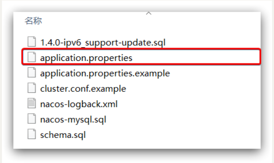
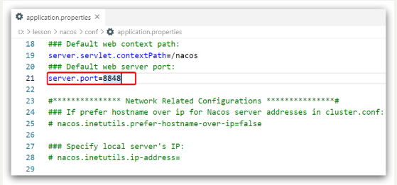

# Nacos安装

## 目录

-   [安装](#安装)
    -   [Windows安装](#Windows安装)
        -   [下载安装包](#下载安装包)

        -   [解压](#解压)

        -   [端口配置](#端口配置)

        -   [启动](#启动)

        -   [访问](#访问)

    -   [Linux安装](#Linux安装)
        -   [安装JDK](#安装JDK)

        -   [上传安装包](#上传安装包)

        -   [解压](#解压)

        -   [端口配置](#端口配置)

        -   [启动](#启动)

-   [Nacos的依赖](#Nacos的依赖)


# 安装

## Windows安装

开发阶段采用单机安装即可

### 下载安装包

在Nacos的GitHub页面，提供有下载链接，可以下载编译好的Nacos服务端或者源代码：

GitHub主页：[https://github.com/alibaba/nacos](https://github.com/alibaba/nacos "https://github.com/alibaba/nacos")

GitHub的Release下载页：[https://github.com/alibaba/nacos/releases](https://github.com/alibaba/nacos/releases "https://github.com/alibaba/nacos/releases")

如图：


### 解压

将这个包解压到任意非中文目录下，如图：


目录说明：

-   bin：启动脚本
-   conf：配置文件


### 端口配置

Nacos的默认端口是8848，如果你电脑上的其它进程占用了8848端口，请先尝试关闭该进程。

**如果无法关闭占用8848端口的进程**，也可以进入nacos的conf目录，修改配置文件中的端口：



修改其中的内容：



### 启动

启动非常简单，进入bin目录，结构如下：


然后执行命令即可：

-   windows命令：
    ```java
    startup.cmd -m standalone
    ```

执行后的效果如图：


### 访问

在浏览器输入地址：[http://127.0.0.1:8848/nacos](http://127.0.0.1:8848/nacos "http://127.0.0.1:8848/nacos")即可：


默认的账号和密码都是nacos，进入后：


## Linux安装

### 安装JDK

Nacos依赖于JDK运行，索引Linux上也需要安装JDK才行。

上传jdk安装包：


上传到某个目录，例如：`/usr/local/`

然后解压缩：

```java
tar -xvf jdk-8u144-linux-x64.tar.gz
```

然后重命名为java

配置环境变量：

```text
export JAVA_HOME=/usr/local/java
export PATH=$PATH:$JAVA_HOME/bin
```

设置环境变量：

```text
source /etc/profile
```


### 上传安装包

如图：


如下的tar.gz：


上传到Linux服务器的某个目录，例如`/usr/local/src`目录下：


### 解压

命令解压缩安装包：

```text
tar -xvf nacos-server-1.4.1.tar.gz
```

然后删除安装包：

```text
rm -rf nacos-server-1.4.1.tar.gz
```

目录中最终样式：


目录内部：


### 端口配置

与windows中类似


### 启动

在nacos/bin目录中，输入命令启动Nacos：

```text
sh startup.sh -m standalone
```


# Nacos的依赖

父工程：

```xml
<dependency>
    <groupId>com.alibaba.cloud</groupId>
    <artifactId>spring-cloud-alibaba-dependencies</artifactId>
    <version>2.2.5.RELEASE</version>
    <type>pom</type>
    <scope>import</scope>
</dependency>
```

客户端：

```xml
<!-- nacos客户端依赖包 -->
<dependency>
    <groupId>com.alibaba.cloud</groupId>
    <artifactId>spring-cloud-starter-alibaba-nacos-discovery</artifactId>
</dependency>

```

