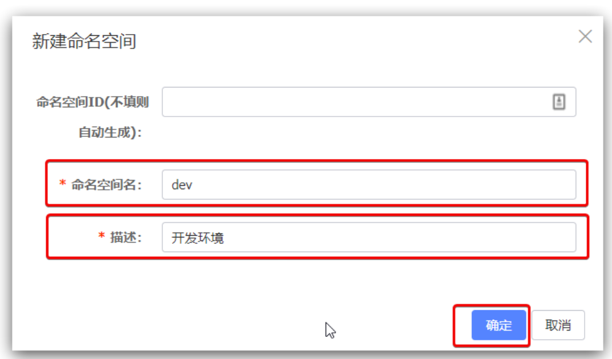
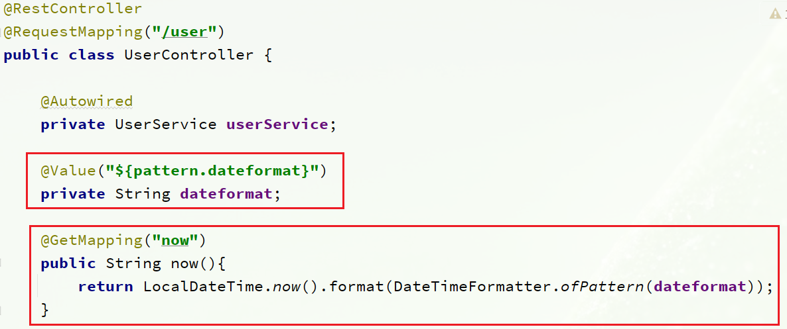
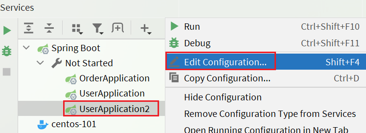
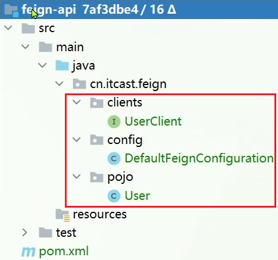
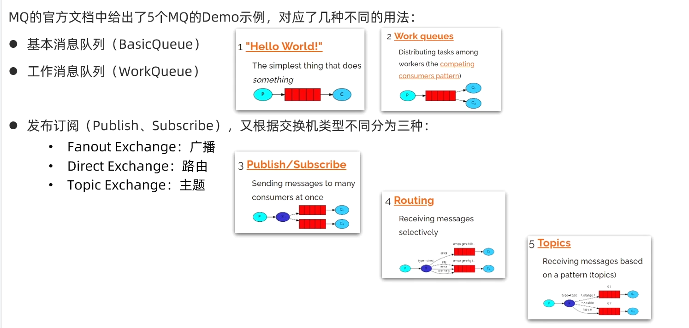
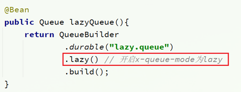

# SpringCloud

## 目录

-   [利用RestTemplate远程调用](#利用RestTemplate远程调用)
-   [Eureka](#Eureka)
    -   [Eureka注册中心](#Eureka注册中心)
        -   [注册Eureka注册中心-server](#注册Eureka注册中心-server)
        -   [注册业务服务到EurekaServer](#注册业务服务到EurekaServer)
        -   [在业务中完成服务拉取](#在业务中完成服务拉取)
        -   [Ribbon负载均衡](#Ribbon负载均衡)
-   [Nacos](#Nacos)
    -   [Nacos服务注册](#Nacos服务注册)
        -   [服务注册Nacos](#服务注册Nacos)
        -   [服务多级存储模型](#服务多级存储模型)
        -   [Nacos与Eureka的对比](#Nacos与Eureka的对比)
    -   [Nacos配置管理](#Nacos配置管理)
        -   [配置管理](#配置管理)
        -   [从微服务拉取配置](#从微服务拉取配置)
        -   [配置热更新](#配置热更新)
            -   [方式一](#方式一)
            -   [方式二(推荐)](#方式二推荐)
        -   [配置共享](#配置共享)
            -   [1）添加一个环境共享配置](#1添加一个环境共享配置)
            -   [2）在user-service中读取共享配置](#2在user-service中读取共享配置)
            -   [3）运行两个UserApplication，使用不同的profile](#3运行两个UserApplication使用不同的profile)
        -   [配置共享的优先级](#配置共享的优先级)
-   [Feign远程调用](#Feign远程调用)
    -   [Feign替代RestTemplate](#Feign替代RestTemplate)
        -   [1）引入依赖](#1引入依赖)
        -   [2）添加注解](#2添加注解)
        -   [3）编写Feign的客户端](#3编写Feign的客户端)
        -   [4）测试](#4测试)
    -   [使用Feign的步骤](#使用Feign的步骤)
    -   [自定义配置](#自定义配置)
        -   [配置文件方式](#配置文件方式)
        -   [Java代码方式](#Java代码方式)
    -   [Feign使用优化](#Feign使用优化)
    -   [最佳实践](#最佳实践)
        -   [继承方式](#继承方式)
        -   [抽取方式](#抽取方式)
            -   [实现基于抽取的最佳实践](#实现基于抽取的最佳实践)
-   [Gateway服务网关](#Gateway服务网关)
    -   [快速入门](#快速入门)
        -   [1）创建gateway服务，引入依赖](#1创建gateway服务引入依赖)
        -   [2）编写启动类](#2编写启动类)
        -   [3）编写基础配置和路由规则](#3编写基础配置和路由规则)
        -   [4）重启测试](#4重启测试)
        -   [5）网关路由的流程图](#5网关路由的流程图)
    -   [断言工厂](#断言工厂)
    -   [过滤器工厂](#过滤器工厂)
        -   [路由过滤器的种类](#路由过滤器的种类)
        -   [请求头过滤器](#请求头过滤器)
        -   [默认过滤器](#默认过滤器)
        -   [总结](#总结)
    -   [全局过滤器](#全局过滤器)
        -   [全局过滤器作用](#全局过滤器作用)
        -   [自定义全局过滤器](#自定义全局过滤器)
        -   [过滤器执行顺序](#过滤器执行顺序)
    -   [跨域问题](#跨域问题)
        -   [什么是跨域问题](#什么是跨域问题)
        -   [跨域问题](#跨域问题)
        -   [解决跨域问题](#解决跨域问题)
-   [Sentinel持久化](#Sentinel持久化)
    -   [什么是雪崩问题？](#什么是雪崩问题)
    -   [微服务整合Sentinel](#微服务整合Sentinel)
    -   [流量控制](#流量控制)
        -   [簇点链路](#簇点链路)
-   [RabbitMQ消息队列](#RabbitMQ消息队列)
    -   [基本结构](#基本结构)
    -   [RabbitMQ部署](#RabbitMQ部署)
    -   [RabbitMQ消息模型](#RabbitMQ消息模型)
        -   [简单的消息队列模式](#简单的消息队列模式)
            -   [publisher实现](#publisher实现)
            -   [consumer实现](#consumer实现)
    -   [使用SpringAMQP演示五个基本消息队列模式](#使用SpringAMQP演示五个基本消息队列模式)
        -   [Basic Queue](#Basic-Queue)
            -   [消息发送](#消息发送)
            -   [消息接收](#消息接收)
        -   [WorkQueue/Task queues](#WorkQueueTask-queues)
            -   [消息发送](#消息发送)
            -   [消息接收](#消息接收)
            -   [能者多劳](#能者多劳)
        -   [发布/订阅](#发布订阅)
            -   [Fanout](#Fanout)
            -   [Direct](#Direct)
            -   [Topic](#Topic)
        -   [消息转换器](#消息转换器)
            -   [默认转换器](#默认转换器)
            -   [配置JSON转换器](#配置JSON转换器)
    -   [消息可靠性](#消息可靠性)
        -   [生产者确认机制](#生产者确认机制)
            -   [修改配置](#修改配置)
            -   [定义Return回调](#定义Return回调)
            -   [定义ConfirmCallback](#定义ConfirmCallback)
        -   [消息持久化](#消息持久化)
            -   [交换机持久化](#交换机持久化)
            -   [队列持久化](#队列持久化)
            -   [消息持久化](#消息持久化)
        -   [消费者消息确认机制](#消费者消息确认机制)
        -   [消费失败重试机制](#消费失败重试机制)
            -   [本地重试](#本地重试)
            -   [失败策略](#失败策略)
    -   [死信交换机](#死信交换机)
        -   [死信和死信交换机](#死信和死信交换机)
            -   [什么是死信？](#什么是死信)
            -   [死信交换机的使用场景是什么？](#死信交换机的使用场景是什么)
            -   [利用死信交换机接收死信（拓展）](#利用死信交换机接收死信拓展)
        -   [TTL](#TTL)
            -   [接收超时死信的死信交换机](#接收超时死信的死信交换机)
            -   [声明一个队列，并且指定TTL](#声明一个队列并且指定TTL)
            -   [发送消息时，设定TTL](#发送消息时设定TTL)
        -   [延迟队列](#延迟队列)
            -   [使用DelayExchange](#使用DelayExchange)
    -   [惰性队列](#惰性队列)
        -   [消息堆积问题](#消息堆积问题)
        -   [惰性队列](#惰性队列)
            -   [基于命令行设置lazy-queue](#基于命令行设置lazy-queue)
            -   [基于@Bean声明lazy-queue](#基于Bean声明lazy-queue)
            -   [基于@RabbitListener声明LazyQueue](#基于RabbitListener声明LazyQueue)
    -   [MQ集群](#MQ集群)
        -   [普通集群](#普通集群)
            -   [集群结构和特征](#集群结构和特征)
        -   [镜像集群](#镜像集群)
            -   [集群结构和特征](#集群结构和特征)
        -   [仲裁队列](#仲裁队列)
            -   [集群特征](#集群特征)
            -   [Java代码创建仲裁队列](#Java代码创建仲裁队列)
        -   [SpringAMQP连接MQ集群](#SpringAMQP连接MQ集群)
    -   [报错记录](#报错记录)


### 利用RestTemplate远程调用

-   step1：将RestTemplate注册成Bean
    ```java
        @Bean
        public RestTemplate restTemplate(){
            return new RestTemplate();
        }
    ```
-   step2：在需要使用的位置，引入Bean依赖和编写远程调用代码

    例：订单业务中需要查询对应的用户信息
    ```java
        @Autowired
        private OrderMapper orderMapper;

        @Autowired
        private RestTemplate restTemplate;

        public Order queryOrderById(Long orderId) {
            // 1.查询订单
            Order order = orderMapper.findById(orderId);
            // 2. 利用RestTemplate发送请求远程调用User服务
            String url = "http://localhost:8081/user/" + order.getUserId();
            User user = restTemplate.getForObject(url, User.class);
            // 3.封装user到order里
            order.setUser(user);
            // 4.返回
            return order;
        }
    ```

# Eureka

### Eureka注册中心

#### 注册Eureka注册中心-server

-   step1：新建Maven工程，命名为eureka-server
-   step2：在pom.xml中引入依赖
    ```xml
    <dependency>
        <groupId>org.springframework.cloud</groupId>
        <artifactId>spring-cloud-starter-netflix-eureka-server</artifactId>
    </dependency>
    ```
-   step3：编写启动类，同时添加一个@EnableEurekaServer注解，开启eureka的注册中心功能
    ```java
    @SpringBootApplication
    @EnableEurekaServer 
    public class EurekaApplication {
        public static void main(String[] args) {
            SpringApplication.run(EurekaApplication.class, args);
        }
    }
    ```
-   step4：在配置文件中配置信息
    ```java
    server:
      port: 10086
    spring:
      application:
        name: eureka-server
    eureka:
      client:
        service-url: 
          defaultZone: http://127.0.0.1:10086/eureka
    ```

#### 注册业务服务到EurekaServer

-   step1：在业务项目的pom.xml中引入依赖
    ```xml
      <!--eureka客户端依赖-->
      <dependency>
      <groupId>org.springframework.cloud</groupId>
      <artifactId>spring-cloud-starter-netflix-eureka-client</artifactId>
      </dependency>
    ```
-   step2：在配置文件中配置信息
    ```yaml
    eureka:
      client:
        service-url:
          defaultZone: http://127.0.0.1:10086/eureka
    ```

#### 在业务中完成服务拉取

服务拉取是基于服务名称获取服务列表，然后在对服务列表做负载均衡

-   step1：修改OrderService的代码，修改访问的url路径，用服务名代替ip、端口
    ```java
        @Autowired
        private OrderMapper orderMapper;

        @Autowired
        private RestTemplate restTemplate;

        public Order queryOrderById(Long orderId) {
            // 1.查询订单
            Order order = orderMapper.findById(orderId);
            // 2.利用RestTemplate发送请求远程调用User服务
            //   使用eureka中的服务
            String url = "http://userservice/user/" + order.getUserId();
            User user = restTemplate.getForObject(url, User.class);
            // 3.封装user到order里
            order.setUser(user);
            // 4.返回
            return order;
        }
    ```
-   step2：在RestTemplate的Bean注解下添加负载均衡注解 @LoadBalanced
    ```java
        @Bean
        @LoadBalanced
        public RestTemplate restTemplate(){
            return new RestTemplate();
        }
    ```

#### Ribbon负载均衡

负载均衡规则

-   规则接口：IRule
-   默认实现是ZoneAvoidanceRule，根据zone选择服务列表，然后轮询

负载均衡自定义方式

-   代码方式
-   配置方式
    ```yaml
    # 配置负载均衡策略
    userservice:
      ribbon:
        NFLoadBalancerRuleClassName: com.alibaba.cloud.nacos.ribbon.NacosRule # 负载均衡规则 
    ```

饥饿加载

-   开启饥饿加载
-   指定饥饿加载的微服务名称

# Nacos

[Nacos安装](Nacos安装/Nacos安装.md "Nacos安装")

windows开启Nacos进入安装好的bin目录：startup.cmd -m standalone

## Nacos服务注册

### 服务注册Nacos

-   step1：在父工程添加spring-cloud-alilbaba的管理依赖
    ```java
    <!--alibaba-nacos版本依赖-->
    <dependency>
        <groupId>com.alibaba.cloud</groupId>
        <artifactId>spring-cloud-alibaba-dependencies</artifactId>
        <version>2.2.6.RELEASE</version>
        <type>pom</type>
        <scope>import</scope>
    </dependency>
    ```
-   step2：添加nacos客户端依赖
    ```java
    <!--nacos客户端依赖-->
    <dependency>
        <groupId>com.alibaba.cloud</groupId>
        <artifactId>spring-cloud-starter-alibaba-nacos-discovery</artifactId>
    </dependency>
    ```
-   step3：业务中配置nacos地址
    ```java
      cloud:
        nacos:
          server-addr: localhost:8848
    ```

### 服务多级存储模型

1.  一级是服务，例如userservice
2.  二级是集群，例如杭州或上海
3.  三级是实例，例如杭州机房的某台部署了userservice的服务器

-   配置实例的集群属性

    修改application.yml文件，添加spring.cloud.nacos.discovery.cluster-name
    ```java
      cloud:
        nacos:
          discovery:
            cluster-name: SZ #深圳
    ```
    添加VM参数：-Dserver.port=808x可以让idea开启多台服务器
-   修改负载均衡策略

    修改order-service的application.yml文件，修改负载均衡规则：
    ```java
    userservice:
      ribbon:
        NFLoadBalancerRuleClassName: com.alibaba.cloud.nacos.ribbon.NacosRule # 负载均衡规则  
    ```
    NacosRule 负载均衡策略
    1.  优先选择同集群服务实例列表
    2.  本地集群找不到提供者，才去其它集群寻找，并且会报警告
    3.  确定了可用实例列表，再采用随机负载均衡挑选实例
    根据权重负责均衡

环境隔离—namespace

-   nacos中可以有多个namespace，namespace下可以有group、service等
-   不同namespace之间相互隔离，例如不同namespace的服务互相不可见
-   每个namespace都有唯一id


创建namespace

默认情况下，所有service、data、group都在同一个namespace，名为public：


点击页面新增按钮，添加一个namespace：


然后，填写表单：



给微服务配置namespace只能通过修改配置来实现。

例如，修改order-service的application.yml文件：

```yaml
spring:
  cloud:
    nacos:
      server-addr: localhost:8848
      discovery:
        cluster-name: SZ
        namespace: 492a7d5d-237b-46a1-a99a-fa8e98e4b0f9 # 命名空间，填ID
```

重启order-service后，访问控制台，可以看到下面的结果：


此时访问order-service，因为namespace不同，会导致找不到userservice，控制台会报错：


Nacos的服务实例分为两种类型：

-   临时实例：如果实例宕机超过一定时间，会从服务列表剔除，默认的类型。
-   非临时实例：如果实例宕机，不会从服务列表剔除，也可以叫永久实例。

配置一个服务实例为永久实例：

```yaml
spring:
  cloud:
    nacos:
      discovery:
        ephemeral: false # 设置为非临时实例
```

Nacos和Eureka整体结构类似，服务注册、服务拉取、心跳等待，但是也存在一些差异：


### Nacos与Eureka的对比

-   Nacos与eureka的共同点
    -   都支持服务注册和服务拉取
    -   都支持服务提供者心跳方式做健康检测
-   Nacos与Eureka的区别
    -   Nacos支持服务端主动检测提供者状态：临时实例采用心跳模式，非临时实例采用主动检测模式
    -   临时实例心跳不正常会被剔除，非临时实例则不会被剔除
    -   Nacos支持服务列表变更的消息推送模式，服务列表更新更及时
    -   Nacos集群默认采用AP方式，当集群中存在非临时实例时，采用CP模式；Eureka采用AP方式

## Nacos配置管理

### 配置管理


然后在弹出的表单中，填写配置信息：


注意：项目的核心配置，需要热更新的配置才有放到nacos管理的必要。基本不会变更的一些配置还是保存在微服务本地比较好。

### 从微服务拉取配置

微服务要拉取nacos中管理的配置，并且与本地的application.yml配置合并，才能完成项目启动。

但如果尚未读取application.yml，又如何得知nacos地址呢？

因此spring引入了一种新的配置文件：bootstrap.yaml文件，会在application.yml之前被读取，流程如下：


1）引入nacos-config依赖

首先，在user-service服务中，引入nacos-config的客户端依赖：

```xml
<!--nacos配置管理依赖-->
<dependency>
    <groupId>com.alibaba.cloud</groupId>
    <artifactId>spring-cloud-starter-alibaba-nacos-config</artifactId>
</dependency>
```

2）添加bootstrap.yaml

然后，在user-service中添加一个bootstrap.yaml文件，内容如下：

```yaml
spring:
  application:
    name: userservice # 服务名称
  profiles:
    active: dev #开发环境，这里是dev 
  cloud:
    nacos:
      server-addr: localhost:8848 # Nacos地址
      config:
        file-extension: yaml # 文件后缀名
```

这里会根据spring.cloud.nacos.server-addr获取nacos地址，再根据

`${spring.application.name}-${spring.profiles.active}.${spring.cloud.nacos.config.file-extension}`作为文件id，来读取配置。

例如中，读取`userservice-dev.yaml`中的配置属性


3）读取nacos配置

在user-service中的UserController中添加业务逻辑，读取pattern.dateformat配置：



在页面访问，可以看到效果：


### 配置热更新

要实现配置热更新，可以使用两种方式：

#### 方式一

在@Value注入的变量所在类上添加注解@RefreshScope：


#### 方式二(推荐)

使用@ConfigurationProperties注解代替@Value注解。

在user-service服务中，添加一个类，读取patterrn.dateformat属性：

```java
package cn.itcast.user.config;

import lombok.Data;
import org.springframework.boot.context.properties.ConfigurationProperties;
import org.springframework.stereotype.Component;

@Component
@Data
@ConfigurationProperties(prefix = "pattern")
public class PatternProperties {
    private String dateformat;
}
```

在UserController中使用这个类代替@Value：


### 配置共享

其实微服务启动时，会去nacos读取多个配置文件，例如：

-   `[spring.application.name]-[spring.profiles.active].yaml`，例如：userservice-dev.yaml
-   `[spring.application.name].yaml`，例如：userservice.yaml

而`[spring.application.name].yaml`不包含环境，因此可以被多个环境共享。

下面我们通过案例来测试配置共享

#### 1）添加一个环境共享配置

我们在nacos中添加一个userservice.yaml文件：


#### 2）在user-service中读取共享配置

在user-service服务中，修改PatternProperties类，读取新添加的属性：


在user-service服务中，修改UserController，添加一个方法：


#### 3）运行两个UserApplication，使用不同的profile

修改UserApplication2这个启动项，改变其profile值：




这样，UserApplication(8081)使用的profile是dev，UserApplication2(8082)使用的profile是test。

启动UserApplication和UserApplication2

访问[http://localhost:8081/user/prop](http://localhost:8081/user/prop "http://localhost:8081/user/prop")，结果：


访问[http://localhost:8082/user/prop](http://localhost:8082/user/prop "http://localhost:8082/user/prop")，结果：


可以看出来，不管是dev，还是test环境，都读取到了envSharedValue这个属性的值。

### 配置共享的优先级

当nacos、服务本地同时出现相同属性时，优先级有高低之分：


# Feign远程调用

利用RestTemplate发起远程调用的代码

```java
 String url = "http://userservice/user/" + order.getUserId();
 User user = restTemplate.getForObject(url, User.class);
```

存在下面的问题：

•代码可读性差，编程体验不统一

•参数复杂URL难以维护

### Feign替代RestTemplate

Fegin的使用步骤如下：

#### 1）引入依赖

我们在order-service服务的pom文件中引入feign的依赖：

```xml
<dependency>
    <groupId>org.springframework.cloud</groupId>
    <artifactId>spring-cloud-starter-openfeign</artifactId>
</dependency>
```

#### 2）添加注解

在order-service的启动类添加注解开启Feign的功能：

```java
@EnableFeignClients
```

#### 3）编写Feign的客户端

在order-service中新建一个接口，内容如下：

```java
import cn.itcast.order.pojo.User;
import org.springframework.cloud.openfeign.FeignClient;
import org.springframework.web.bind.annotation.GetMapping;
import org.springframework.web.bind.annotation.PathVariable;

@FeignClient("userservice")
public interface UserClient {
    @GetMapping("/user/{id}")
    User findById(@PathVariable("id") Long id);
}
```

这个客户端主要是基于SpringMVC的注解来声明远程调用的信息，比如：

-   服务名称：userservice
-   请求方式：GET
-   请求路径：/user/{id}
-   请求参数：Long id
-   返回值类型：User

这样，Feign就可以帮助我们发送http请求，无需自己使用RestTemplate来发送了。

#### 4）测试

修改order-service中的OrderService类中的queryOrderById方法，使用Feign客户端代替RestTemplate：

```java
  public Order queryOrderById(Long orderId) {
          // 1.查询订单
          Order order = orderMapper.findById(orderId);
          // 2. 使用Feign远程调用
          User user = userClient.findById(order.getUserId());
          // 3.封装user到order里
          order.setUser(user);
          // 4.返回
          return order;
  }
```

### 使用Feign的步骤

① 引入依赖

② 添加@EnableFeignClients注解

③ 编写FeignClient接口

④ 使用FeignClient中定义的方法代替RestTemplate

## 自定义配置

Feign可以支持很多的自定义配置，如下表所示：

| 类型                     | 作用       | 说明                                |
| ---------------------- | -------- | --------------------------------- |
| **feign.Logger.Level** | 修改日志级别   | 包含四种不同的级别：NONE、BASIC、HEADERS、FULL |
| feign.codec.Decoder    | 响应结果的解析器 | http远程调用的结果做解析，例如解析json字符串为java对象 |
| feign.codec.Encoder    | 请求参数编码   | 将请求参数编码，便于通过http请求发送              |
| feign. Contract        | 支持的注解格式  | 默认是SpringMVC的注解                   |
| feign. Retryer         | 失败重试机制   | 请求失败的重试机制，默认是没有，不过会使用Ribbon的重试    |

一般情况下，默认值就能满足我们使用，如果要自定义时，只需要创建自定义的@Bean覆盖默认Bean即可。

下面以日志为例来演示如何自定义配置。

### 配置文件方式

基于配置文件修改feign的日志级别可以针对单个服务：

```yaml
feign:  
  client:
    config: 
      userservice: # 针对某个微服务的配置
        loggerLevel: FULL #  日志级别 
```

也可以针对所有服务：

```yaml
feign:  
  client:
    config: 
      default: # 这里用default就是全局配置，如果是写服务名称，则是针对某个微服务的配置
        loggerLevel: FULL #  日志级别 
```

而日志的级别分为四种：

-   NONE：不记录任何日志信息，这是默认值。
-   BASIC：仅记录请求的方法，URL以及响应状态码和执行时间
-   HEADERS：在BASIC的基础上，额外记录了请求和响应的头信息
-   FULL：记录所有请求和响应的明细，包括头信息、请求体、元数据。

### Java代码方式

也可以基于Java代码来修改日志级别，先声明一个类，然后声明一个Logger.Level的对象：

```java
public class DefaultFeignConfiguration  {
    @Bean
    public Logger.Level feignLogLevel(){
        return Logger.Level.BASIC; // 日志级别为BASIC
    }
}
```

如果要**全局生效**，将其放到启动类的@EnableFeignClients这个注解中：

```java
@EnableFeignClients(defaultConfiguration = DefaultFeignConfiguration .class) 
```

如果是**局部生效**，则把它放到对应的@FeignClient这个注解中：

```java
@FeignClient(value = "userservice", configuration = DefaultFeignConfiguration .class) 
```

## Feign使用优化

Feign底层发起http请求，依赖于其它的框架。其底层客户端实现包括：

•URLConnection：默认实现，不支持连接池

•Apache HttpClient ：支持连接池

•OKHttp：支持连接池

因此提高Feign的性能主要手段就是使用**连接池**代替默认的URLConnection。

这里我们用Apache的HttpClient来演示。

1）引入依赖

在order-service的pom文件中引入Apache的HttpClient依赖：

```xml
<!--httpClient的依赖 -->
<dependency>
    <groupId>io.github.openfeign</groupId>
    <artifactId>feign-httpclient</artifactId>
</dependency>
```

2）配置连接池

在order-service的application.yml中添加配置：

```yaml
feign:
  client:
    config:
      default: # default全局的配置
        loggerLevel: BASIC # 日志级别，BASIC就是基本的请求和响应信息
  httpclient:
    enabled: true # 开启feign对HttpClient的支持
    max-connections: 200 # 最大的连接数
    max-connections-per-route: 50 # 每个路径的最大连接数
```

接下来，在FeignClientFactoryBean中的loadBalance方法中打断点：


Debug方式启动order-service服务，可以看到这里的client，底层就是Apache HttpClient：


一些优化总结：

1.日志级别尽量用basic

2.使用HttpClient或OKHttp代替URLConnection

① 引入feign-httpClient依赖

② 配置文件开启httpClient功能，设置连接池参数

## 最佳实践

所谓最佳实践，就是使用过程中总结的经验，最好的一种使用方式。

自习观察可以发现，Feign的客户端与服务提供者的controller代码非常相似：

feign客户端：


UserController：


有没有一种办法简化这种重复的代码编写呢？

### 继承方式

一样的代码可以通过继承来共享：

1）定义一个API接口，利用定义方法，并基于SpringMVC注解做声明。

2）Feign客户端和Controller都集成改接口


优点：

-   简单
-   实现了代码共享

缺点：

-   服务提供方、服务消费方紧耦合
-   参数列表中的注解映射并不会继承，因此Controller中必须再次声明方法、参数列表、注解

### 抽取方式

将Feign的Client抽取为独立模块，并且把接口有关的POJO、默认的Feign配置都放到这个模块中，提供给所有消费者使用。

例如，将UserClient、User、Feign的默认配置都抽取到一个feign-api包中，所有微服务引用该依赖包，即可直接使用。


#### 实现基于抽取的最佳实践

**1）抽取**

首先创建一个module，命名为feign-api：


项目结构：


在feign-api中然后引入feign的starter依赖

```xml
<dependencies>
    <dependency>
        <groupId>org.springframework.cloud</groupId>
        <artifactId>spring-cloud-starter-openfeign</artifactId>
    </dependency>
</dependencies>
```

然后，order-service中编写的UserClient、User、DefaultFeignConfiguration都复制到feign-api项目中



**2）在order-service中使用feign-api**

首先，删除order-service中的UserClient、User、DefaultFeignConfiguration等类或接口。

在order-service的pom文件中中引入feign-api的依赖：

```xml
<dependency>
    <groupId>cn.itcast.demo</groupId>
    <artifactId>feign-api</artifactId>
    <version>1.0</version>
</dependency>
```

修改order-service中的所有与上述三个组件有关的导包部分，改成导入feign-api中的包

**3）重启测试**

重启后，发现服务报错了：


这是因为UserClient现在在cn.itcast.feign.clients包下，而order-service的@EnableFeignClients注解是在cn.itcast.order包下，不在同一个包，无法扫描到UserClient。

**4）解决扫描包问题**

方式一：

指定Feign应该扫描的包：

```java
@EnableFeignClients(basePackages = "cn.itcast.feign.clients")
```

方式二：

指定需要加载的Client接口：

```java
@EnableFeignClients(clients = {UserClient.class})
```

# Gateway服务网关

网关的**核心功能特性**：

-   请求路由
-   权限控制
-   限流


**权限控制**：网关作为微服务入口，需要校验用户是是否有请求资格，如果没有则进行拦截。

**路由和负载均衡**：一切请求都必须先经过gateway，但网关不处理业务，而是根据某种规则，把请求转发到某个微服务，这个过程叫做路由。当然路由的目标服务有多个时，还需要做负载均衡。

**限流**：当请求流量过高时，在网关中按照下流的微服务能够接受的速度来放行请求，避免服务压力过大。

在SpringCloud中网关的实现包括两种：

-   gateway
-   zuul

Zuul是基于Servlet的实现，属于阻塞式编程。而SpringCloudGateway则是基于Spring5中提供的WebFlux，属于响应式编程的实现，具备更好的性能。

使用的基本步骤如下：

1.  创建SpringBoot工程gateway，引入网关依赖
2.  编写启动类
3.  编写基础配置和路由规则
4.  启动网关服务进行测试

## 快速入门

#### 1）创建gateway服务，引入依赖

创建服务：


引入依赖：

```xml
<!--网关-->
<dependency>
    <groupId>org.springframework.cloud</groupId>
    <artifactId>spring-cloud-starter-gateway</artifactId>
</dependency>
<!--nacos服务发现依赖-->
<dependency>
    <groupId>com.alibaba.cloud</groupId>
    <artifactId>spring-cloud-starter-alibaba-nacos-discovery</artifactId>
</dependency>
```

#### 2）编写启动类

```java
package cn.itcast.gateway;

import org.springframework.boot.SpringApplication;
import org.springframework.boot.autoconfigure.SpringBootApplication;

@SpringBootApplication
public class GatewayApplication {

  public static void main(String[] args) {
    SpringApplication.run(GatewayApplication.class, args);
  }
}
```

#### 3）编写基础配置和路由规则

创建application.yml文件，内容如下：

```yaml
server:
  port: 10010 # 网关端口
spring:
  application:
    name: gateway # 服务名称
  cloud:
    nacos:
      server-addr: localhost:8848 # nacos地址
    gateway:
      routes: # 网关路由配置
        - id: user-service # 路由id，自定义，只要唯一即可
          # uri: http://127.0.0.1:8081 # 路由的目标地址 http就是固定地址
          uri: lb://userservice # 路由的目标地址 lb就是负载均衡，后面跟服务名称
          predicates: # 路由断言，也就是判断请求是否符合路由规则的条件
            - Path=/user/** # 这个是按照路径匹配，只要以/user/开头就符合要求
```

我们将符合`Path` 规则的一切请求，都代理到 `uri`参数指定的地址。

本例中，我们将 `/user/**`开头的请求，代理到`lb://userservice`，lb是负载均衡，根据服务名拉取服务列表，实现负载均衡。

#### 4）重启测试

重启网关，访问http\://localhost:10010/user/1时，符合`/user/**`规则，请求转发到uri：[http://userservice/user/1，得到了结果：](http://userservice/user/1，得到了结果： "http://userservice/user/1，得到了结果：")


#### 5）网关路由的流程图

整个访问的流程如下：


总结：

网关搭建步骤：

1.  创建项目，引入nacos服务发现和gateway依赖
2.  配置application.yml，包括服务基本信息、nacos地址、路由

路由配置包括：

1.  路由id：路由的唯一标示
2.  路由目标（uri）：路由的目标地址，http代表固定地址，lb代表根据服务名负载均衡
3.  路由断言（predicates）：判断路由的规则，
4.  路由过滤器（filters）：对请求或响应做处理

## 断言工厂

我们在配置文件中写的断言规则只是字符串，这些字符串会被Predicate Factory读取并处理，转变为路由判断的条件

例如Path=/user/\*\*是按照路径匹配，这个规则是由

`org.springframework.cloud.gateway.handler.predicate.PathRoutePredicateFactory`类来

处理的，像这样的断言工厂在SpringCloudGateway还有十几个:

| **名称**     | **说明**            | **示例**                                                                                                   |
| ---------- | ----------------- | -------------------------------------------------------------------------------------------------------- |
| After      | 是某个时间点后的请求        | - After=2037-01-20T17:42:47.789-07:00\[America/Denver]                                                   |
| Before     | 是某个时间点之前的请求       | - Before=2031-04-13T15:14:47.433+08:00\[Asia/Shanghai]                                                   |
| Between    | 是某两个时间点之前的请求      | - Between=2037-01-20T17:42:47.789-07:00\[America/Denver], 2037-01-21T17:42:47.789-07:00\[America/Denver] |
| Cookie     | 请求必须包含某些cookie    | - Cookie=chocolate, ch.p                                                                                 |
| Header     | 请求必须包含某些header    | - Header=X-Request-Id, \d+                                                                               |
| Host       | 请求必须是访问某个host（域名） | - Host=**.somehost.org,**.anotherhost.org                                                                |
| Method     | 请求方式必须是指定方式       | - Method=GET,POST                                                                                        |
| Path       | 请求路径必须符合指定规则      | - Path=/red/{segment},/blue/\*\*                                                                         |
| Query      | 请求参数必须包含指定参数      | - Query=name, Jack或者- Query=name                                                                         |
| RemoteAddr | 请求者的ip必须是指定范围     | - RemoteAddr=192.168.1.1/24                                                                              |
| Weight     | 权重处理              |                                                                                                          |

我们只需要掌握Path这种路由工程就可以了。

## 过滤器工厂

GatewayFilter是网关中提供的一种过滤器，可以对进入网关的请求和微服务返回的响应做处理：


### 路由过滤器的种类

Spring提供了31种不同的路由过滤器工厂。例如：

| **名称**               | **说明**         |
| -------------------- | -------------- |
| AddRequestHeader     | 给当前请求添加一个请求头   |
| RemoveRequestHeader  | 移除请求中的一个请求头    |
| AddResponseHeader    | 给响应结果中添加一个响应头  |
| RemoveResponseHeader | 从响应结果中移除有一个响应头 |
| RequestRateLimiter   | 限制请求的流量        |

### 请求头过滤器

下面我们以AddRequestHeader 为例来讲解。

> **需求**：给所有进入userservice的请求添加一个请求头：Truth=itcast is freaking awesome!

只需要修改gateway服务的application.yml文件，添加路由过滤即可：

```yaml
spring:
  cloud:
    gateway:
      routes:
      - id: user-service 
        uri: lb://userservice 
        predicates: 
        - Path=/user/** 
        filters: # 过滤器
        - AddRequestHeader=Truth, Itcast is freaking awesome! # 添加请求头
```

当前过滤器写在userservice路由下，因此仅仅对访问userservice的请求有效。

### 默认过滤器

如果要对所有的路由都生效，则可以将过滤器工厂写到default下。格式如下：

```yaml
spring:
  cloud:
    gateway:
      routes:
      - id: user-service 
        uri: lb://userservice 
        predicates: 
        - Path=/user/**
      default-filters: # 默认过滤项
      - AddRequestHeader=Truth, Itcast is freaking awesome! 
```

### 总结

过滤器的作用是什么？

① 对路由的请求或响应做加工处理，比如添加请求头

② 配置在路由下的过滤器只对当前路由的请求生效

defaultFilters的作用是什么？

① 对所有路由都生效的过滤器

## 全局过滤器

上一节学习的过滤器，网关提供了31种，但每一种过滤器的作用都是固定的。如果我们希望拦截请求，做自己的业务逻辑则没办法实现。

### 全局过滤器作用

全局过滤器的作用也是处理一切进入网关的请求和微服务响应，与GatewayFilter的作用一样。区别在于GatewayFilter通过配置定义，处理逻辑是固定的；而GlobalFilter的逻辑需要自己写代码实现。

定义方式是实现GlobalFilter接口。

```java
public interface GlobalFilter {
    /**
     *  处理当前请求，有必要的话通过{@link GatewayFilterChain}将请求交给下一个过滤器处理
     *
     * @param exchange 请求上下文，里面可以获取Request、Response等信息
     * @param chain 用来把请求委托给下一个过滤器 
     * @return {@code Mono<Void>} 返回标示当前过滤器业务结束
     */
    Mono<Void> filter(ServerWebExchange exchange, GatewayFilterChain chain);
}
```

在filter中编写自定义逻辑，可以实现下列功能：

-   登录状态判断
-   权限校验
-   请求限流等

### 自定义全局过滤器

需求：定义全局过滤器，拦截请求，判断请求的参数是否满足下面条件：

-   参数中是否有authorization，
-   authorization参数值是否为admin

如果同时满足则放行，否则拦截

实现：

在gateway中定义一个过滤器：

```java
package cn.itcast.gateway.filters;

import org.springframework.cloud.gateway.filter.GatewayFilterChain;
import org.springframework.cloud.gateway.filter.GlobalFilter;
import org.springframework.core.annotation.Order;
import org.springframework.http.HttpStatus;
import org.springframework.stereotype.Component;
import org.springframework.web.server.ServerWebExchange;
import reactor.core.publisher.Mono;

@Order(-1)
@Component
public class AuthorizeFilter implements GlobalFilter {
    @Override
    public Mono<Void> filter(ServerWebExchange exchange, GatewayFilterChain chain) {
        // 1.获取请求参数
        MultiValueMap<String, String> params = exchange.getRequest().getQueryParams();
        // 2.获取authorization参数
        String auth = params.getFirst("authorization");
        // 3.校验
        if ("admin".equals(auth)) {
            // 放行
            return chain.filter(exchange);
        }
        // 4.拦截
        // 4.1.禁止访问，设置状态码
        exchange.getResponse().setStatusCode(HttpStatus.FORBIDDEN);
        // 4.2.结束处理
        return exchange.getResponse().setComplete();
    }
}
```

### 过滤器执行顺序

请求进入网关会碰到三类过滤器：当前路由的过滤器、DefaultFilter、GlobalFilter

请求路由后，会将当前路由过滤器和DefaultFilter、GlobalFilter，合并到一个过滤器链（集合）中，排序后依次执行每个过滤器：


排序的规则是什么呢？

-   每一个过滤器都必须指定一个int类型的order值，**order值越小，优先级越高，执行顺序越靠前**。
-   GlobalFilter通过实现Ordered接口，或者添加@Order注解来指定order值，由我们自己指定
-   路由过滤器和defaultFilter的order由Spring指定，默认是按照声明顺序从1递增。
-   当过滤器的order值一样时，会按照 defaultFilter > 路由过滤器 > GlobalFilter的顺序执行。

详细内容，可以查看源码：

`org.springframework.cloud.gateway.route.RouteDefinitionRouteLocator#getFilters()`方法是先加载defaultFilters，然后再加载某个route的filters，然后合并。

`org.springframework.cloud.gateway.handler.FilteringWebHandler#handle()`方法会加载全局过滤器，与前面的过滤器合并后根据order排序，组织过滤器链

## 跨域问题

### 什么是跨域问题

跨域：域名不一致就是跨域，主要包括：

-   域名不同： [www.taobao.com](http://www.taobao.com "www.taobao.com") 和 [www.taobao.org](http://www.taobao.org "www.taobao.org") 和 [www.jd.com](http://www.jd.com "www.jd.com") 和 [miaosha.jd.com](http://miaosha.jd.com "miaosha.jd.com")
-   域名相同，端口不同：localhost:8080和localhost8081

跨域问题：浏览器禁止请求的发起者与服务端发生跨域ajax请求，请求被浏览器拦截的问题

解决方案：CORS，这个以前应该学习过，这里不再赘述了。不知道的小伙伴可以查看https\://www\.ruanyifeng.com/blog/2016/04/cors.html

### 跨域问题


从localhost:8090访问localhost:10010，端口不同，显然是跨域的请求。

### 解决跨域问题

在gateway服务的application.yml文件中，添加下面的配置：

```yaml
spring:
  cloud:
    gateway:
      # 。。。
      globalcors: # 全局的跨域处理
        add-to-simple-url-handler-mapping: true # 解决options请求被拦截问题
        corsConfigurations:
          '[/**]':
            allowedOrigins: # 允许哪些网站的跨域请求 
              - "http://localhost:8090"
            allowedMethods: # 允许的跨域ajax的请求方式
              - "GET"
              - "POST"
              - "DELETE"
              - "PUT"
              - "OPTIONS"
            allowedHeaders: "*" # 允许在请求中携带的头信息
            allowCredentials: true # 是否允许携带cookie
            maxAge: 360000 # 这次跨域检测的有效期
```

# Sentinel持久化

### 什么是雪崩问题？

-   微服务之间相互调用，因为调用链中的一个服务故障，引起整个链路都无法访问的情况。

    

解决雪崩问题的常见方式有四种：

-   超时处理

    设定超时时间，请求超过一定时间没有响应就返回错误信息，不会无休止等待

    
-   仓壁模式

    限定每个业务能使用的线程数，避免耗尽整个tomcat的资源，因此也叫线程隔离

    
-   断路器模式

    由**断路器**统计业务执行的异常比例，如果超出阈值则会**熔断**该业务，拦截访问该业务的一切请求

    

    当发现访问服务D的请求异常比例过高时，认为服务D有导致雪崩的风险，会拦截访问服务D的一切请求，形成熔断：

    
-   限流

    **流量控制**：限制业务访问的QPS，避免服务因流量的突增而故障。

    

### 微服务整合Sentinel

我们在order-service中整合sentinel，并连接sentinel的控制台，步骤如下：

1）引入sentinel依赖

```xml
<!--sentinel-->
<dependency>
    <groupId>com.alibaba.cloud</groupId> 
    <artifactId>spring-cloud-starter-alibaba-sentinel</artifactId>
</dependency>
```

2）配置控制台

修改application.yaml文件，添加下面内容：

```yaml
server:
  port: 8088
spring:
  cloud: 
    sentinel:
      transport:
        dashboard: localhost:8080
```

3）访问order-service的任意端点

打开浏览器，访问http\://localhost:8088/order/101，这样才能触发sentinel的监控。

然后再访问sentinel的控制台，查看效果：


## 流量控制

### 簇点链路

当请求进入微服务时，首先会访问DispatcherServlet，然后进入Controller、Service、Mapper，这样的一个调用链就叫做**簇点链路**。簇点链路中被监控的每一个接口就是一个**资源**。

默认情况下sentinel会监控SpringMVC的每一个端点（Endpoint，也就是controller中的方法），因此SpringMVC的每一个端点（Endpoint）就是调用链路中的一个资源。

例如，我们刚才访问的order-service中的OrderController中的端点：/order/{orderId}


流控、熔断等都是针对簇点链路中的资源来设置的，因此我们可以点击对应资源后面的按钮来设置规则：

-   流控：流量控制
-   降级：降级熔断
-   热点：热点参数限流，是限流的一种
-   授权：请求的权限控制

# RabbitMQ消息队列

## 基本结构


RabbitMQ中的一些角色：

-   publisher：生产者
-   consumer：消费者
-   exchange个：交换机，负责消息路由
-   queue：队列，存储消息
-   virtualHost：虚拟主机，隔离不同租户的exchange、queue、消息的隔离

## RabbitMQ部署

[RabbitMQ部署指南.zip](file/RabbitMQ部署指南_GQx_M072zG.zip "RabbitMQ部署指南.zip")

## RabbitMQ消息模型



### 简单的消息队列模式


官方的HelloWorld是基于最基础的消息队列模型来实现的，只包括三个角色：

-   publisher：消息发布者，将消息发送到队列queue
-   queue：消息队列，负责接受并缓存消息
-   consumer：订阅队列，处理队列中的消息

#### publisher实现

思路：

-   建立连接
-   创建Channel
-   声明队列
-   发送消息
-   关闭连接和channel

    代码实现：
    ```java
    import com.rabbitmq.client.Channel;
    import com.rabbitmq.client.Connection;
    import com.rabbitmq.client.ConnectionFactory;
    import org.junit.Test;

    import java.io.IOException;
    import java.util.concurrent.TimeoutException;

    public class PublisherTest {
        @Test
        public void testSendMessage() throws IOException, TimeoutException {
            // 1.建立连接
            ConnectionFactory factory = new ConnectionFactory();
            // 1.1.设置连接参数，分别是：主机名、端口号、vhost、用户名、密码
            factory.setHost("host");
            factory.setPort(5672);
            factory.setVirtualHost("/");
            factory.setUsername("username");
            factory.setPassword("password");
            // 1.2.建立连接
            Connection connection = factory.newConnection();

            // 2.创建通道Channel
            Channel channel = connection.createChannel();

            // 3.创建队列
            String queueName = "simple.queue";
            channel.queueDeclare(queueName, false, false, false, null);

            // 4.发送消息
            String message = "hello, rabbitmq!";
            channel.basicPublish("", queueName, null, message.getBytes());
            System.out.println("发送消息成功：【" + message + "】");

            // 5.关闭通道和连接
            channel.close();
            connection.close();

        }
    }
    ```

#### consumer实现

代码思路：

-   建立连接
-   创建Channel
-   声明队列
-   订阅消息

    代码实现：
    ```java
    import com.rabbitmq.client.*;

    import java.io.IOException;
    import java.util.concurrent.TimeoutException;

    public class ConsumerTest {

        public static void main(String[] args) throws IOException, TimeoutException {
            // 1.建立连接
            ConnectionFactory factory = new ConnectionFactory();
            // 1.1.设置连接参数，分别是：主机名、端口号、vhost、用户名、密码
            factory.setHost("host");
            factory.setPort(5672);
            factory.setVirtualHost("/");
            factory.setUsername("username");
            factory.setPassword("password");
            // 1.2.建立连接
            Connection connection = factory.newConnection();

            // 2.创建通道Channel
            Channel channel = connection.createChannel();

            // 3.创建队列
            String queueName = "simple.queue";
            channel.queueDeclare(queueName, false, false, false, null);

            // 4.订阅消息
            channel.basicConsume(queueName, true, new DefaultConsumer(channel){
                @Override
                public void handleDelivery(String consumerTag, Envelope envelope,
                                           AMQP.BasicProperties properties, byte[] body) throws IOException {
                    // 5.处理消息
                    String message = new String(body);
                    System.out.println("接收到消息：【" + message + "】");
                }
            });
            System.out.println("等待接收消息。。。。");
        }
    }
    ```
-   **基本消息队列的消息发送流程：**
    1.  建立connection
    2.  创建channel
    3.  利用channel声明队列
    4.  利用channel向队列发送消息
-   **基本消息队列的消息接收流程：**
    1.  建立connection
    2.  创建channel
    3.  利用channel声明队列
    4.  定义consumer的消费行为handleDelivery()
    5.  利用channel将消费者与队列绑定

## 使用SpringAMQP演示五个基本消息队列模式

SpringAMQP提供了三个功能：

-   自动声明队列、交换机及其绑定关系
-   基于注解的监听器模式，异步接收消息
-   封装了RabbitTemplate工具，用于发送消息

### Basic Queue

在父工程mq-demo中引入依赖

```xml
<!--AMQP依赖，包含RabbitMQ-->
<dependency>
    <groupId>org.springframework.boot</groupId>
    <artifactId>spring-boot-starter-amqp</artifactId>
</dependency>
```

#### **消息发送**

首先配置MQ地址，在publisher服务的application.yml中添加配置：

```yaml
spring:
  rabbitmq:
    host: host# 主机名
    port: 5672 # 端口
    virtual-host: / # 虚拟主机
    username: username# 用户名
    password: password# 密码
```

然后在publisher服务中编写测试类SpringAmqpTest，并利用RabbitTemplate实现消息发送：

```java
import org.junit.Test;
import org.junit.runner.RunWith;
import org.springframework.amqp.rabbit.core.RabbitTemplate;
import org.springframework.beans.factory.annotation.Autowired;
import org.springframework.boot.test.context.SpringBootTest;
import org.springframework.test.context.junit4.SpringRunner;

@RunWith(SpringRunner.class)
@SpringBootTest
public class SpringAmqpTest {

    @Autowired
    private RabbitTemplate rabbitTemplate;

    @Test
    public void testSimpleQueue() {
        // 队列名称
        String queueName = "simple.queue";
        // 消息
        String message = "hello, spring amqp!";
        // 发送消息
        rabbitTemplate.convertAndSend(queueName, message);
    }
}
```

#### **消息接收**

首先配置MQ地址，在consumer服务的application.yml中添加配置：

```yaml
spring:
  rabbitmq:
    host: host# 主机名
    port: 5672 # 端口
    virtual-host: / # 虚拟主机
    username: username # 用户名
    password: password # 密码
```

然后在consumer服务的`cn.itcast.mq.listener`包中新建一个类SpringRabbitListener，代码如下：

```java
import org.springframework.amqp.rabbit.annotation.RabbitListener;
import org.springframework.stereotype.Component;

@Component
public class SpringRabbitListener {

    @RabbitListener(queues = "simple.queue")
    public void listenSimpleQueueMessage(String msg) throws InterruptedException {
        System.out.println("spring 消费者接收到消息：【" + msg + "】");
    }
}
```

### WorkQueue/Task queues

Work queues，也被称为（Task queues），任务模型。简单来说就是**让多个消费者绑定到一个队列，共同消费队列中的消息**。


当消息处理比较耗时的时候，可能生产消息的速度会远远大于消息的消费速度。长此以往，消息就会堆积越来越多，无法及时处理。

此时就可以使用work 模型，多个消费者共同处理消息处理，速度就能大大提高了。

#### **消息发送**

这次我们循环发送，模拟大量消息堆积现象。

在publisher服务中的SpringAmqpTest类中添加一个测试方法：

```java
/**
     * workQueue
     * 向队列中不停发送消息，模拟消息堆积。
     */
@Test
public void testWorkQueue() throws InterruptedException {
    // 队列名称
    String queueName = "simple.queue";
    // 消息
    String message = "hello, message_";
    for (int i = 0; i < 50; i++) {
        // 发送消息
        rabbitTemplate.convertAndSend(queueName, message + i);
        Thread.sleep(20);
    }
}
```

#### **消息接收**

要模拟多个消费者绑定同一个队列，我们在consumer服务的SpringRabbitListener中添加2个新的方法：

```java
@RabbitListener(queues = "simple.queue")
public void listenWorkQueue1(String msg) throws InterruptedException {
    System.out.println("消费者1接收到消息：【" + msg + "】" + LocalTime.now());
    Thread.sleep(20);
}

@RabbitListener(queues = "simple.queue")
public void listenWorkQueue2(String msg) throws InterruptedException {
    System.err.println("消费者2........接收到消息：【" + msg + "】" + LocalTime.now());
    Thread.sleep(200);
}
```

注意到这个消费者sleep了1000秒，模拟任务耗时。

#### **能者多劳**

在spring中有一个简单的配置，可以**考虑到消费者的处理能力**解决消息平均分配，提高工作效率的问题。修改consumer服务的application.yml文件，添加配置：

```yaml
spring:
  rabbitmq:
    listener:
      simple:
        prefetch: 1 # 每次只能获取一条消息，处理完成才能获取下一个消息
```

Work模型的使用：

-   多个消费者绑定到一个队列，同一条消息只会被一个消费者处理
-   通过设置prefetch来控制消费者预取的消息数量

### 发布/订阅


在订阅模型中，多了一个exchange角色：

-   Publisher：生产者，也就是要发送消息的程序，但是不再发送到队列中，而是发给X（交换机）
-   Exchange：交换机。一方面，接收生产者发送的消息。另一方面，知道如何处理消息，例如递交给某个特别队列、递交给所有队列、或是将消息丢弃。到底如何操作，取决于Exchange的类型。Exchange有以下3种类型：
    -   Fanout：广播，将消息交给所有绑定到交换机的队列
    -   Direct：定向，把消息交给符合指定routing key 的队列
    -   Topic：通配符，把消息交给符合routing pattern（路由模式） 的队列
-   Consumer：消费者，与以前一样，订阅队列，没有变化
-   Queue：消息队列也与以前一样，接收消息、缓存消息。

**Exchange（交换机）只负责转发消息，不具备存储消息的能力**，因此如果没有任何队列与Exchange绑定，或者没有符合路由规则的队列，那么消息会丢失！

#### Fanout


在广播模式下，消息发送流程是这样的：

-   1） 可以有多个队列
-   2） 每个队列都要绑定到Exchange（交换机）
-   3） 生产者发送的消息，只能发送到交换机，交换机来决定要发给哪个队列，生产者无法决定
-   4） 交换机把消息发送给绑定过的所有队列
-   5） 订阅队列的消费者都能拿到消息

**案例**

-   创建一个交换机 itcast.fanout，类型是Fanout
-   创建两个队列fanout.queue1和fanout.queue2，绑定到交换机itcast.fanout


**声明队列和交换机**

Spring提供了一个接口Exchange，来表示所有不同类型的交换机：


在consumer中创建一个类，声明队列和交换机：

```java
package cn.itcast.mq.config;

import org.springframework.amqp.core.Binding;
import org.springframework.amqp.core.BindingBuilder;
import org.springframework.amqp.core.FanoutExchange;
import org.springframework.amqp.core.Queue;
import org.springframework.context.annotation.Bean;
import org.springframework.context.annotation.Configuration;

@Configuration
public class FanoutConfig {
    /**
     * 声明交换机
     * @return Fanout类型交换机
     */
    @Bean
    public FanoutExchange fanoutExchange(){
        return new FanoutExchange("itcast.fanout");
    }

    /**
     * 第1个队列
     */
    @Bean
    public Queue fanoutQueue1(){
        return new Queue("fanout.queue1");
    }

    /**
     * 绑定队列和交换机
     */
    @Bean
    public Binding bindingQueue1(Queue fanoutQueue1, FanoutExchange fanoutExchange){
        return BindingBuilder.bind(fanoutQueue1).to(fanoutExchange);
    }

    /**
     * 第2个队列
     */
    @Bean
    public Queue fanoutQueue2(){
        return new Queue("fanout.queue2");
    }

    /**
     * 绑定队列和交换机
     */
    @Bean
    public Binding bindingQueue2(Queue fanoutQueue2, FanoutExchange fanoutExchange){
        return BindingBuilder.bind(fanoutQueue2).to(fanoutExchange);
    }
}
```

**消息发送**

在publisher服务的SpringAmqpTest类中添加测试方法：

```java
@Test
public void testFanoutExchange() {
    // 队列名称
    String exchangeName = "itcast.fanout";
    // 消息
    String message = "hello, everyone!";
    rabbitTemplate.convertAndSend(exchangeName, "", message);
}
```

**消息接收**

在consumer服务的SpringRabbitListener中添加两个方法，作为消费者：

```java
@RabbitListener(queues = "fanout.queue1")
public void listenFanoutQueue1(String msg) {
    System.out.println("消费者1接收到Fanout消息：【" + msg + "】");
}

@RabbitListener(queues = "fanout.queue2")
public void listenFanoutQueue2(String msg) {
    System.out.println("消费者2接收到Fanout消息：【" + msg + "】");
}
```

交换机的作用是什么？

-   接收publisher发送的消息
-   将消息按照规则路由到与之绑定的队列
-   不能缓存消息，路由失败，消息丢失
-   FanoutExchange的会将消息路由到每个绑定的队列

声明队列、交换机、绑定关系的Bean是什么？

-   Queue
-   FanoutExchange
-   Binding

#### Direct

通过交换机和队列中通信的某个RoutingKey指定到达哪个消息队列


在Direct模型下：

-   队列与交换机的绑定，不能是任意绑定了，而是要指定一个`RoutingKey`（路由key）
-   消息的发送方在 向 Exchange发送消息时，也必须指定消息的 `RoutingKey`。
-   Exchange不再把消息交给每一个绑定的队列，而是根据消息的`Routing Key`进行判断，只有队列的`Routingkey`与消息的 `Routing key`完全一致，才会接收到消息

**案例需求如下**：

1.  利用@RabbitListener声明Exchange、Queue、RoutingKey
2.  在consumer服务中，编写两个消费者方法，分别监听direct.queue1和direct.queue2
3.  在publisher中编写测试方法，向itcast. direct发送消息

**基于注解声明队列和交换机**

基于@Bean的方式声明队列和交换机比较麻烦，Spring还提供了基于注解方式来声明。

在consumer的SpringRabbitListener中添加两个消费者，同时基于注解来声明队列和交换机：

```java
@RabbitListener(bindings = @QueueBinding(
    value = @Queue(name = "direct.queue1"),
    exchange = @Exchange(name = "itcast.direct", type = ExchangeTypes.DIRECT),
    key = {"red", "blue"}
))
public void listenDirectQueue1(String msg){
    System.out.println("消费者接收到direct.queue1的消息：【" + msg + "】");
}

@RabbitListener(bindings = @QueueBinding(
    value = @Queue(name = "direct.queue2"),
    exchange = @Exchange(name = "itcast.direct", type = ExchangeTypes.DIRECT),
    key = {"red", "yellow"}
))
public void listenDirectQueue2(String msg){
    System.out.println("消费者接收到direct.queue2的消息：【" + msg + "】");
}
```

**消息发送**

在publisher服务的SpringAmqpTest类中添加测试方法：

```java
@Test
public void testSendDirectExchange() {
    // 交换机名称
    String exchangeName = "itcast.direct";
    // 消息
    String message = "红色警报！日本乱排核废水，导致海洋生物变异，惊现哥斯拉！";
    // 发送消息
    rabbitTemplate.convertAndSend(exchangeName, "red", message);
}
```

**描述下Direct交换机与Fanout交换机的差异？**

-   Fanout交换机将消息路由给每一个与之绑定的队列
-   Direct交换机根据RoutingKey判断路由给哪个队列
-   如果多个队列具有相同的RoutingKey，则与Fanout功能类似

**基于@RabbitListener注解声明队列和交换机有哪些常见注解？**

-   @Queue
-   @Exchange

#### Topic

`Topic`类型的`Exchange`与`Direct`相比，都是可以根据`RoutingKey`把消息路由到不同的队列。只不过`Topic`类型`Exchange`可以让队列在绑定`Routing key` 的时候使用通配符！

`Routingkey` 一般都是有一个或多个单词组成，多个单词之间以”.”分割，例如： `item.insert`

通配符规则：

`#`：匹配一个或多个词

`*`：匹配不多不少恰好1个词

举例：

`item.#`：能够匹配`item.spu.insert` 或者 `item.spu`

`item.*`：只能匹配`item.spu`

**案例需求**


-   Queue1：绑定的是`china.#` ，因此凡是以 `china.`开头的`routing key` 都会被匹配到。包括china.news和china.weather
-   Queue2：绑定的是`#.news` ，因此凡是以 `.news`结尾的 `routing key` 都会被匹配。包括china.news和japan.news

**简单需求**


实现思路如下：

1.  并利用@RabbitListener声明Exchange、Queue、RoutingKey
2.  在consumer服务中，编写两个消费者方法，分别监听topic.queue1和topic.queue2
3.  在publisher中编写测试方法，向itcast. topic发送消息

**消息发送**

在publisher服务的SpringAmqpTest类中添加测试方法：

```java
/**
     * topicExchange
     */
@Test
public void testSendTopicExchange() {
    // 交换机名称
    String exchangeName = "itcast.topic";
    // 消息
    String message = "喜报！孙悟空大战哥斯拉，胜!";
    // 发送消息
    rabbitTemplate.convertAndSend(exchangeName, "china.news", message);
}
```

**消息接收**

在consumer服务的SpringRabbitListener中添加方法：

```java
@RabbitListener(bindings = @QueueBinding(
    value = @Queue(name = "topic.queue1"),
    exchange = @Exchange(name = "itcast.topic", type = ExchangeTypes.TOPIC),
    key = "china.#"
))
public void listenTopicQueue1(String msg){
    System.out.println("消费者接收到topic.queue1的消息：【" + msg + "】");
}

@RabbitListener(bindings = @QueueBinding(
    value = @Queue(name = "topic.queue2"),
    exchange = @Exchange(name = "itcast.topic", type = ExchangeTypes.TOPIC),
    key = "#.news"
))
public void listenTopicQueue2(String msg){
    System.out.println("消费者接收到topic.queue2的消息：【" + msg + "】");
}
```

### 消息转换器

Spring会把发送的消息序列化为字节发送给MQ，接收消息的时候，还会把字节反序列化为Java对象。


，默认情况下Spring采用的序列化方式是JDK序列化。而使用JDK序列化存在下列问题：

-   数据体积过大
-   有安全漏洞
-   可读性差

#### 默认转换器

修改消息发送的代码，发送一个Map对象：

```java
@Test
public void testSendMap() throws InterruptedException {
    // 准备消息
    Map<String,Object> msg = new HashMap<>();
    msg.put("name", "Jack");
    msg.put("age", 21);
    // 发送消息
    rabbitTemplate.convertAndSend("simple.queue","", msg);
}
```

停止consumer服务

发送消息后查看控制台：


#### 配置JSON转换器

如果需要将消息体的体积更小、可读性更高，可以使用JSON方式来做序列化和反序列化。

在publisher和consumer两个服务中都引入依赖：

```xml
<dependency>
    <groupId>com.fasterxml.jackson.dataformat</groupId>
    <artifactId>jackson-dataformat-xml</artifactId>
    <version>2.9.10</version>
</dependency>
```

**配置消息转换器**

在启动类中添加一个Bean即可：

```java
@Bean
public MessageConverter jsonMessageConverter(){
    return new Jackson2JsonMessageConverter();
}
```

## 消息可靠性

消息从发送，到消费者接收，会经过多个过程：


常见的丢失原因包括：

-   发送时丢失：
    -   生产者发送的消息未送达exchange
    -   消息到达exchange后未到达queue
-   MQ宕机，queue将消息丢失
-   consumer接收到消息后未消费就宕机

针对这些问题，RabbitMQ分别给出了解决方案：

-   生产者确认机制
-   mq持久化
-   消费者确认机制
-   失败重试机制

### 生产者确认机制

RabbitMQ提供了publisher confirm机制来避免消息发送到MQ过程中丢失。这种机制必须给每个消息指定一个唯一ID。消息发送到MQ以后，会返回一个结果给发送者，表示消息是否处理成功。

返回结果有两种方式：

-   publisher-confirm，发送者确认
    -   消息成功投递到交换机，返回ack
    -   消息未投递到交换机，返回nack
-   publisher-return，发送者回执
    -   消息投递到交换机了，但是没有路由到队列。返回ACK，及路由失败原因。


注意：

确认机制发送消息时，需要给每个消息设置一个全局唯一id,以区分不同消息，避免ack冲突

#### 修改配置

首先，修改publisher服务中的application.yml文件，添加下面的内容：

```yaml
spring:
  rabbitmq:
    publisher-confirm-type: correlated
    publisher-returns: true
    template:
      mandatory: true
   
```

说明：

-   `publish-confirm-type`：开启publisher-confirm，这里支持两种类型：
    -   `simple`：同步等待confirm结果，直到超时
    -   `correlated`：异步回调，定义ConfirmCallback，MQ返回结果时会回调这个ConfirmCallback
-   `publish-returns`：开启publish-return功能，同样是基于callback机制，不过是定义ReturnCallback
-   `template.mandatory`：定义消息路由失败时的策略。true，则调用ReturnCallback；false：则直接丢弃消息

#### 定义Return回调

每个RabbitTemplate只能配置一个ReturnCallback，因此需要在项目加载时配置：

修改publisher服务，添加一个：

```java
@Slf4j
@Configuration
public class CommonConfig implements ApplicationContextAware {
    @Override
    public void setApplicationContext(ApplicationContext applicationContext) throws BeansException {
        // 获取RabbitTemplate
        RabbitTemplate rabbitTemplate = applicationContext.getBean(RabbitTemplate.class);
        // 设置ReturnCallback
        rabbitTemplate.setReturnCallback((message, replyCode, replyText, exchange, routingKey) -> {
            // 投递失败，记录日志
            log.info("消息发送失败，应答码{}，原因{}，交换机{}，路由键{},消息{}",
                     replyCode, replyText, exchange, routingKey, message.toString());
            // 如果有业务需要，可以重发消息
        });
    }
}
```

#### 定义ConfirmCallback

ConfirmCallback可以在发送消息时指定，因为每个业务处理confirm成功或失败的逻辑不一定相同。

在publisher服务的cn.itcast.mq.spring.SpringAmqpTest类中，定义一个单元测试方法：

```java
public void testSendMessage2SimpleQueue() throws InterruptedException {
    // 1.消息体
    String message = "hello, spring amqp!";
    // 2.全局唯一的消息ID，需要封装到CorrelationData中
    CorrelationData correlationData = new CorrelationData(UUID.randomUUID().toString());
    // 3.添加callback
    correlationData.getFuture().addCallback(
        result -> {
            if(result.isAck()){
                // 3.1.ack，消息成功
                log.debug("消息发送成功, ID:{}", correlationData.getId());
            }else{
                // 3.2.nack，消息失败
                log.error("消息发送失败, ID:{}, 原因{}",correlationData.getId(), result.getReason());
            }
        },
        ex -> log.error("消息发送异常, ID:{}, 原因{}",correlationData.getId(),ex.getMessage())
    );
    // 4.发送消息
    rabbitTemplate.convertAndSend("task.direct", "task", message, correlationData);

    // 休眠一会儿，等待ack回执
    Thread.sleep(2000);
}
```

### 消息持久化

生产者确认可以确保消息投递到RabbitMQ的队列中，但是消息发送到RabbitMQ以后，如果突然宕机，也可能导致消息丢失。

要想确保消息在RabbitMQ中安全保存，必须开启消息持久化机制。

-   交换机持久化
-   队列持久化
-   消息持久化

#### 交换机持久化

RabbitMQ中交换机默认是非持久化的，mq重启后就丢失。

SpringAMQP中可以通过代码指定交换机持久化：

```java
@Bean
public DirectExchange simpleExchange(){
    // 三个参数：交换机名称、是否持久化、当没有queue与其绑定时是否自动删除
    return new DirectExchange("simple.direct", true, false);
}
```

事实上，默认情况下，由SpringAMQP声明的交换机都是持久化的。

可以在RabbitMQ控制台看到持久化的交换机都会带上`D`的标示：


#### 队列持久化

RabbitMQ中队列默认是非持久化的，mq重启后就丢失。

SpringAMQP中可以通过代码指定交换机持久化：

```java
@Bean
public Queue simpleQueue(){
    // 使用QueueBuilder构建队列，durable就是持久化的
    return QueueBuilder.durable("simple.queue").build();
}
```

事实上，默认情况下，由SpringAMQP声明的队列都是持久化的。

可以在RabbitMQ控制台看到持久化的队列都会带上`D`的标示：


#### 消息持久化

利用SpringAMQP发送消息时，可以设置消息的属性（MessageProperties），指定delivery-mode：

-   1：非持久化
-   2：持久化

用java代码指定：


默认情况下，SpringAMQP发出的任何消息都是持久化的，不用特意指定。

### 消费者消息确认机制

RabbitMQ是**阅后即焚**机制，RabbitMQ确认消息被消费者消费后会立刻删除。

而RabbitMQ是通过消费者回执来确认消费者是否成功处理消息的：消费者获取消息后，应该向RabbitMQ发送ACK回执，表明自己已经处理消息。

设想这样的场景：

-   1）RabbitMQ投递消息给消费者
-   2）消费者获取消息后，返回ACK给RabbitMQ
-   3）RabbitMQ删除消息
-   4）消费者宕机，消息尚未处理

这样，消息就丢失了。因此消费者返回ACK的时机非常重要。

而SpringAMQP则允许配置三种确认模式：

• manual：手动ack，需要在业务代码结束后，调用api发送ack。

• auto：自动ack，由spring监测listener代码是否出现异常，没有异常则返回ack；抛出异常则返回nack

• none：关闭ack，MQ假定消费者获取消息后会成功处理，因此消息投递后立即被删除

由此可知：

-   none模式下，消息投递是不可靠的，可能丢失
-   auto模式类似事务机制，出现异常时返回nack，消息回滚到mq；没有异常，返回ack
-   manual：自己根据业务情况，判断什么时候该ack

一般，我们都是使用默认的auto即可。

### 消费失败重试机制

当消费者出现异常后，消息会不断requeue（重入队）到队列，再重新发送给消费者，然后再次异常，再次requeue，无限循环，导致mq的消息处理飙升，带来不必要的压力：


#### **本地重试**

我们可以利用Spring的retry机制，在消费者出现异常时利用本地重试，而不是无限制的requeue到mq队列。

修改consumer服务的application.yml文件，添加内容：

```yaml
spring:
  rabbitmq:
    listener:
      simple:
        retry:
          enabled: true # 开启消费者失败重试
          initial-interval: 1000 # 初识的失败等待时长为1秒
          multiplier: 1 # 失败的等待时长倍数，下次等待时长 = multiplier * last-interval
          max-attempts: 3 # 最大重试次数
          stateless: true # true无状态；false有状态。如果业务中包含事务，这里改为false
```

重启consumer服务，重复之前的测试。可以发现：

-   在重试3次后，SpringAMQP会抛出异常AmqpRejectAndDontRequeueException，说明本地重试触发了
-   查看RabbitMQ控制台，发现消息被删除了，说明最后SpringAMQP返回的是ack，mq删除消息了

结论：

-   开启本地重试时，消息处理过程中抛出异常，不会requeue到队列，而是在消费者本地重试
-   重试达到最大次数后，Spring会返回ack，消息会被丢弃

#### 失败策略

在之前的测试中，达到最大重试次数后，消息会被丢弃，这是由Spring内部机制决定的。

在开启重试模式后，重试次数耗尽，如果消息依然失败，则需要有MessageRecovery接口来处理，它包含三种不同的实现：

-   RejectAndDontRequeueRecoverer：重试耗尽后，直接reject，丢弃消息。默认就是这种方式
-   ImmediateRequeueMessageRecoverer：重试耗尽后，返回nack，消息重新入队
-   RepublishMessageRecoverer：重试耗尽后，将失败消息投递到指定的交换机

比较优雅的一种处理方案是RepublishMessageRecoverer，失败后将消息投递到一个指定的，专门存放异常消息的队列，后续由人工集中处理。


1）在consumer服务中定义处理失败消息的交换机和队列

```java
@Bean
public DirectExchange errorMessageExchange(){
    return new DirectExchange("error.direct");
}
@Bean
public Queue errorQueue(){
    return new Queue("error.queue", true);
}
@Bean
public Binding errorBinding(Queue errorQueue, DirectExchange errorMessageExchange){
    return BindingBuilder.bind(errorQueue).to(errorMessageExchange).with("error");
}
```

2）定义一个RepublishMessageRecoverer，关联队列和交换机

```java
@Bean
public MessageRecoverer republishMessageRecoverer(RabbitTemplate rabbitTemplate){
    return new RepublishMessageRecoverer(rabbitTemplate, "error.direct", "error");
}
```

完整代码：

```java
@Configuration
public class ErrorMessageConfig {
    @Bean
    public DirectExchange errorMessageExchange(){
        return new DirectExchange("error.direct");
    }
    @Bean
    public Queue errorQueue(){
        return new Queue("error.queue", true);
    }
    @Bean
    public Binding errorBinding(Queue errorQueue, DirectExchange errorMessageExchange){
        return BindingBuilder.bind(errorQueue).to(errorMessageExchange).with("error");
    }

    @Bean
    public MessageRecoverer republishMessageRecoverer(RabbitTemplate rabbitTemplate){
        return new RepublishMessageRecoverer(rabbitTemplate, "error.direct", "error");
    }
}
```

**如何确保RabbitMQ消息的可靠性？**

-   开启生产者确认机制，确保生产者的消息能到达队列
-   开启持久化功能，确保消息未消费前在队列中不会丢失
-   开启消费者确认机制为auto，由spring确认消息处理成功后完成ack
-   开启消费者失败重试机制，并设置MessageRecoverer，多次重试失败后将消息投递到异常交换机，交由人工处理

## 死信交换机

### 死信和死信交换机

#### 什么是死信？

当一个队列中的消息满足下列情况之一时，可以成为死信（dead letter）：

-   消费者使用basic.reject或 basic.nack声明消费失败，并且消息的requeue参数设置为false
-   消息是一个过期消息，超时无人消费
-   要投递的队列消息满了，无法投递

#### 死信交换机的使用场景是什么？

-   如果队列绑定了死信交换机，死信会投递到死信交换机；
-   可以利用死信交换机收集所有消费者处理失败的消息（死信），交由人工处理，进一步提高消息队列的可靠性。
-   **死信交换机是在消息队列进行处理，而失败策略是在消费者处进行处理**


如果这个包含死信的队列配置了`dead-letter-exchange`属性，指定了一个交换机，那么队列中的死信就会投递到这个交换机中，而这个交换机称为**死信交换机**（Dead Letter Exchange，检查DLX）。

#### 利用死信交换机接收死信（拓展）

在失败重试策略中，默认的RejectAndDontRequeueRecoverer会在本地重试次数耗尽后，发送reject给RabbitMQ，消息变成死信，被丢弃。

给simple.queue添加一个死信交换机，给死信交换机绑定一个队列。这样消息变成死信后也不会丢弃，而是最终投递到死信交换机，路由到与死信交换机绑定的队列。

我们在consumer服务中，定义一组死信交换机、死信队列：

```java
// 声明普通的 simple.queue队列，并且为其指定死信交换机：dl.direct
@Bean
public Queue simpleQueue2(){
    return QueueBuilder.durable("simple.queue") // 指定队列名称，并持久化
        .deadLetterExchange("dl.direct") // 指定死信交换机
        .build();
}
// 声明死信交换机 dl.direct
@Bean
public DirectExchange dlExchange(){
    return new DirectExchange("dl.direct", true, false);
}
// 声明存储死信的队列 dl.queue
@Bean
public Queue dlQueue(){
    return new Queue("dl.queue", true);
}
// 将死信队列 与 死信交换机绑定
@Bean
public Binding dlBinding(){
    return BindingBuilder.bind(dlQueue()).to(dlExchange()).with("simple");
}
```

### TTL

一个队列中的消息如果超时未消费，则会变为死信，超时分为两种情况：

-   消息所在的队列设置了超时时间
-   消息本身设置了超时时间

#### 接收超时死信的死信交换机

在consumer服务的SpringRabbitListener中，定义一个新的消费者，并且声明 死信交换机、死信队列：

```java
@RabbitListener(bindings = @QueueBinding(
    value = @Queue(name = "dl.ttl.queue", durable = "true"),
    exchange = @Exchange(name = "dl.ttl.direct"),
    key = "ttl"
))
public void listenDlQueue(String msg){
    log.info("接收到 dl.ttl.queue的延迟消息：{}", msg);
}
```

#### 声明一个队列，并且指定TTL

要给队列设置超时时间，需要在声明队列时配置x-message-ttl属性：

```java
@Bean
public Queue ttlQueue(){
    return QueueBuilder.durable("ttl.queue") // 指定队列名称，并持久化
        .ttl(10000) // 设置队列的超时时间，10秒
        .deadLetterExchange("dl.ttl.direct") // 指定死信交换机
        .build();
}
```

注意，这个队列设定了死信交换机为`dl.ttl.direct`

声明交换机，将ttl与交换机绑定：

```java
@Bean
public DirectExchange ttlExchange(){
    return new DirectExchange("ttl.direct");
}
@Bean
public Binding ttlBinding(){
    return BindingBuilder.bind(ttlQueue()).to(ttlExchange()).with("ttl");
}
```

发送消息，但是不要指定TTL：

```java
@Test
public void testTTLQueue() {
    // 创建消息
    String message = "hello, ttl queue";
    // 消息ID，需要封装到CorrelationData中
    CorrelationData correlationData = new CorrelationData(UUID.randomUUID().toString());
    // 发送消息
    rabbitTemplate.convertAndSend("ttl.direct", "ttl", message, correlationData);
    // 记录日志
    log.debug("发送消息成功");
}
```

发送消息的日志：


查看下接收消息的日志：


因为队列的TTL值是10000ms，也就是10秒。可以看到消息发送与接收之间的时差刚好是10秒。

#### 发送消息时，设定TTL

在发送消息时，也可以指定TTL：

```java
@Test
public void testTTLMsg() {
    // 创建消息
    Message message = MessageBuilder
        .withBody("hello, ttl message".getBytes(StandardCharsets.UTF_8))
        .setExpiration("5000")
        .build();
    // 消息ID，需要封装到CorrelationData中
    CorrelationData correlationData = new CorrelationData(UUID.randomUUID().toString());
    // 发送消息
    rabbitTemplate.convertAndSend("ttl.direct", "ttl", message, correlationData);
    log.debug("发送消息成功");
}
```

查看发送消息日志：


接收消息日志：


这次，发送与接收的延迟只有5秒。说明当队列、消息都设置了TTL时，任意一个到期就会成为死信。

### 延迟队列

利用TTL结合死信交换机，我们实现了消息发出后，消费者延迟收到消息的效果。这种消息模式就称为延迟队列（Delay Queue）模式。

延迟队列的使用场景包括：

-   延迟发送短信
-   用户下单，如果用户在15 分钟内未支付，则自动取消
-   预约工作会议，20分钟后自动通知所有参会人员

因为延迟队列的需求非常多，所以RabbitMQ的官方也推出了一个插件，原生支持延迟队列效果。

这个插件就是DelayExchange插件。参考RabbitMQ的插件列表页面：[https://www.rabbitmq.com/community-plugins.html](https://www.rabbitmq.com/community-plugins.html "https://www.rabbitmq.com/community-plugins.html")


#### 使用DelayExchange

插件的使用也非常简单：声明一个交换机，交换机的类型可以是任意类型，只需要设定delayed属性为true即可，然后声明队列与其绑定即可。

**1）声明DelayExchange交换机**

基于注解方式（推荐）：


也可以基于@Bean的方式：


**发送消息**

发送消息时，一定要携带x-delay属性，指定延迟的时间：


**延迟队列插件的使用步骤包括哪些？**

• 声明一个交换机，添加delayed属性为true

• 发送消息时，添加x-delay头，值为超时时间

## 惰性队列

### 消息堆积问题

当生产者发送消息的速度超过了消费者处理消息的速度，就会导致队列中的消息堆积，直到队列存储消息达到上限。之后发送的消息就会成为死信，可能会被丢弃，这就是消息堆积问题。


解决消息堆积有两种思路：

-   增加更多消费者，提高消费速度。也就是我们之前说的work queue模式
-   扩大队列容积，提高堆积上限

### 惰性队列

从RabbitMQ的3.6.0版本开始，就增加了Lazy Queues的概念，也就是惰性队列。惰性队列的特征如下：

-   接收到消息后直接存入磁盘而非内存
-   消费者要消费消息时才会从磁盘中读取并加载到内存
-   支持数百万条的消息存储

#### 基于命令行设置lazy-queue

而要设置一个队列为惰性队列，只需要在声明队列时，指定x-queue-mode属性为lazy即可。可以通过命令行将一个运行中的队列修改为惰性队列：

```ybsz
rabbitmqctl set_policy Lazy "^lazy-queue$" '{"queue-mode":"lazy"}' --apply-to queues  
```

命令解读：

-   `rabbitmqctl` ：RabbitMQ的命令行工具
-   `set_policy` ：添加一个策略
-   `Lazy` ：策略名称，可以自定义
-   `"^lazy-queue$"` ：用正则表达式匹配队列的名字
-   `'{"queue-mode":"lazy"}'` ：设置队列模式为lazy模式
-   `--apply-to queues  `：策略的作用对象，是所有的队列

#### 基于@Bean声明lazy-queue



#### 基于@RabbitListener声明LazyQueue


**消息堆积问题的解决方案？**

-   队列上绑定多个消费者，提高消费速度
-   使用惰性队列，可以再mq中保存更多消息

**惰性队列的优点有哪些？**

-   基于磁盘存储，消息上限高
-   没有间歇性的page-out，性能比较稳定

**惰性队列的缺点有哪些？**

-   基于磁盘存储，消息时效性会降低
-   性能受限于磁盘的IO

## MQ集群

RabbitMQ的是基于Erlang语言编写，而Erlang又是一个面向并发的语言，天然支持集群模式。RabbitMQ的集群有两种模式：

•**普通集群**：是一种分布式集群，将队列分散到集群的各个节点，从而提高整个集群的并发能力。

•**镜像集群**：是一种主从集群，普通集群的基础上，添加了主从备份功能，提高集群的数据可用性。

镜像集群虽然支持主从，但主从同步并不是强一致的，某些情况下可能有数据丢失的风险。因此在RabbitMQ的3.8版本以后，推出了新的功能：**仲裁队列**来代替镜像集群，底层采用Raft协议确保主从的数据一致性。

### 普通集群

#### 集群结构和特征

普通集群，或者叫标准集群（classic cluster），具备下列特征：

-   会在集群的各个节点间共享部分数据，包括：交换机、队列元信息。不包含队列中的消息。
-   当访问集群某节点时，如果队列不在该节点，会从数据所在节点传递到当前节点并返回
-   队列所在节点宕机，队列中的消息就会丢失

结构如图：


### 镜像集群

#### 集群结构和特征

镜像集群：本质是主从模式，具备下面的特征：

-   交换机、队列、队列中的消息会在各个mq的镜像节点之间同步备份。
-   创建队列的节点被称为该队列的**主节点，备份到的其它节点叫做该队列的**镜像节点。
-   一个队列的主节点可能是另一个队列的镜像节点
-   所有操作都是主节点完成，然后同步给镜像节点
-   主宕机后，镜像节点会替代成新的主

结构如图：


### 仲裁队列

#### 集群特征

仲裁队列：仲裁队列是3.8版本以后才有的新功能，用来替代镜像队列，具备下列特征：

-   与镜像队列一样，都是主从模式，支持主从数据同步
-   使用非常简单，没有复杂的配置
-   主从同步基于Raft协议，强一致

#### Java代码创建仲裁队列

```java
@Bean
public Queue quorumQueue() {
    return QueueBuilder
        .durable("quorum.queue") // 持久化
        .quorum() // 仲裁队列
        .build();
}
```

### SpringAMQP连接MQ集群

注意，这里用address来代替host、port方式

```java
spring:
  rabbitmq:
    addresses: 192.168.150.105:8071, 192.168.150.105:8072, 192.168.150.105:8073
    username: username
    password: password
    virtual-host: /
```

## 报错记录

解决报错一：

```powershell
Channel shutdown: channel error; protocol method: 
#method<channel.close>(reply-code=406, reply-text=PRECONDITION_FAILED - inequivalent arg 'x-dead-letter-routing-key' for queue 'ttl.queue' in vhost '/': received the value 'dl' of type 'longstr' but current is none, class-id=50, method-id=10)
```

解决方法:

登录管理平台->选择队列名->找到delete选项删除即可

同一个服务器开启多个应用程序


