# SpringMVC

## 目录

-   [基本介绍](#基本介绍)
-   [快速入门](#快速入门)
    -   [代码步骤](#代码步骤)
    -   [启动服务器初始化过程](#启动服务器初始化过程)
    -   [单次请求过程](#单次请求过程)
-   [Bean加载控制](#Bean加载控制)
-   [数据传输](#数据传输)
    -   [数据传入](#数据传入)
        -   [基本数据传递](#基本数据传递)
        -   [JSON数据传输](#JSON数据传输)
        -   [日期数据传输](#日期数据传输)
        -   [内部实现原理](#内部实现原理)
    -   [数据传出](#数据传出)
        -   [响应数据](#响应数据)
            -   [响应页面](#响应页面)
            -   [返回文本数据](#返回文本数据)
            -   [响应POJO对象](#响应POJO对象)
            -   [响应POJO集合对象](#响应POJO集合对象)
            -   [@ResponseBody](#ResponseBody)
-   [前端控制器DispathcherServlet](#前端控制器DispathcherServlet)
    -   [拦截器](#拦截器)
        -   [实现''拦截器''开发](#实现拦截器开发)
        -   [拦截器的执行流程](#拦截器的执行流程)
        -   [拦截器参数](#拦截器参数)
    -   [拦截器链配置](#拦截器链配置)
        -   [配置多个拦截器](#配置多个拦截器)
-   [SpringMVC的执行过程](#SpringMVC的执行过程)

#### 基本介绍

SpringMVC是隶属于Spring框架的一部分，主要是用来进行Web开发，是对Servlet进行了封装。

如何处理请求和响应是SpringMVC中非常重要的一块内容

现在web程序大都基于三层架构来实现。

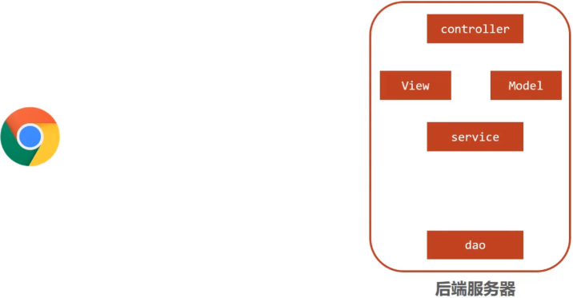

-   浏览器发送一个请求给后端服务器，后端服务器现在是使用Servlet来接收请求和数据
-   如果所有的处理都交给Servlet来处理的话，所有的东西都耦合在一起，对后期的维护和扩展极为不利
-   将后端服务器Servlet拆分成三层，分别是`web`、`service`和`dao`
    -   web层主要由servlet来处理，负责页面请求和数据的收集以及响应结果给前端
    -   service层主要负责业务逻辑的处理
    -   dao层主要负责数据的增删改查操作
-   servlet处理请求和数据的时候，存在的问题是一个servlet只能处理一个请求
-   针对web层进行了优化，采用了**MVC设计模式**，将其设计为`controller`、`view`和`Model`
    -   controller负责请求和数据的接收，接收后将其转发给service进行业务处理
    -   service根据需要会调用dao对数据进行增删改查
    -   dao把数据处理完后将结果交给service,service再交给controller
    -   controller根据需求组装成Model和View,Model和View组合起来生成页面转发给前端浏览器
    -   这样做的好处就是controller可以处理多个请求，并对请求进行分发，执行不同的业务操作。

随着互联网的发展，上面的模式因为是同步调用，性能慢慢的跟不是需求，所以异步调用慢慢的走到了前台，是现在比较流行的一种处理方式。

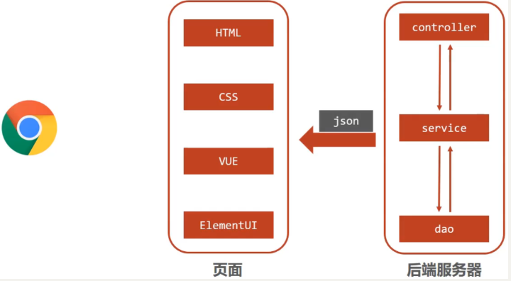

-   因为是异步调用，所以后端不需要返回view视图，将其去除
-   前端如果通过异步调用的方式进行交互，后台就需要将返回的数据转换成json格式进行返回
-   SpringMVC==主要==负责的就是
    -   controller如何接收请求和数据
    -   如何将请求和数据转发给业务层
    -   如何将响应数据转换成json发回到前端

介绍了这么多，对SpringMVC进行一个定义

-   SpringMVC是一种基于Java实现MVC模型的轻量级Web框架
-   优点
    -   使用简单、开发便捷(相比于Servlet)
    -   灵活性强

关于`SpringMVC`模式的应用

-   一次性工作
    -   创建工程，设置服务器，加载工程
    -   导入坐标
    -   创建`web`容器启动类，加载`SpringMVC`配置，并设置`SpringMVC`请求拦截路径
    -   `SpringMVC`核心配置类（设置配置类，扫描`controller`包，加载`Controller`控制器`bean`）
-   多次工作
    -   定义处理请求的控制器类
    -   定义处理请求的控制器方法，并配置映射路径（`@RequestMapping`）与返回json数据（`@ResponseBody`）

## 快速入门

#### 代码步骤

1.打开IDEA,创建一个新的web项目，手动补全目录结构

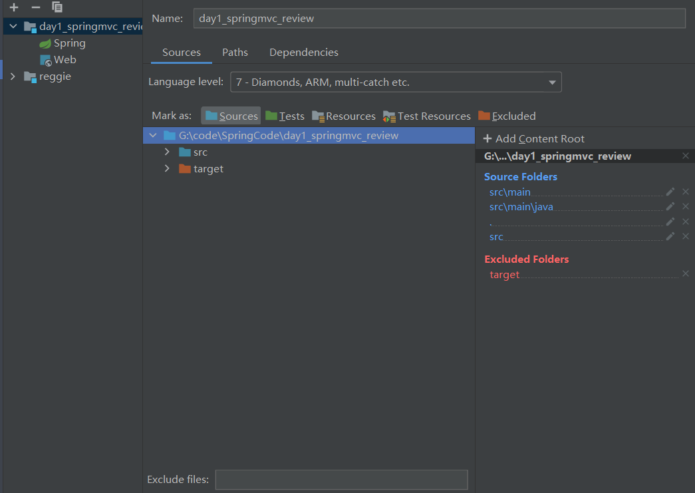

2.导入jar包，将pom.xml中多余的内容删除掉，再添加SpringMVC需要的依赖

```java
<?xml version="1.0" encoding="UTF-8"?>
<project xmlns="http://maven.apache.org/POM/4.0.0" xmlns:xsi="http://www.w3.org/2001/XMLSchema-instance"
  xsi:schemaLocation="http://maven.apache.org/POM/4.0.0 http://maven.apache.org/xsd/maven-4.0.0.xsd">
  <modelVersion>4.0.0</modelVersion>
  <groupId>com.itheima</groupId>
  <artifactId>springmvc_01_quickstart</artifactId>
  <version>1.0-SNAPSHOT</version>
  <packaging>war</packaging>

  <dependencies>
    <dependency>
      <groupId>javax.servlet</groupId>
      <artifactId>javax.servlet-api</artifactId>
      <version>3.1.0</version>
      <scope>provided</scope>
    </dependency>
    <dependency>
      <groupId>org.springframework</groupId>
      <artifactId>spring-webmvc</artifactId>
      <version>5.2.10.RELEASE</version>
    </dependency>
  </dependencies>

  <build>
    <plugins>
      <plugin>
        <groupId>org.apache.tomcat.maven</groupId>
        <artifactId>tomcat7-maven-plugin</artifactId>
        <version>2.1</version>
        <configuration>
          <port>80</port>
          <path>/</path>
        </configuration>
      </plugin>
    </plugins>
  </build>
</project>
```

**说明:** servlet的坐标为什么需要添加`<scope>provided</scope>`?

-   scope是maven中jar包依赖作用范围的描述
-   如果不设置默认是`compile`在在编译、运行、测试时均有效
-   如果运行有效的话就会和tomcat中的servlet-api包发生冲突，导致启动报错
-   provided代表的是该包只在编译和测试的时候用，运行的时候无效直接使用tomcat中的，就避免冲突

3.创建配置类

```java
@Configuration
@ComponentScan("com.itheima.controller")
public class SpringMvcConfig {
}
```

4.创建Controller类

```java
@Controller
public class UserController {
    
    @RequestMapping("/save")
    public void save(){
        System.out.println("user save ...");
    }
}
```

5.使用配置类替换web.xml

将web.xml删除，换成ServletContainersInitConfig

```java
public class ServletContainersInitConfig extends AbstractDispatcherServletInitializer {
    //加载springmvc配置类
    protected WebApplicationContext createServletApplicationContext() {
        //初始化WebApplicationContext对象
        AnnotationConfigWebApplicationContext ctx = new AnnotationConfigWebApplicationContext();
        //加载指定配置类
        ctx.register(SpringMvcConfig.class);
        return ctx;
    }

    //设置由springmvc控制器处理的请求映射路径
    protected String[] getServletMappings() {
        return new String[]{"/"};
    }

    //加载spring配置类
    protected WebApplicationContext createRootApplicationContext() {
        return null;
    }
}
```

6.配置Tomcat环境

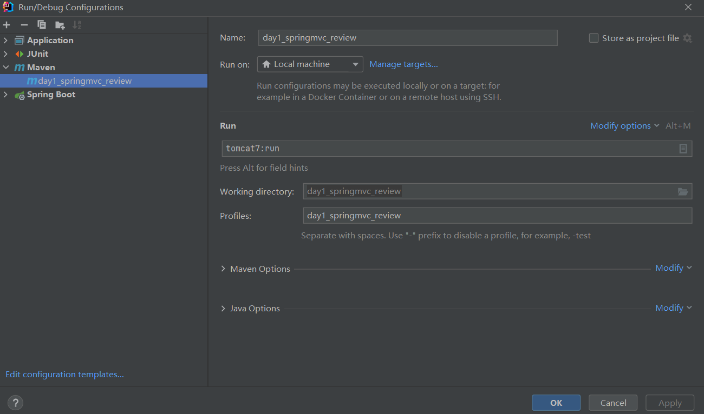

7.运行程序即可

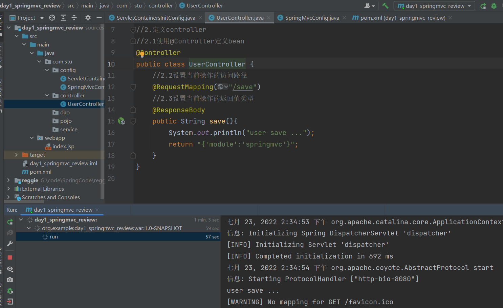

浏览器返回结果：

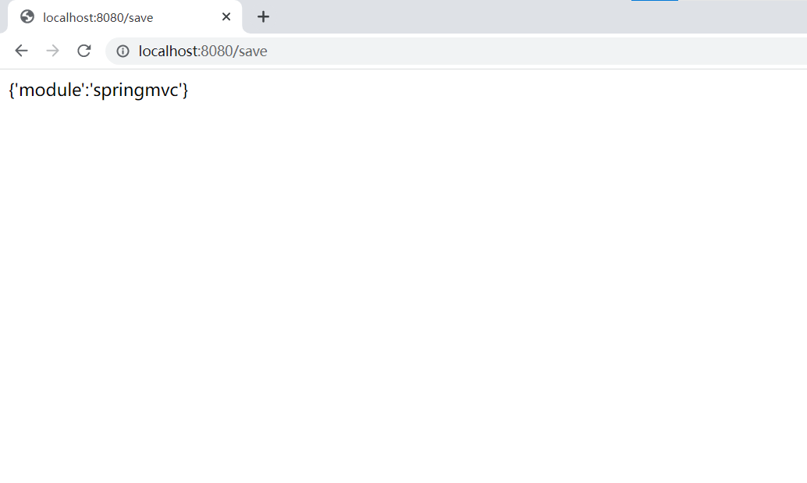

***

-   对快速入门案例中的SpringMVC工作流程分为两部分：`启动服务器初始化过程`和`单次请求过程`

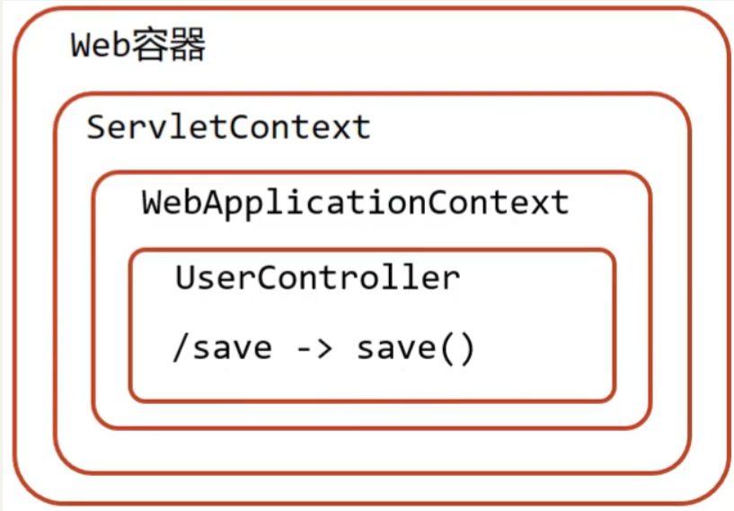

#### 启动服务器初始化过程

1.  服务器启动，执行ServletContainersInitConfig类，初始化web容器
    -   功能类似于以前的web.xml
2.  执行createServletApplicationContext方法，创建了WebApplicationContext对象
    -   该方法加载SpringMVC的配置类SpringMvcConfig来初始化SpringMVC的容器
3.  加载SpringMvcConfig配置类

    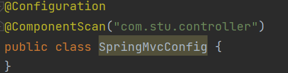
4.  执行@ComponentScan加载对应的bean

    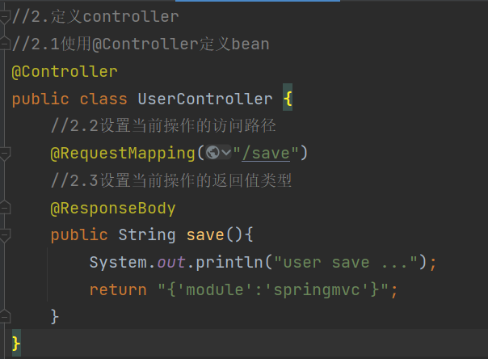
    -   扫描指定包及其子包下所有类上的注解，如Controller类上的@Controller注解
5.  加载UserController，每个@RequestMapping的名称对应一个具体的方法
    -   此时就建立了 `/save` 和 save方法的对应关系
6.  执行getServletMappings方法，设定SpringMVC拦截请求的路径规则

    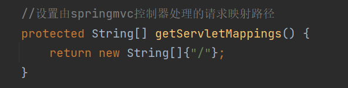
    -   `/`代表所拦截请求的路径规则，只有被拦截后才能交给SpringMVC来处理请求

#### 单次请求过程

1.  发送请求`http://localhost/save`
2.  web容器发现该请求满足SpringMVC拦截规则，将请求交给SpringMVC处理
3.  解析请求路径/save
4.  由/save匹配执行对应的方法save(）
    -   上面的第五步已经将请求路径和方法建立了对应关系，通过/save就能找到对应的save方法
5.  执行save()
6.  检测到有@ResponseBody直接将save()方法的返回值作为响应体返回给请求方

## Bean加载控制

&#x20;    现在项目的目录结构：

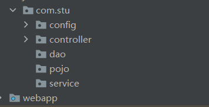

-   config目录存入的是配置类,写过的配置类有:
    -   ServletContainersInitConfig
    -   SpringConfig
    -   SpringMvcConfig
    -   JdbcConfig
    -   MybatisConfig
-   controller目录存放的是SpringMVC的controller类
-   service目录存放的是service接口和实现类
-   dao目录存放的是dao/Mapper接口

controller、service和dao这些类都需要被容器管理成bean对象，那么到底是该让SpringMVC加载还是让Spring加载呢?

-   SpringMVC加载其相关bean(表现层bean),也就是controller包下的类
-   Spring控制的bean
    -   业务bean(Service)
    -   功能bean(DataSource,SqlSessionFactoryBean,MapperScannerConfigurer等)

分析清楚谁该管哪些bean以后，接下来要解决的问题是如何让Spring和SpringMVC分开加载各自的内容。

在SpringMVC的配置类`SpringMvcConfig`中使用注解`@ComponentScan`，我们只需要将其扫描范围设置到controller即可，如

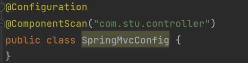

在Spring的配置类`SpringConfig`中使用注解`@ComponentScan`,当时扫描的范围中其实是已经包含了controller,如:

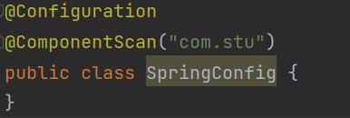

从包结构来看的话，Spring已经多把SpringMVC的controller类也给扫描到，所以针对这个问题该如何解决，因为功能不同，如何避免Spring错误加载到SpringMVC的bean?

解决方案也比较简单，就是:

-   加载Spring控制的bean的时候排除掉SpringMVC控制的bean

具体该如何排除：

-   **方式一:Spring加载的bean设定扫描范围为精准范围，例如service包、dao包等**

    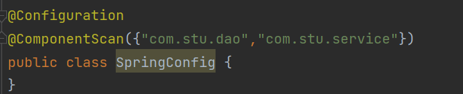

    上述只是通过例子说明可以精确指定让Spring扫描对应的包结构，真正在做开发的时候，因为Dao最终是交给`MapperScannerConfigurer`对象来进行扫描处理的，我们只需要将其扫描到service包即可。
-   **方式二:Spring加载的bean设定扫描范围为com.stu,排除掉controller包中的bean**
    ```java
    @Configuration
    @ComponentScan(value="com.stu",
            excludeFilters=@ComponentScan.Filter(
                    type = FilterType.ANNOTATION,
                    classes = Controller.class
            )
    )
    public class SpringConfig {   
    }
    ```
    -   excludeFilters属性：设置扫描加载bean时，排除的过滤规则
    -   type属性：设置排除规则，当前使用按照bean定义时的注解类型进行排除
        -   ANNOTATION：按照注解排除(最常用)
        -   ASSIGNABLE\_TYPE:按照指定的类型过滤
        -   ASPECTJ:按照Aspectj表达式排除，基本上不会用
        -   REGEX:按照正则表达式排除
        -   CUSTOM:按照自定义规则排除
    -   classes属性：设置排除的具体注解类，当前设置排除@Controller定义的bean
        注意:测试的时候，需要把SpringMvcConfig配置类上的@ComponentScan注解注释掉，否则不会报错==
    出现问题的原因是，
    -   Spring配置类扫描的包是`com.stu`
    -   SpringMVC的配置类，`SpringMvcConfig`上有一个@Configuration注解，也会被Spring扫描到
    -   SpringMvcConfig上又有一个@ComponentScan，把controller类又给扫描进来了
    -   所以如果不把@ComponentScan注释掉，Spring配置类将Controller排除，但是因为扫描到SpringMVC的配置类，又将其加载回来，演示的效果就出不来
    -   解决方案，也简单，把SpringMVC的配置类移出Spring配置类的扫描范围即可。
-   **方式三:不区分Spring与SpringMVC的环境，加载到同一个环境中\[了解即可]**

有了Spring的配置类，要想在tomcat服务器启动将其加载，我们需要修改ServletContainersInitConfig

```java
public class ServletContainersInitConfig extends AbstractDispatcherServletInitializer {
    protected WebApplicationContext createServletApplicationContext() {
        AnnotationConfigWebApplicationContext ctx = new AnnotationConfigWebApplicationContext();
        ctx.register(SpringMvcConfig.class);
        return ctx;
    }
    protected String[] getServletMappings() {
        return new String[]{"/"};
    }
    protected WebApplicationContext createRootApplicationContext() {
      AnnotationConfigWebApplicationContext ctx = new AnnotationConfigWebApplicationContext();
        ctx.register(SpringConfig.class);
        return ctx;
    }
}
```

对于上述的配置方式，Spring还提供了一种更简单的配置方式，可以不用再去创建`AnnotationConfigWebApplicationContext`对象，不用手动`register`对应的配置类，如何实现?

```java
public class ServletContainersInitConfig extends AbstractAnnotationConfigDispatcherServletInitializer {

    protected Class<?>[] getRootConfigClasses() {
        return new Class[]{SpringConfig.class};
    }

    protected Class<?>[] getServletConfigClasses() {
        return new Class[]{SpringMvcConfig.class};
    }

    protected String[] getServletMappings() {
        return new String[]{"/"};
    }
}
```

# 数据传输

## 数据传入

### **基本数据**传递

-   **普通参数**

    使用@RequestParam注解，解决前后端参数名不同

    例：前端的是`name`,后台接收使用的是`userName`,两个名称对不上，导致接收数据失败

    **写上@RequestParam注解框架就不需要自己去解析注入，能提升框架处理性能**
-   **POJO类型参数**

    请求参数名与形参对象属性名相同，定义POJO类型形参即可接收参数

    **请求参数key的名称要和POJO中属性的名称一致，否则无法封装**
-   **嵌套POJO类型参数**

    请求参数名与形参对象属性名相同，按照对象层次结构关系即可接收嵌套POJO属性参数

    **请求参数key的名称要和POJO中属性的名称一致，否则无法封装**
-   **数组类型参数**

    请求参数名与形参对象属性名相同且请求参数为多个，定义数组类型即可接收参数

    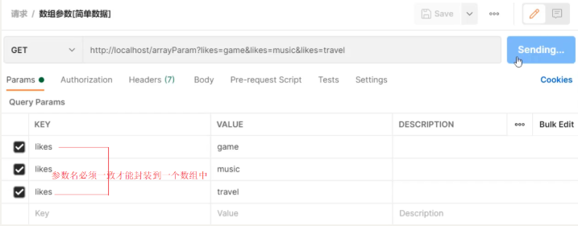
    ```java
      //数组参数：同名请求参数可以直接映射到对应名称的形参数组对象中
        @RequestMapping("/arrayParam")
        @ResponseBody
        public String arrayParam(String[] likes){
            System.out.println("数组参数传递 likes ==> "+ Arrays.toString(likes));
            return "{'module':'array param'}";
        }
    ```
-   **集合类型参数**

    同名请求参数可以使用@RequestParam注解映射到对应名称的集合对象中作为数据
    ```java
    @RequestMapping("/listParam")
    @ResponseBody
    public String listParam(@RequestParam List<String> likes){
        System.out.println("集合参数传递 likes ==> "+ likes);
        return "{'module':'list param'}";
    }
    ```

***

### JSON数据传输

对于JSON数据类型，常见的有三种:

-   json普通数组（\["value1","value2","value3",...]）
-   json对象（{key1:value1,key2:value2,...}）
-   json对象数组（\[{key1:value1,...},{key2:value2,...}]）

对应`JSON`数据格式的传输，需要使用JSON转换器进行，在`pom.xml`中导入`fastjson`等可以对应`json`转换的jar包的`maven`坐标

**步骤1:pom.xml添加依赖**

SpringMVC默认使用的是jackson来处理json的转换，所以需要在pom.xml添加jackson依赖

```java
<dependency>
    <groupId>com.fasterxml.jackson.core</groupId>
    <artifactId>jackson-databind</artifactId>
    <version>2.9.0</version>
</dependency>
```

**步骤2:使用api调试工具发送JSON数据**

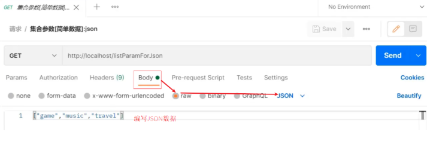

**步骤3:开启SpringMVC注解支持****@EnableWebMvc**​

```java
@Configuration
@ComponentScan("com.itheima.controller")
//开启json数据类型自动转换
 @EnableWebMvc 
public class SpringMvcConfig {
}
```

**步骤4:参数前添加****@RequestBody**​

```java
//使用@RequestBody注解将外部传递的json数组数据映射到形参的集合对象中作为数据
@RequestMapping("/listParamForJson")
@ResponseBody
public String listParamForJson(@RequestBody List<String> likes){
    System.out.println("list common(json)参数传递 list ==> "+likes);
    return "{'module':'list common for json param'}";
}
```

***

### 日期数据传输

SpringMVC默认支持的字符串转日期的格式为`yyyy/MM/dd`

若日期格式为：yyyy-MM-dd，则需要进行格式转换，使用`@DateTimeFormat`

```java
@RequestMapping("/dataParam")
@ResponseBody
public String dataParam(Date date,
                        @DateTimeFormat(pattern="yyyy-MM-dd") Date date1)
    System.out.println("参数传递 date ==> "+date);
  System.out.println("参数传递 date1(yyyy-MM-dd) ==> "+date1);
    return "{'module':'data param'}";
}
```

***

### 内部实现原理

讲解内部原理之前，我们需要先思考个问题:

-   前端传递字符串，后端使用日期Date接收
-   前端传递JSON数据，后端使用对象接收
-   前端传递字符串，后端使用Integer接收
-   后台需要的数据类型有很多中
-   在数据的传递过程中存在很多类型的转换

问:谁来做这个类型转换?

答:SpringMVC

问:SpringMVC是如何实现类型转换的?

答:SpringMVC中提供了很多类型转换接口和实现类

在框架中，有一些类型转换接口，其中有:

-   (1) Converter接口

```java
/**
*  S: the source type
*  T: the target type
*/
public interface Converter<S, T> {
    @Nullable
    //该方法就是将从页面上接收的数据(S)转换成我们想要的数据类型(T)返回
    T convert(S source);
}
```

**注意:Converter所属的包为**\*\*`org.springframework.core.convert.converter`\*\*

Converter接口的实现类

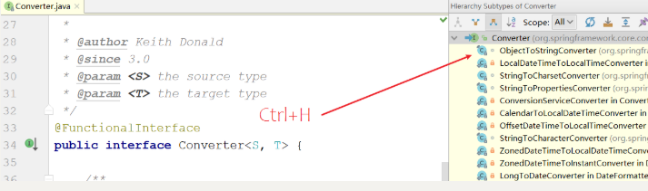

框架中有提供很多对应Converter接口的实现类，用来实现不同数据类型之间的转换,如:

请求参数年龄数据（String→Integer）

日期格式转换（String → Date）

-   (2) HttpMessageConverter接口

该接口是实现对象与JSON之间的转换工作

**注意:SpringMVC的配置类把@EnableWebMvc当做标配配置上去，不要省略**

***

## 数据传出

### 响应数据

#### 响应页面

**步骤1:设置返回页面**

```java
@Controller
public class UserController {
    
    @RequestMapping("/toJumpPage")
    //注意
    //1.此处不能添加@ResponseBody,如果加了该注入，会直接将page.jsp当字符串返回前端
    //2.方法需要返回String
    public String toJumpPage(){
        System.out.println("跳转页面");
        return "page.jsp";
    }
    
}
```

**步骤2:启动程序测试**

此处涉及到页面跳转，所以不适合采用PostMan进行测试，直接打开浏览器，输入

`http://localhost/toJumpPage`

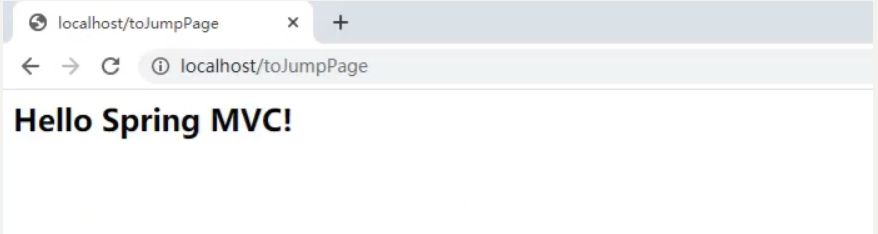

#### 返回文本数据

**步骤1:设置返回文本内容**

```java
@Controller
public class UserController {
    
     @RequestMapping("/toText")
  //注意此处该注解就不能省略，如果省略了,会把response text当前页面名称去查找，如果没有回报404错误
    @ResponseBody
    public String toText(){
        System.out.println("返回纯文本数据");
        return "response text";
    }
    
}
```

**步骤2:启动程序测试**

此处不涉及到页面跳转，因为我们现在发送的是GET请求，可以使用浏览器也可以使用PostMan进行测试，输入地址`http://localhost/toText`访问

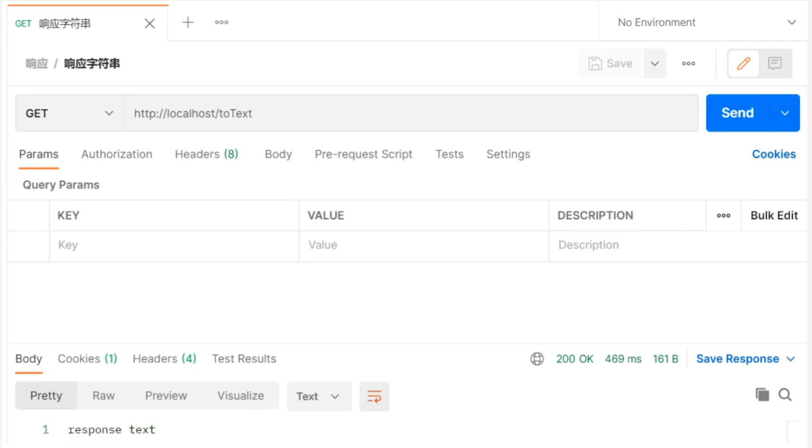

**返回JSON数据**

#### 响应POJO对象

```java
@Controller
public class UserController {
    
    @RequestMapping("/toJsonPOJO")
    @ResponseBody
    public User toJsonPOJO(){
        System.out.println("返回json对象数据");
        User user = new User();
        user.setName("itcast");
        user.setAge(15);
        return user;
    }
    
}
```

返回值为实体类对象，设置返回值为实体类类型，即可实现返回对应对象的json数据，需要依赖@ResponseBody注解和@EnableWebMvc注解

重新启动服务器，访问`http://localhost/toJsonPOJO`

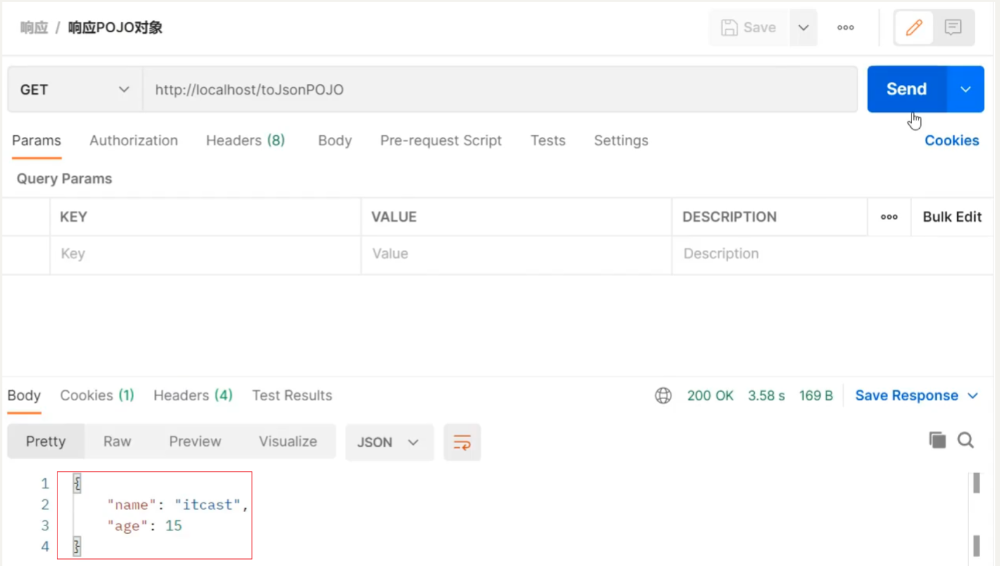

#### 响应POJO集合对象

```java
@Controller
public class UserController {
    
    @RequestMapping("/toJsonList")
    @ResponseBody
    public List<User> toJsonList(){
        System.out.println("返回json集合数据");
        User user1 = new User();
        user1.setName("传智播客");
        user1.setAge(15);

        User user2 = new User();
        user2.setName("黑马程序员");
        user2.setAge(12);

        List<User> userList = new ArrayList<User>();
        userList.add(user1);
        userList.add(user2);

        return userList;
    }
    
}

```

重新启动服务器，访问`http://localhost/toJsonList`

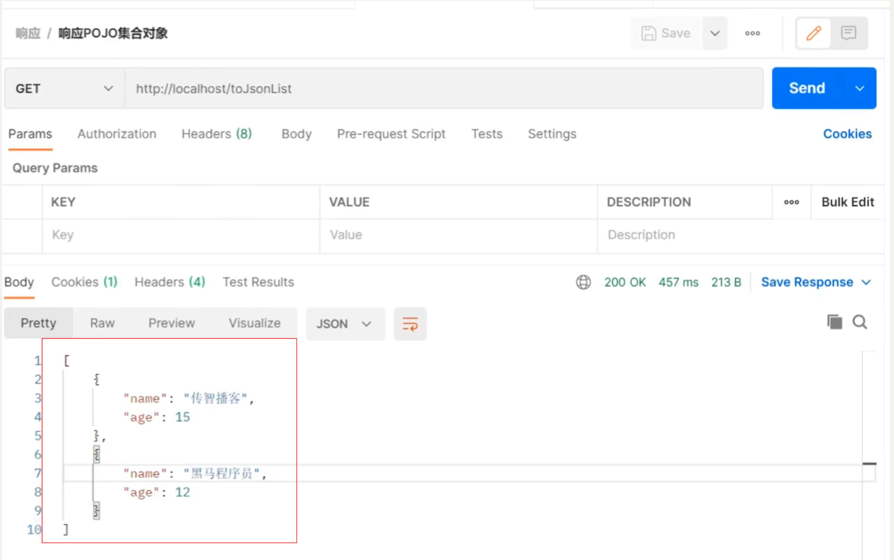

#### @ResponseBody

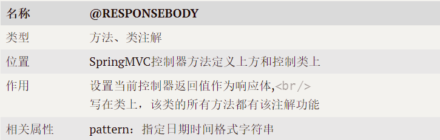

**说明:**

-   该注解可以写在类上或者方法上
-   写在类上就是该类下的所有方法都有@ReponseBody功能
-   当方法上有@ReponseBody注解后
    -   方法的返回值为字符串，会将其作为文本内容直接响应给前端
    -   方法的返回值为对象，会将对象转换成JSON响应给前端

此处又使用到了类型转换，内部还是通过Converter接口的实现类完成的，所以Converter除了前面所说的功能外，它还可以实现:

-   对象转Json数据(POJO -> json)
-   集合转Json数据(Collection -> json)

# 前端控制器DispathcherServlet

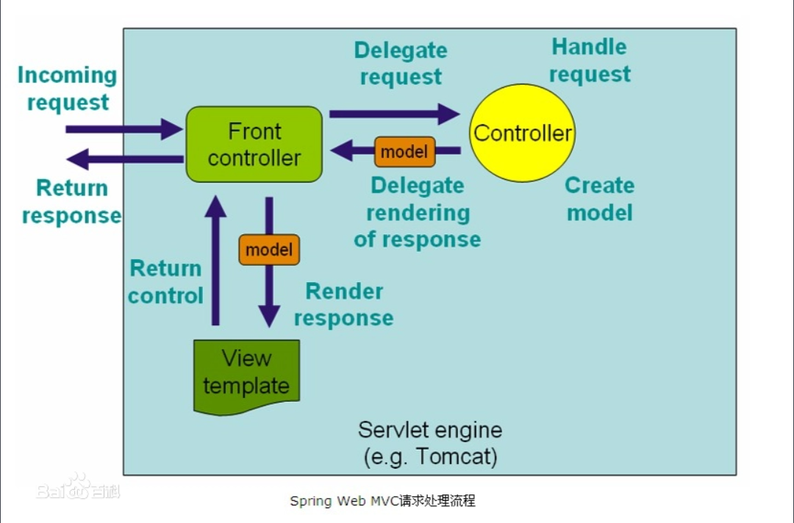

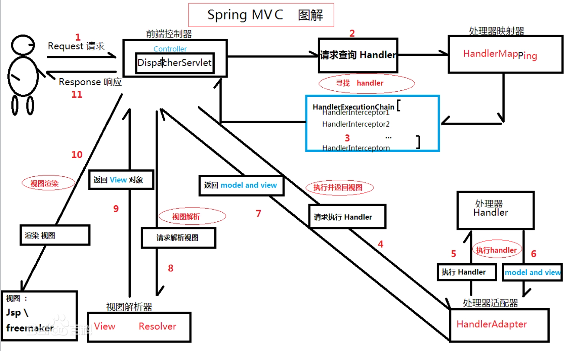

### 拦截器

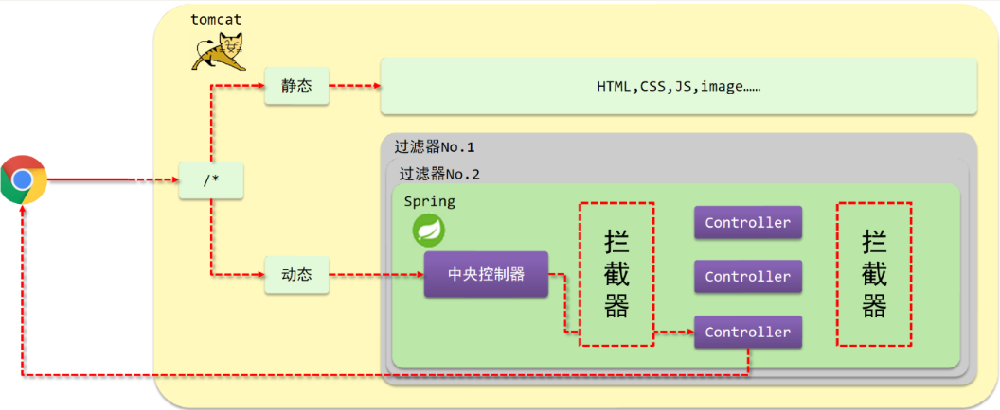

(1)浏览器发送一个请求会先到Tomcat的web服务器

(2)Tomcat服务器接收到请求以后，会去判断请求的是静态资源还是动态资源

(3)如果是静态资源，会直接到Tomcat的项目部署目录下去直接访问

(4)如果是动态资源，就需要交给项目的后台代码进行处理

(5)在找到具体的方法之前，我们可以去配置过滤器(可以配置多个)，按照顺序进行执行

(6)然后进入到到中央处理器(SpringMVC中的内容)，SpringMVC会根据配置的规则进行拦截

(7)如果满足规则，则进行处理，找到其对应的controller类中的方法进行执行,完成后返回结果

(8)如果不满足规则，则不进行处理

(9)这个时候，如果我们需要在每个Controller方法执行的前后添加业务，具体该如何来实现?

这个就是拦截器要做的事。

-   拦截器（Interceptor）是一种动态拦截方法调用的机制，在SpringMVC中动态拦截控制器方法的执行
-   作用:
    -   在指定的方法调用前后执行预先设定的代码
    -   阻止原始方法的执行
    -   总结：拦截器就是用来做增强

看完以后，大家会发现

-   拦截器和过滤器在作用和执行顺序上也很相似

所以这个时候，就有一个问题需要思考:拦截器和过滤器之间的区别是什么?

-   归属不同：Filter属于Servlet技术，Interceptor属于SpringMVC技术
-   拦截内容不同：Filter对所有访问进行增强，Interceptor仅针对SpringMVC的访问进行增强

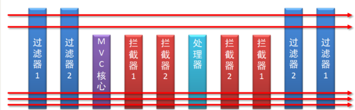

#### 实现''拦截器''开发

步骤1：创建拦截器类

让类实现`HandlerInterceptor`接口，重写接口中的三个方法

```java
@Component
//定义拦截器类，实现HandlerInterceptor接口
//注意当前类必须受Spring容器控制
public class ProjectInterceptor implements HandlerInterceptor {
    @Override
    //原始方法调用前执行的内容
    public boolean preHandle(HttpServletRequest request, HttpServletResponse response, Object handler) throws Exception {
        System.out.println("preHandle...");
        return true;
    }

    @Override
    //原始方法调用后执行的内容
    public void postHandle(HttpServletRequest request, HttpServletResponse response, Object handler, ModelAndView modelAndView) throws Exception {
        System.out.println("postHandle...");
    }

    @Override
    //原始方法调用完成后执行的内容
    public void afterCompletion(HttpServletRequest request, HttpServletResponse response, Object handler, Exception ex) throws Exception {
        System.out.println("afterCompletion...");
    }
}
```

注意：拦截器类要被SpringMVC容器扫描到

步骤2：配置拦截器类

```java
@Configuration
public class SpringMvcSupport extends WebMvcConfigurationSupport {
    @Autowired
    private ProjectInterceptor projectInterceptor;

    @Override
    protected void addResourceHandlers(ResourceHandlerRegistry registry) {
        registry.addResourceHandler("/pages/**").addResourceLocations("/pages/");
    }

    @Override
    protected void addInterceptors(InterceptorRegistry registry) {
        //配置拦截器
        registry.addInterceptor(projectInterceptor).addPathPatterns("/books" );
    }
}
```

步骤3：SpringMVC添加SpringMvcSupport包扫描

```java
@Configuration
@ComponentScan({"com.stu.controller","com.stu.config"})
@EnableWebMvc
public class SpringMvcConfig{
   
}
```

步骤4：测试

步骤5：修改拦截器拦截规则

```java
@Configuration
public class SpringMvcSupport extends WebMvcConfigurationSupport {
    @Autowired
    private ProjectInterceptor projectInterceptor;

    @Override
    protected void addResourceHandlers(ResourceHandlerRegistry registry) {
        registry.addResourceHandler("/pages/**").addResourceLocations("/pages/");
    }

    @Override
    protected void addInterceptors(InterceptorRegistry registry) {
        //配置拦截器
        registry.addInterceptor(projectInterceptor).addPathPatterns("/books","/books/*" );
    }
}
```

附：可简化SpringMvcSupport的编写

```java
@Configuration
@ComponentScan({"com.stu.controller"})
@EnableWebMvc
//实现WebMvcConfigurer接口可以简化开发，但具有一定的侵入性
public class SpringMvcConfig implements WebMvcConfigurer {
    @Autowired
    private ProjectInterceptor projectInterceptor;

    @Override
    public void addInterceptors(InterceptorRegistry registry) {
        //配置多拦截器
        registry.addInterceptor(projectInterceptor)
        .addPathPatterns("/books","/books/*");
    }
}
```

#### 拦截器的执行流程

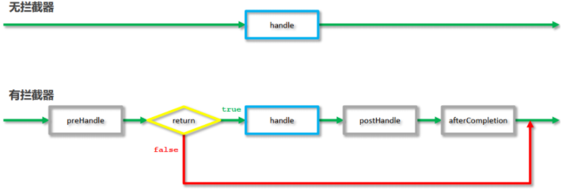

当有拦截器后，请求会先进入preHandle方法，

如果方法返回true，则放行继续执行后面的handle\[controller的方法]和后面的方法

如果返回false，则直接跳过后面方法的执行。

#### 拦截器参数

1.前置处理方法

原始方法之前运行preHandle

```java
public boolean preHandle(HttpServletRequest request,
                         HttpServletResponse response,
                         Object handler) throws Exception {
    System.out.println("preHandle");
    return true;
}
```

-   request:请求对象
-   response:响应对象
-   handler:被调用的处理器对象，本质上是一个方法对象，对反射中的Method对象进行了再包装

使用request对象可以获取请求数据中的内容，如获取请求头的`Content-Type`

```java
public boolean preHandle(HttpServletRequest request, HttpServletResponse response, Object handler) throws Exception {
    String contentType = request.getHeader("Content-Type");
    System.out.println("preHandle..."+contentType);
    return true;
}
```

使用handler参数，可以获取方法的相关信息

```java
public boolean preHandle(HttpServletRequest request, HttpServletResponse response, Object handler) throws Exception {
    HandlerMethod hm = (HandlerMethod)handler;
    String methodName = hm.getMethod().getName();//可以获取方法的名称
    System.out.println("preHandle..."+methodName);
    return true;
}
```

2.后置处理方法

原始方法运行后运行，如果原始方法被拦截，则不执行 &#x20;

```java
public void postHandle(HttpServletRequest request,
                       HttpServletResponse response,
                       Object handler,
                       ModelAndView modelAndView) throws Exception {
    System.out.println("postHandle");
}
```

前三个参数和上面的是一致的。

modelAndView:如果处理器执行完成具有返回结果，可以读取到对应数据与页面信息，并进行调整

因为咱们现在都是返回json数据，所以该参数的使用率不高

3.完成处理方法

拦截器最后执行的方法，无论原始方法是否执行

```java
public void afterCompletion(HttpServletRequest request,
                            HttpServletResponse response,
                            Object handler,
                            Exception ex) throws Exception {
    System.out.println("afterCompletion");
}
```

前三个参数与上面的是一致的。

ex:如果处理器执行过程中出现异常对象，可以针对异常情况进行单独处理 &#x20;

因为我们现在已经有全局异常处理器类，所以该参数的使用率也不高。

这三个方法中，最常用的是preHandle,在这个方法中可以通过返回值来决定是否要进行放行，我们可以把业务逻辑放在该方法中，如果满足业务则返回true放行，不满足则返回false拦截。

### 拦截器链配置

#### 配置多个拦截器

步骤1:创建拦截器类

实现接口，并重写接口中的方法

```java
@Component
public class ProjectInterceptor2 implements HandlerInterceptor {
    @Override
    public boolean preHandle(HttpServletRequest request, HttpServletResponse response, Object handler) throws Exception {
        System.out.println("preHandle...2");
        return false;
    }

    @Override
    public void postHandle(HttpServletRequest request, HttpServletResponse response, Object handler, ModelAndView modelAndView) throws Exception {
        System.out.println("postHandle...2");
    }

    @Override
    public void afterCompletion(HttpServletRequest request, HttpServletResponse response, Object handler, Exception ex) throws Exception {
        System.out.println("afterCompletion...2");
    }
}
```

步骤2:配置拦截器类

```java
@Configuration
@ComponentScan({"com.stu.controller"})
@EnableWebMvc
//实现WebMvcConfigurer接口可以简化开发，但具有一定的侵入性
public class SpringMvcConfig implements WebMvcConfigurer {
    @Autowired
    private ProjectInterceptor projectInterceptor;
    @Autowired
    private ProjectInterceptor2 projectInterceptor2;

    @Override
    public void addInterceptors(InterceptorRegistry registry) {
        //配置多拦截器
        registry.addInterceptor(projectInterceptor).addPathPatterns("/books","/books/*");
        registry.addInterceptor(projectInterceptor2).addPathPatterns("/books","/books/*");
    }
}
```

步骤3:运行程序，观察顺序

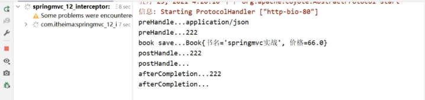

拦截器执行的顺序是和配置顺序有关——先进后出

-   当配置多个拦截器时，形成拦截器链
-   拦截器链的运行顺序参照拦截器添加顺序为准
-   当拦截器中出现对原始处理器的拦截，后面的拦截器均终止运行
-   当拦截器运行中断，仅运行配置在前面的拦截器的afterCompletion操作

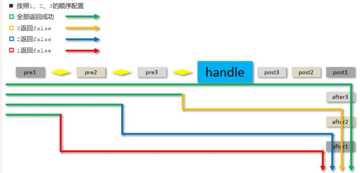

-   preHandle：与配置顺序相同，必定运行
-   postHandle:与配置顺序相反，可能不运行
-   afterCompletion:与配置顺序相反，可能不运行。

这个顺序不太好记，最终只需要把握住一个原则即可：以最终的运行结果为准

# SpringMVC的执行过程

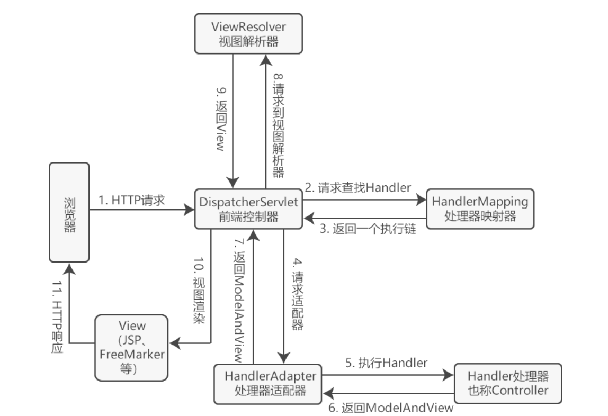

SpringMVC 的执行流程如下：

1.  用户点击某个请求路径，发起一个 HTTP request 请求，该请求会被提交到 DispatcherServlet（前端控制器）；
2.  由 DispatcherServlet 请求一个或多个 HandlerMapping（处理器映射器），并返回一个执行链（HandlerExecutionChain）。
3.  DispatcherServlet 将执行链返回的 Handler 信息发送给 HandlerAdapter（处理器适配器）；
4.  HandlerAdapter 根据 Handler 信息找到并执行相应的 Handler（常称为 Controller）；
5.  Handler 执行完毕后会返回给 HandlerAdapter 一个 ModelAndView 对象（Spring MVC的底层对象，包括 Model 数据模型和 View 视图信息）；
6.  HandlerAdapter 接收到 ModelAndView 对象后，将其返回给 DispatcherServlet ；
7.  DispatcherServlet 接收到 ModelAndView 对象后，会请求 ViewResolver（视图解析器）对视图进行解析；
8.  ViewResolver 根据 View 信息匹配到相应的视图结果，并返回给 DispatcherServlet；
9.  DispatcherServlet 接收到具体的 View 视图后，进行视图渲染，将 Model 中的模型数据填充到 View 视图中的 request 域，生成最终的 View（视图）；
10. 视图负责将结果显示到浏览器（客户端）。
